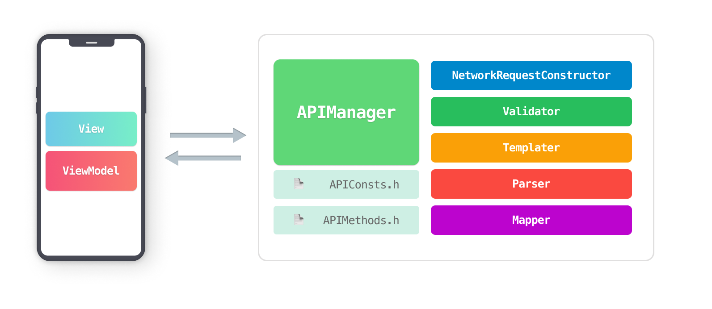
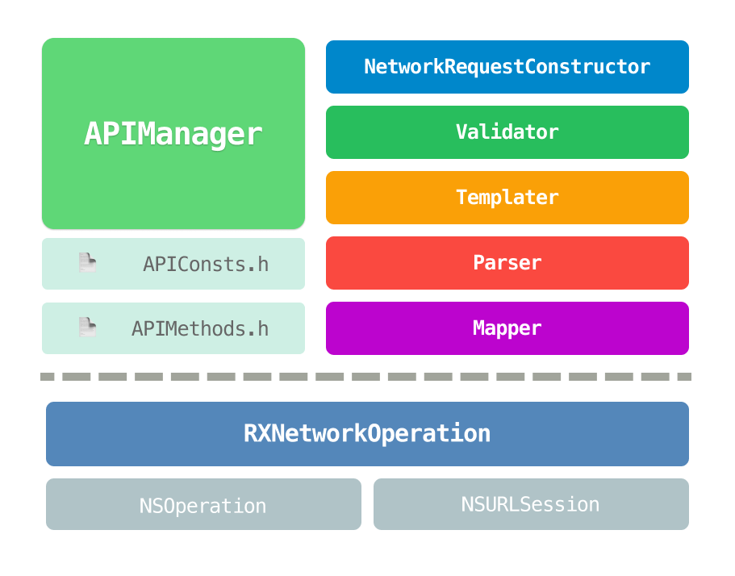
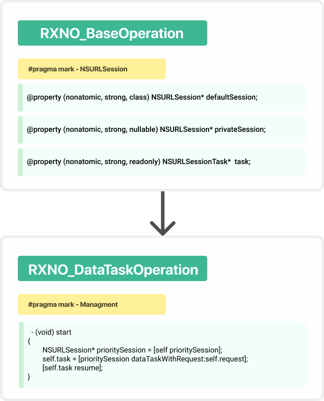
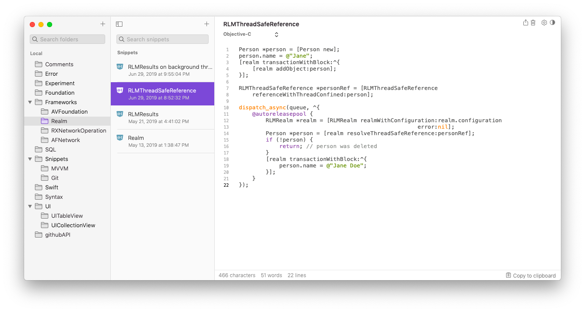

# A network layer is a heart of the mobile app

How to efficiently design a network layer for an iOS application.

<p align="center">

</p>

## For whom this article is written

The article is mainly aimed at developers who are passionate about building network layers for applications with a large functional load and complex architecture.

Below you can find a fresh look at such urgent problems of development and support of the network stack of the application in 2021.

Unlike most works on architecture topics, which are mostly theoretical, this article is replete with examples of specific solutions.
And for this reason, it is quite long and voluminous, if you like me, are extremely passionate about building massive architectures, to facilitate perception, it is recommended to divide the acquaintance with the material into several approaches, in order to better assimilate knowledge.

## Introduction

The entire network layer is based on the concept of creating a group of classes that initialize and serve the network operations of the `RXNetworkOperation` framework.

Network operations are inheritors of the `NSOperation` class, which incorporate support for the `NSURLSession` class protocols, and also add a new layer of abstraction for more convenient operation management.

The standard class `NSURLSessionTask` (and its heirs), which traditionally perform network requests, on the contrary, is fundamentally not used in the network layer directly, due to the fact that the support of various protocols for the correct functioning of the object is cumbersome and not flexible enough.

For example, if you want to display the download progress while receiving data from the Internet, when using `RXNetworkOperation` you do not need to implement the protocol methods, you can get all the necessary data in the appropriate blocks.

In addition, you have the ability to configure network operation objects very flexibly, as a result of which you can perform operations synchronously, not create properties to hold them in memory, pause and resume at any time, and also enjoy all the advantages of a regular `NSOperation` object.

## The architecture of the network layer

In order to make working with the network in our application easy and pleasant, we need to perform an initial decomposition of the entire network layer.
The layer will be divided into the following modules and files, which you can see below:

<p align="center">

</p>

## Responsibilities of Network Layer classes

| Emoji-Code | The name of the module        | Functional responsibility                                                                                                                                        |
| ---------- | ----------------------------- |:---------------------------------------------------------------------------------------------------------------------------------------------------------------- |
| 🌐🕹       | **APIManager**                | Creates and modifies network operations using other modules.                                                                                                     |
| 🏗🧱       | **NetworkRequestConstructor** | Constructs `NSURLRequest` requests to the `API`.                                                                                                                 |
| 🚦⚖️       | **Validator**                 | Validates the response received from the server.                                                                                                                 |
| 🖨🧾       | **Templater**                 | Restores the samples of responses from the server in the format `.json` from the device's disk so that the `Validator` can compare the response with the sample. |
| 🗂 🔍      | **Parser**                    | Retrieves data from a complex structure.                                                                                                                         |
| 📄 ➡️ 💾   | **Mapper**                    | Builds data models from `json`.                                                                                                                                  |

<br>

## Responsibilities of individual network layer files

| File name            | Functional responsibility                                               |
| -------------------- | ----------------------------------------------------------------------- |
| 📄  **APIConsts.h**  | Contains the declaration of abbreviations, macros, and C-functions.     |
| 📄  **APIMethods.h** | Contains enumerations of `API` methods that the network layer supports. |

<br>

## A brief introduction to RXNO

The `RXNetworkOperation` (**RXNO**) framework is a private commercial technology that is **not** publicly available. However, the philosophy of the framework and some implementation points are publicly open.

So, let's get started.
The technology offers a choice of several different classes for performing tasks.

| Class anme               | Abbreviated name | Purpose                                                                                                                                                                                                                               |
| ------------------------ |:----------------:| ------------------------------------------------------------------------------------------------------------------------------------------------------------------------------------------------------------------------------------- |
| `RXNO_DataTaskOperation` | **DTO**          | Downloads data without writing to disk.<br/>Uploads data to the server.<br/>Is a versatile and most commonly used class.<br/>Widely used for most everyday tasks, getting `json`, downloading images, uploading data.                 |
| `RXNO_DownloadOperation` | **DO**           | Downloads data and writes it to disk as a separate file.                                                                                                                                                                              |
| `RXNO_UploadOperation`   | **UO**           | It is intended for uploading data to the server, unlike `DTO` it has a distinctive ability to upload data located on the device's disk(without first converting it to `NSData`), for this it takes the local  `NSURL` as parameters . |

<p align="center">

</p>

**Examples of usage:**

1) **Getting json.**
   
   Creates, starts, and holds the operation in memory without having to create a property.
   
   ```objectivec
   [[DTO GET:url completion:^(DTO * _Nonnull op, NSError * _Nullable error) {
       NSLog(@"op.json: %@",op.json);
   }] retainOperationAndStart];
   ```
   
   <br>
2. **Getting  image.**
   Creates the operation and adds it to the queue.
   
   ```objectivec
   DTO* picOp =
   [DTO GET:url params:@{} completion:^(DTO * _Nonnull op, NSError * _Nullable error) {
       UIImage* image = [UIImage imageWithData:op.receivedData];
   }];
   [self.queue addOperation:picOp];
   ```
   
   <br>

3. **Upload photo to the server**
   Initializes the operation using a pre-prepared `NSURLRequest` and customizes its behavior by assigning a private `NSURLSession`, based on which the `NSURLSessionDataTask` object will be created inside the operation.
   
   ```objectivec
   NSURLRequest* request = [NSURLRequest new];
   DTO* customOp =
   [DTO request:request uploadProgress:^(DTO * _Nonnull op, DTOUpProgress p) {
   
       NSLog(@"Progress: %f",(float)p.totalBytesSent/p.totalBytesExpectedToSend);
   
   } downloadProgress:nil completion:^(DTO * _Nonnull op, NSError * _Nullable error) {
   
       if (op.state == RXNO_SuccessFinished){
           NSLog(@"Your photo was successfully uploaded!");
       }else{
           NSLog(@"Your photo was uploaded with error: %@",error);
       }
   }];
   customOp.privateSession = self.myPrivateSession;
   [self.queue addOperation:customOp];
   ```

---

<br>

**Practice of avoiding callback-hell in complex compound operations**

Often you can witness how to fully display the controller interface, you need to perform several network requests that depend on each other and must be executed in a strict sequence.
For example, in order to display all the user's music in a table, you first need to get the `id` of all the albums, and then only download the lists themselves.

Above was one of the most trivial examples when you need to perform several operations to get data, where each subsequent operation depends on the data that the previous one received.

As a result, when using standard approaches in building a network layer, namely the use of bare `NSURLSessionTask`, as well as wrappers like `AFNetworking` and others, you will inevitably form a `callback-hell `of varying degrees of complexity. <br><br>

                                                                           

To solve this problem, the `RXNO_GroupOperation` class was developed inside the `RXNO` framework.
Which is just like `RXNO_BaseOperation` is a direct descendant of `NSOperation`, and also has a similar control interface to `RXNO_BaseOperation`.

<p align="center">

</p>

`RXNO_GroupOperation` has some similarities with` NSBlockOperation`, and is intended so that in the body of its `mainBlock` you synchronously start the execution of normal network operations to avoid the occurrence of` callback-hell`.

In the example below, we initialize a group operation, then initialize two network operations and execute them synchronously.

```objectivec
 GO* go =
[GO groupOperation:^(GO * _Nonnull groupOp) {

    DTO* getUsersAlbums = [[DTO GET:url1] syncStart];

    NSArray<NSNumber*>* albums = getUsersAlbums.json[@"albums"];

    DTO* getAllUsersMusic = [[DTO GET:url2 params:@{@"albums":albums}] syncStart];

    [weak.array addObjects:getAllUsersMusic.json[@"music"]];
}];
[self.queue addOperation:go];
```

Thus, when using group operations, we completely get rid of such a phenomenon as **callback-hell**, which significantly saves development time.

At the beginning of the article, we said that our goal is to create a network layer for applications with a significant functional load, thanks to the internal algorithms of group operations, the user can collect their arbitrary constructs from them, we are talking about the fact that it is possible in the body of one group operation to perform others ...<br>
This feature opens up a whole horizon of possibilities for easily obtaining large amounts of data.

An example is this simulation code:

```objectivec
 // So at the click of a button we initialize a group operation 'downloadMediaOperation'.
  - (IBAction) downloadMediaContent
 {
   self.downloadMediaOperation = [self getAllMediaContent];
   [self.queue addOperation: self.downloadMediaOperation];
 }

 // We also have the option to cancel its execution.
 - (IBAction) cancelDownloadingMediaContent
 {
    [self.downloadMediaOperation cancel];
 }
```

The `getAllMediaContent` method initializes one group operation, in the body of which two others are executed.

As a result, it turns out that the end user will receive only one group operation, which can have unlimited nesting. As a result of the work of which it can get the expected effect without having such a side effect as `callback-hell`.

```objectivec
 - (GO*) getAllMediaContent
 {
     __block GroupOperation* group =  [GroupOperation groupProgressDescription:nil
                                                                 progressCount:nil
                                                          progressCancellation:nil
                                                               executableBlock:^(GO * _Nonnull groupOp){

        GO* musicOperation = [weak getAllMusicProgressCancellation:^{
                                // Make sure that if 'group' was canceled, then cancel nested operations.
                                 if (group.state == RXNO_Cancelled){ [musicOperation cancel]; }
                             }];
        ...

        GO* videoOperation = [weak getAllVideoProgressCancellation:^{
                                // Make sure that if 'group' was canceled, then cancel nested operations.
                                if (group.state == RXNO_Cancelled){ [videoOperation cancel]; }
                              }];
        ....
     }];
   return group;
 }
```

<br>

## The main rule of building network layer modules

Among others, one dominant rule can be distinguished, which is that each module of the network layer should have **only class methods** and **only property of a class**.

A similar radical step was taken in order to avoid generating a heap of singletons and questions about who and where to store `strong` references to objects that administer the network layer.
<br>
<br>

## Detailed reviews of network layer modules

### 🌐🕹 APIManager.h

| The main task                | Creation, modification and execution of network operations.                                                                                                                        |
| ---------------------------- | ---------------------------------------------------------------------------------------------------------------------------------------------------------------------------------- |
| **List of responsibilities** | - Providing methods for interacting with the product `API`.<br/>- Support authentication protocol <Auth2_0_Delegate>.<br/>- Manage the received token, delete and write to memory. |

The `RXNO` framework provides a choice to the user based on which` NSURLSession` the `NSURLSessionTask` task will be created.<br>
By default, for each operation, the framework provides its own internal session, which is the property of the class.<br>
Despite this, we have the opportunity to establish our own session, which may contain some custom settings, and then the `NSURLSessionTask` task will be created on its basis.

This engineering solution can be seen more clearly in this diagram:

<p align="center">

</p>

As we can see in the `start` method, the algorithm calls the` prioritySession` function, which returns the private session from the `privateSession` if it was initialized, and if not, it returns` defaultSession`.

It is for such purposes that the `APIManager` class stores its own default session.
So that, if necessary, we can configure the session at any time and create the desired task on its basis.

```objectivec
#pragma mark - URLSession

@property (class, nonatomic, readonly, strong) NSURLSession* defaultSession;
```

Such a case may occur when you have to fulfill a request with sensitive data content, that is, for example, a request for transferring funds in a banking application.

For which one of the security requirements will be the prohibition of caching any data accompanying this request, for which you actually have to create a session with the ephemeral configuration `[NSURLSessionConfiguration ephemeralSessionConfiguration]`.

By the way, in this implementation of the `APIManager` version, we can see only one session of the class, in fact, there can be an unlimited number of them, for each of your needs.

---

<br>

Next, we have the declaration of two `NSOperationQueue` queues, they are needed since all our network connections are performed by the` NSOperation` heirs.

The `aSyncQueue` queue is designed to perform asynchronous operations.
And `syncQueue` is exclusively for those that need to be executed in strict sequence.

```objectivec
#pragma mark - Queues
@property (class, nonatomic, readonly, strong) NSOperationQueue* aSyncQueue;
@property (class, nonatomic, readonly, strong) NSOperationQueue* syncQueue;
```

----

<br>

After the declaration of the queues, there is a declaration of various helper methods and properties that deal with the preparation and configuration of the network stack.

```objectivec
#pragma mark - BaseURL & EndPoint
/*--------------------------------------------------------------------------------------------------------------
 Here you can store the value that you intend to use as the address to the server in all requests.
 For example: 'https://api.vk.com/method/'
 --------------------------------------------------------------------------------------------------------------*/
@property (class, nonatomic, strong, nullable) NSString* baseURL;

/*--------------------------------------------------------------------------------------------------------------
 Returns the result of joining two strings. 'baseURL' and the value from the 'method' argument.
 --------------------------------------------------------------------------------------------------------------*/
+ (NSString*) baseURLappend:(NSString*)method;


#pragma mark - Customization
/*--------------------------------------------------------------------------------------------------------------
 The method was created to allow additional configuration of 'APIManager' before use.
 For example, you want to set some additional custom parameters.
 You can do this by calling this method inside 'didFinishLaunchingWithOptions: ..'.
 --------------------------------------------------------------------------------------------------------------*/
+ (void) prepareAPIManagerBeforeUsing:(nullable void(^)(void))completion;
```

---

<br>

This is followed by the declaration of the property that stores the token and the methods for managing it.

```objectivec
#pragma mark - Token Property
/*--------------------------------------------------------------------------------------------------------------
 Property stores the model of the token obtained after authorization.
 If you restart the application, the property getter will automatically retrieve the token from the 'KeyChain'.
 --------------------------------------------------------------------------------------------------------------*/
@property (class, nonatomic, strong, nullable) Token* token;


#pragma mark - Token Access Methods

+ (BOOL) isThereTokenInKeychain;                //  Returns 'YES' if the token was written to 'KeyChain'
+ (nullable Token*) restoreTokenFromKeychain;   //  Restores token model from 'KeyChain'

+ (void)     removeTokenInKeychain;             //  Removes token from 'KeyChain'
+ (NSError*) saveTokenInKeychain:(Token*)token; //  Stores token in 'KeyChain'

/*--------------------------------------------------------------------------------------------------------------
 Typically, the method is called after successful authorization or receiving an updated token.
 The method updates the value in the 'token' property itself, and also writes the new version to the 'KeyChain'.
 --------------------------------------------------------------------------------------------------------------*/
+ (void) updateToken:(NSString*)accessToken expiresAfter:(NSString*)expiresAfter userID:(NSString*)userID;
```

---

Below is a section of methods that fulfill the requirements of the `<Auth2_0_Delegate>` protocol.<br>
Which deals with the coordination of the process of obtaining a token.

```objectivec
#pragma mark - <Auth2_0_Delegate>
/*--------------------------------------------------------------------------------------------------------------
 'AuthViewController' calls this method on its delegate and passes the received token to it.
 --------------------------------------------------------------------------------------------------------------*/
+ (void) receiveTokenFromWebViewAuth:(nullable Token*)token error:(nullable NSError*)error;

/*--------------------------------------------------------------------------------------------------------------
This method is called by internal APIManager algorithms. If the operation fails for a reason
obsolete token. Internally, the method of the 'Router' class is called, which represents the 'AuthViewController'.
In turn, which, after receiving a fresh token, calls the 'receiveTokenFromWebViewAuth' method of its delegate,
which is the APIManager class.
 --------------------------------------------------------------------------------------------------------------*/
+ (void) authenticationProcess:(nullable AuthenticationCompletion)completion;
```

----

<br>

The penultimate section, called `Network Operations`, contains methods that create operations that directly perform all interactions with the Internet.

Below are some demo methods for getting user data as an example.<br>
Pay attention to some points:

1) All methods are exclusively class methods.

2) All methods have parameters that take data from which the request will be built.
    If you need to pass a large amount of data to execute a query, it makes sense to declare one `:(nullable NSDictionary <NSString *, id> *) properties`  instead of many parameters.

3) Method return not only objects `DTO, DO, UO`, but also group operations` GO`.

```objectivec
#pragma mark - Network Operations
/*--------------------------------------------------------------------------------------------------------------
  Returns an array of information about users
 --------------------------------------------------------------------------------------------------------------*/
+ (DTO*) usersGet:(NSArray<NSString*>*)userIDs
           fields:(NSArray<NSString*>* _Nullable)fields
       completion:(nullable void(^)(NSArray<UserProfile*>* _Nullable userProfiles, BO* op))completion;


/*--------------------------------------------------------------------------------------------------------------
 Returns an array of posts from a user or community wall
 --------------------------------------------------------------------------------------------------------------*/
+ (DTO*) wallGet:(nullable NSString*)ownerID
          offset:(NSInteger)offset
           count:(NSInteger)count
          filter:(nullable NSString*)filter
      completion:(nullable void(^)(NSArray<WallPost*>* _Nullable wallPosts, BO* op))completion;

/*--------------------------------------------------------------------------------------------------------------
 The method uploads an array of images to the server.
 Limitations: no more than 6 photos at a time in the method.
 --------------------------------------------------------------------------------------------------------------*/
+ (GO*) uploadImages:(NSArray<NSData*>*)imagesData
              userID:(nullable NSString*)userID
             groupID:(nullable NSString*)groupID
          completion:(nullable void(^)(NSArray<NSDictionary*>* _Nullable savedImages, GO* op))completion;

/*--------------------------------------------------------------------------------------------------------------
 Makes a request to the server. Deletes cookies in 'WKWebsiteDataStore'.
 Resets the value in 'APIManager.token' and removes the token from 'KeyChain'.
 --------------------------------------------------------------------------------------------------------------*/
+ (DTO*) logout:(nullable void(^)(void)) completion;
```

----

<br>

And finally, in the last section, helper methods are listed, into which different code is taken out in order to avoid duplication and reduce the total amount of code in the application.

```objectivec
#pragma mark - Helpers - Syntax Sugar
/*--------------------------------------------------------------------------------------------------------------
  Below will be presented methods that allow you to reduce the code syntax when working with the network layer.
 --------------------------------------------------------------------------------------------------------------*/

/*--------------------------------------------------------------------------------------------------------------
 The method is called inside group operations to terminate subsequent operations if the current one was
 completed with an error. The method calls the given 'completion' block if the operation contains 'error'.
 --------------------------------------------------------------------------------------------------------------*/
+ (NSError*) callCompletion:(nullable void(^)(NSError* _Nullable error))completion ifOccuredErrorInOperation:(BO*)op;

/*--------------------------------------------------------------------------------------------------------------
 The method was created to shorten the syntax.
 Called inside the 'completion' method blocks of the APIManager class.
 --------------------------------------------------------------------------------------------------------------*/
+ (NSError*) callCompletionWithTwoArg:(nullable void(^)(NSError* _Nullable error, id _Nullable arg1))completion ifOccuredErrorInOperation:(BO*)op;

+ (NSError*) callCompletionWithThreeArg:(nullable void(^)(NSError* _Nullable error, id _Nullable arg1, id _Nullable arg2))completion ifOccuredErrorInOperation:(BO*)op;
```

Source code: [APIManager.h](CodeSnippets(EN)/APIManager.h)
<br><br>

### 📄 The File APIConsts.h

In this file, we declare all the `typedef` shortcuts for classes and blocks, `#define` macros and C-functions.

```objectivec
#ifndef APIConsts_h
#define APIConsts_h

/*--------------------------------------------------------------------------------------------------------------
 (📄) File 'APIConsts.h' - contains declaration of abbreviations and abbreviations
 --------------------------------------------------------------------------------------------------------------*/

@class  APIManager;
typedef APIManager API;

@class  NetworkRequestConstructor;
typedef NetworkRequestConstructor NRC;

typedef void(^AuthenticationCompletion)(NSError* _Nullable error);


/*--------------------------------------------------------------------------------------------------------------
A macro created for a situation when logging is disabled in the application. But there is still a need to output
logs during critical errors. For example: The validator cannot find the request template on disk and therefore
returns an error even for a correct server response.
 --------------------------------------------------------------------------------------------------------------*/
#if __has_feature(objc_arc)
#define APILog(FORMAT, ...) fprintf(stderr,"%s %s\n", [[NSString stringWithFormat:@"%s",__PRETTY_FUNCTION__] UTF8String], [[NSString stringWithFormat:FORMAT, ##__VA_ARGS__] UTF8String]);
#else
#define APILog(format, ...) CFShow([NSString stringWithFormat:@"%s %@",__PRETTY_FUNCTION__, [NSString stringWithFormat:format, ## __VA_ARGS__]]);
#endif

#endif
```

Source code: [APIConsts.h](CodeSnippets(EN)/APIConsts.h)
<br><br>

### 📄 The File APIMethods.h

It is good practice to declare all string constants in one place. What we will do by declaring in the file `APIMethods.h` all the methods that our network layer supports.

In addition to string constants, the file has duplication of the same methods already in the `enum` format.
This is done for the general convenience of the user, who will pass their arguments to the parameters of the methods that configure network requests.

```objectivec
#ifndef APIMethods_h
#define APIMethods_h

/*--------------------------------------------------------------------------------------------------------------
 (📄) File 'APIMethods.h' - contains enumerations of API methods that 'APIManager' supports
 --------------------------------------------------------------------------------------------------------------*/

#pragma mark - Enum API Part
/*--------------------------------------------------------------------------------------------------------------
API enumerations of methods supported by 'APIManager'.
Used for convenience in 'NetworkRequestConstructor' as arguments to query building functions.
 --------------------------------------------------------------------------------------------------------------*/
typedef NS_ENUM(NSInteger, APIMethod) {

    APIMethod_Unknow = 0,
    APIMethod_UserGet,
    APIMethod_FriendsGet,

    APIMethod_WallGet,
    APIMethod_WallPost,

    APIMethod_PhotosGetAll,
    APIMethod_PhotosGetWallUploadServer,
    APIMethod_PhotosSaveWallPhoto,

    APIMethod_Logout
};


#pragma mark - String Constants API Part
/*--------------------------------------------------------------------------------------------------------------
String constants containing the name EndPoint and the name of the API methods.
Used by the 'NetworkRequestConstructor' constructor when constructing the NSURLRequest.
 --------------------------------------------------------------------------------------------------------------*/
static NSString *const usersGet = @"users.get"; // Returns extended information about users.
static NSString *const wallGet  = @"wall.get";  // Returns entries from users' wall
static NSString *const wallPost = @"wall.post"; // Lets you create a post on the wall

static NSString *const photosGetAll  = @"photos.getAll"; // Returns all photos of a user or community in anti-chronological order.
static NSString *const friendsGet    = @"friends.get";   // Returns a list of user friend ids or extended information about user friends


static NSString *const photosGetWallUploadServer = @"photos.getWallUploadServer"; // Returns the server address for uploading a photo to a user or community wall.
static NSString *const photosSaveWallPhoto       = @"photos.saveWallPhoto";       // Saves photos after successful upload to the URI obtained by the method

static NSString *const logout = @"auth.logout";

#endif 
```

Source code: [APIMethods.h](CodeSnippets(EN)/APIMethods.h)
<br><br>

### 🏗🧱 NetworkRequestConstructor

| The main task                | Construct 'NSURLRequest' requests for API calls |
| ---------------------------- | ----------------------------------------------- |
| **List of responsibilities** | - Configuring network requests                  |

The philosophy of this module is to provide the user with several options for initializing requests.

1. You can get the request you want using the generic `+buildRequestForMethod:properties:.` <br>
   To which the value from the same `APIMethod` enum from the `APIMethods.h` file is passed, and in the `properties` parameter you must pass all the necessary values.

2. You can get the request you need using an individual `API` function for each method. <br>
    Which are also divided into two subspecies:
   
   - The first type takes several raw arguments (`int` /`nsstring` / `float` / etc.) and forms the request itself.
   
   - The second type takes a ready-made dictionary with parameters, and, if necessary, independently adds the necessary values.

```objectivec
@interface NetworkRequestConstructor : NSObject

#pragma mark - Shared method

/*--------------------------------------------------------------------------------------------------------------
 🥇 The main method for interacting with the query designer.
 --------------------------------------------------------------------------------------------------------------*/
+ (nullable NSMutableURLRequest*) buildRequestForMethod:(APIMethod)method
                                             properties:(nullable NSDictionary<NSString*,id>*)properties;

#pragma mark - Individual methods
#pragma mark - APIMethod - users.get

/*--------------------------------------------------------------------------------------------------------------
 ⭐️ Returns extended information about users.
 -------
 📥 Forms a request from the received dictionary with parameters:

 - user_ids  : [81313]
 - fields    : [photo_50,photo_100,online,last_seen,music]
 - name_case : Nom
 -------
 📖 More details: https://vk.com/dev/users.get
 --------------------------------------------------------------------------------------------------------------*/
+ (nullable NSMutableURLRequest*) buildRequestForMethod_UsersGet:(nullable NSDictionary<NSString*,id>*)properties;

+ (nullable NSMutableURLRequest*) buildRequestForMethod_UsersGet:(nullable NSArray<NSString*>*)userIds
                                                          fields:(nullable NSArray<NSString*>*)fields
                                                        nameCase:(nullable NSString*)nameCase;


#pragma mark - APIMethod - wall.get

/*--------------------------------------------------------------------------------------------------------------
 ⭐️ Returns records from the wall.
 -------
 📥 Forms a request from the received dictionary with parameters:

 - owner_id  : 81313
 - offset    : 0
 - count     : 10
 - filter    : all
 -------
 📖 More details: https://vk.com/dev/wall.get
 --------------------------------------------------------------------------------------------------------------*/
+ (NSMutableURLRequest* _Nullable) buildRequestForMethod_WallGet:(nullable NSDictionary<NSString*,id>*)properties;

+ (NSMutableURLRequest* _Nullable) buildRequestForMethod_WallGet:(nullable NSString*)ownerID
                                                          offset:(NSInteger)offset
                                                           count:(NSInteger)count
                                                          filter:(nullable NSString*)filter;

#pragma mark - APIMethod - oauth.logout

+ (NSMutableURLRequest*) buildRequestForMethod_logout;

@end
```

**Method implementation example**

```objectivec
+ (NSMutableURLRequest* _Nullable) buildRequestForMethod_FriendsGet:(nullable NSString*)ownerID
                                                              order:(nullable NSString*)order
                                                             fields:(NSArray<NSString*>* _Nullable)fields
                                                              count:(NSInteger)count
                                                             offset:(NSInteger)offset
{
    NSMutableDictionary* properties = [NSMutableDictionary new];

    properties[@"user_id"] = (ownerID.length  > 0) ? ownerID  : APIManager.token.userID;
    properties[@"offset"]  = [NSString stringWithFormat:@"%d",(int)offset];
    properties[@"count"]   = (count > 0) ? [NSString stringWithFormat:@"%d",(int)count] : @"1";
    return [NRC buildRequestForMethod_FriendsGet:properties];
}


+ (NSMutableURLRequest* _Nullable) buildRequestForMethod_FriendsGet:(nullable NSDictionary<NSString*,id>*)properties
{
    // We create our own dictionary with parameters, in order to add the missing parameters if the user 
    // did not pass them himself.
    NSMutableDictionary* params = [NSMutableDictionary new];
    params[@"user_id"] = APIManager.token.userID;
    params[@"offset"]  = @"0";
    params[@"count"]   = @"1";

    params[@"order"]   = @"hints";
    params[@"fields"]  = @[@"photo_50",@"photo_100"];

    params[@"name_case"]    =  @"nom";
    params[@"v"]            =  @"5.21";
    params[@"access_token"] =  APIManager.token.access_token;

    // Combining a dictionary of parameters with a template.
    // If the same thing is in two dictionaries, then priority is given to
    // the value from the dictionary that the user passed to the method parameters
    if ((properties.allKeys.count > 0) || (properties != nil)){
        params = (NSMutableDictionary*)[params mergeWithHighPriority:properties isConcatenateArrays:YES];
    }

    // We form a request
    NSMutableURLRequest* request =
    [BO createRequestWithURL:[API baseURLappend:friendsGet] HTTPMethod:GET params:params headers:nil];
    return request;
}
```

Source code: 

| Header file                                                                 | Implementation file                                                         |
| --------------------------------------------------------------------------- | --------------------------------------------------------------------------- |
| [NetworkRequestConstructor.h](CodeSnippets(EN)/NetworkRequestConstructor.h) | [NetworkRequestConstructor.m](CodeSnippets(EN)/NetworkRequestConstructor.m) |

<br><br>

### 🖨🧾 Templater

| The main task                | Recover sample server responses in .json format from device disk.                                                                                                                                                                                                                                                                                                                                                                                                                                                                                           |
| ---------------------------- | ----------------------------------------------------------------------------------------------------------------------------------------------------------------------------------------------------------------------------------------------------------------------------------------------------------------------------------------------------------------------------------------------------------------------------------------------------------------------------------------------------------------------------------------------------------- |
| **List of responsibilities** | - Interact with the `TemplaterFileManager` class that manages the sandbox.<br/><br/>- Write / Read values from `NSUserDefault`.<br/><br/>- Initialize dictionaries from `json` files located in the application sandbox.<br/><br/>- Write templates to the sandbox by the name of the `API` method by which the request was made.<br/><br/>- Delete a specific template by the name of the `API` method by which the request was made.<br/><br/>- Delete all templates from disk.<br/><br/>- Ability to safely move the template folder to other locations. |

In the diagram that describes the architecture of the entire network layer, the `Templater` module was lower than the` Validator`, but the essence of the validator's work is hard to understand without knowing the mechanism of the `Templater`.

Below we can see how each response from the server is processed inside `APIManager`.<br> 
After the successful execution of the network operation, we call the response validation method, where we pass the `json` itself and the enum values, which stores the name of the` API` method.<br> 

Next, `Validator` independently calls the method of the `Templater` class, which will try to restore a sample of the correct server response.<br> 
If the required sample is in the device's storage, a comparative check will take place<br> 

If it succeeds, then the `validateResponse:fromAPIMethod:` method will return `nil`, otherwise an error will be returned.<br> 

<p align="center">

</p>

We will not go into the details of the implementation of this module, due to the fact that it contains many auxiliary functions that ensure correct operation, but have no direct relation to the operation of the network layer.

However, it should be said about some of the possibilities that the class provides.

1.If you intend to include the correct sample server responses in the application project, then the most convenient way is to create an archive named `APIManagerResponseDefaultTemplates.zip`, which must be added to the application's` Bundle`.<br> 
  And then you should call the safe unarchive method `unarchiveFolderWithDefaultTemplates`, even if you call it several times, the archive will not be unpacked again.<br> 
   It is recommended to put the unpacker method call inside the `APIManager` preset method.

```objectivec
   + (void) prepareAPIManagerBeforeUsing:(nullable void(^)(void))completion
   {
       ...
      [Templater unarchiveFolderWithDefaultTemplates:nil completion:^(NSError * _Nonnull error) {
           if (error) APILog(@"unarchiveFolderWithDefaultTemplates error: %@",error);
       }];
       if (completion) completion();
   }
```

2. It is possible to determine the place where the archive will be unpacked. In addition, you can call the method for moving the folder if you decide to change the location, and then the internal algorithms will safely transfer the data to the new location.

3. After recovering `json`  from disk, the sample will be stored in the device's RAM.
   That will reduce the time when re-validating a request made using this `API` method.

4. Also, if for some reason you are unable to save a whole archive with correct samples, the module architecture implies the ability to dynamically write examples of correct responses to disk.

The most important features and functional responsibilities were outlined above, after which you can show the `.h` file itself.

```objectivec
@interface Templater : NSObject

/*--------------------------------------------------------------------------------------------------------------
  Returns the address to the folder that contains the template files.
  If you change the value of the folder, then the folder along with the files will move to another location.
 --------------------------------------------------------------------------------------------------------------*/
@property (atomic, strong, readonly, class) NSString* pathToTemplateDirectory;

/*--------------------------------------------------------------------------------------------------------------
The default is 'NO'. If you replace it with 'YES', then the required file will be searched for in the bundle of the application.
 --------------------------------------------------------------------------------------------------------------*/
@property (nonatomic, assign, class) BOOL loadTemplateFromBundle;

#pragma mark - Methods
/*--------------------------------------------------------------------------------------------------------------
 Allows you to safely change the location of the templates folder.
 --------------------------------------------------------------------------------------------------------------*/
+ (void) setNewPathToTemplateDirectory:(NSString*)path;

/*--------------------------------------------------------------------------------------------------------------
 Recovers a previously written json file from disk or returns it from RAM memory.
 --------------------------------------------------------------------------------------------------------------*/
+ (nullable NSDictionary*) templateForAPIMethod:(APIMethod)method;

/*--------------------------------------------------------------------------------------------------------------
 Writes a sample file named method API
 --------------------------------------------------------------------------------------------------------------*/
+ (nullable NSError*) writeTemplate:(NSDictionary*)template forAPIMethod:(APIMethod)method;

/*--------------------------------------------------------------------------------------------------------------
 Removes sample file from disk and from RAM by method API name
 --------------------------------------------------------------------------------------------------------------*/
+ (nullable NSError*) removeTemplateForAPIMethod:(APIMethod)method;

/*--------------------------------------------------------------------------------------------------------------
 Allows you to safely delete a folder with all templates at the same time
 --------------------------------------------------------------------------------------------------------------*/
+ (nullable NSError*) removeAllTemplates;


/*--------------------------------------------------------------------------------------------------------------
 The method unpacks an archive with a folder of standard json files (responses from the server).
 If you specify nil in the 'atPath' argument, then the algorithm will automatically unzip the folder to the 'Templater.pathToTemplateDirectory' path.
 You can call this method every time you start the application inside the +APIManager.prepareBeforeUsing: method,
 inside built-in protection against repeated unzipping.
 --------------------------------------------------------------------------------------------------------------*/
+ (void) unarchiveFolderWithDefaultTemplates:(nullable NSString*)atPath
                                  completion:(nullable void(^)(NSError* error))completion;

@end
```

Source code: 

| Header file                                                       | Implementation file                                               |
| ----------------------------------------------------------------- | ----------------------------------------------------------------- |
| [Templater.h](CodeSnippets(EN)/Templater.h)                       | [TemplaterFileManager.h](CodeSnippets(EN)/TemplaterFileManager.h) |
| [TemplaterFileManager.h](CodeSnippets(EN)/TemplaterFileManager.h) | [TemplaterFileManager.m](CodeSnippets(EN)/TemplaterFileManager.m) |

<br><br>

### 🚦⚖️ Validator

| The main task                | Find possible errors in the received file and notify the user about it.                                                                                                                                                                  |
| ---------------------------- | ---------------------------------------------------------------------------------------------------------------------------------------------------------------------------------------------------------------------------------------- |
| **List of responsibilities** | - Validate responses from the server using `API` method keys.<br/>- You can pass a pair of `json` +`APIMethod` to a generic method, which will independently determine the required validation method and return the result to you.<br/> |

The `Validator` module supports two types of validation of received responses.

1. **Auto** - the presence of keys in dictionaries, the types of data stored by these keys are checked, and "checking for rules" is also possible.

2. **Manual** - when the developer himself decides how to determine the correctness or incorrectness of the answer.

It is certainly worth noting that the validation process is very specific.<br>
And not for all `backends` the automatic option may be suitable.<br>
In this case, it is recommended to create manual verification methods.

So, below we can see one general method, and the automatic validation method.

```objectivec
@interface Validator : NSObject

#pragma mark - Shared Validation Methods
/*--------------------------------------------------------------------------------------------------------------
The distributor method independently determines which validation method to call for json received by a specific API method 
--------------------------------------------------------------------------------------------------------------*/
+ (NSError* _Nullable) validateResponse:(NSDictionary*)recievedJSON fromAPIMethod:(APIMethod)method;


#pragma mark - Automatic Validation (for pair json + template)
/*--------------------------------------------------------------------------------------------------------------
 The automatic validation method verifies the received json and the sample from disk.
 If a mismatch is found, it returns an error.

 The standard validation procedure consists of several steps:
 1. Checking for the presence of all keys from the template in json.
 2. Checking for identical data types (so that there is one type for the same key).

 (Additionally)
  3. If the template contains validation "rules", they will also be executed.
     For example, you can validate a specific value from json for length, match, suffix, etc.
     To do this, the object you want to validate must have a rules dictionary with its name (eg: "age-Rules").
 --------------------------------------------------------------------------------------------------------------*/
+ (NSError* _Nullable) automaticValidateResponse:(NSDictionary*)recievedJSON
                                        template:(NSDictionary*)templateJSON
                                  validationMask:(ResponseValidationMask)mask
                                   fromAPIMethod:(APIMethod)method;
...

@end
```

After them, methods for supporting response validation for specific `API` methods are declared.

The naming rules for validation methods are as follows:`validateResponseFrom_`+ `name of API method`.

```objectivec
#pragma mark - Specified Validation Method (for specific API method)

/*--------------------------------------------------------------------------------------------------------------
  The method validates the server response to the "users.get" method request.
 --------------------------------------------------------------------------------------------------------------*/
+ (NSError* _Nullable) validateResponseFrom_usersGet:(NSDictionary*)recievedJSON;

/*--------------------------------------------------------------------------------------------------------------
 The method validates the server response to the request for the "wall.get" method.
 --------------------------------------------------------------------------------------------------------------*/
+ (NSError* _Nullable) validateResponseFrom_wallGet:(NSDictionary*)recievedJSON;

/*--------------------------------------------------------------------------------------------------------------
 The method validates the server response to the "photos.getAll" method request.
 --------------------------------------------------------------------------------------------------------------*/
+ (NSError* _Nullable) validateResponseFrom_photosGetAll:(NSDictionary*)recievedJSON;

/*--------------------------------------------------------------------------------------------------------------
 The method validates the server response to the "friends.get" method request.
 --------------------------------------------------------------------------------------------------------------*/
+ (NSError* _Nullable) validateResponseFrom_friendsGet:(NSDictionary*)recievedJSON;
```

<br>

**Method implementation example**

The implementation of the method depends entirely on the needs of the developer.<br>
You can write your own custom check here, and if you have a template, you can use the method
automatic testing, which will compare the received `json` and its sample from disk by ten parameters.

```objectivec
/*--------------------------------------------------------------------------------------------------------------
The method validates the server response to the "users.get" method request. --------------------------------------------------------------------------------------------------------------*/
+ (NSError* _Nullable) validateResponseFrom_usersGet:(NSDictionary*)recievedJSON
{
    // Tries to find a saved sample response on disk
    NSDictionary* template = [Templater templateForAPIMethod:APIMethod_UserGet];

    // If it does not find it, then there is nothing to compare with
    if (!template) return nil;


    // If it finds it, it calls the automatic validation method
    NSError* error = [Validator automaticValidateResponse:recievedJSON
                                                 template:template
                                           validationMask:AllChecks
                                            fromAPIMethod:APIMethod_UserGet];
    return error;
}
```

<br>

**Alternative implementation**

```objectivec
/*--------------------------------------------------------------------------------------------------------------
  The method validates the server response to the "friends.get" method request.
 --------------------------------------------------------------------------------------------------------------*/
+ (NSError* _Nullable) validateResponseFrom_friendsGet:(NSDictionary*)recievedJSON
{
    if !(recievedJSON[@"response"]) 
         return [NSError errorWithDomain:@"hasn't 'response' in json from 'friends.get'" code:0 userInfo:nil];

  return nil;
}
```

**Learn more about automatic data validation**

Above, you may have already seen references to the method performing automatic verification, now it's time to get to know it better..<br>
So, one of the main parameters that the method takes is a bit mask.<br> 
You can pass the set of flags that you are interested in checking for in each specific case.

```objectivec
/*--------------------------------------------------------------------------------------------------------------
 The bitmask contains the settings by which the server response will be validated.
 --------------------------------------------------------------------------------------------------------------*/
typedef NS_OPTIONS(NSUInteger, ResponseValidationMask) {

    CheckOnKeys           = 1 << 0, // Checks for the keys from the template in the received json from the server
    CheckSubEntityOnKeys  = 1 << 1, // Checks for keys from a template in nested structures
    CheckOnTypesOfValues  = 1 << 2, // Checks the correspondence of data types by keys
    CheckOnExtendedRules  = 1 << 3, // Checks for rules (if they were listed in the template)

    AllChecks = CheckOnKeys | CheckSubEntityOnKeys | CheckOnTypesOfValues | CheckOnExtendedRules
};
```

---

⚠️ **There is only one important exception.**. 

Automatic algorithms are able to <u> <mark> only validate dictionaries </mark> </u>. The algorithm cannot compare two arrays with each other, due to the impossibility of establishing which objects to compare with each other.<br>
Therefore, if your server returns an array, and you want to use automatic validation methods, alas, this will not work.<br>
Only if you create a semi-automatic method that will independently extract elements from an array and pass them to the automatic validation methods.

---

If you read the entire section above carefully, you may have noticed the expression "**rule dictionary**".<br>
This term means a dictionary that stores the immediate parameters of the validation <u> for a particular property </u>.

**Let's give an example**:<br>
Let's imagine that you are faced with the task of validating the server response for the age of the user. That he was more than `18` but less than` 27`.<br>
Then, to solve this issue, create a "`dictionary with rules`" in the template.<br> 
The key to the rules must contain the name of the validation object and the suffix `-Rules` at the end.

```objectivec
(Template.json)
{
  "age" : 20,
  "age-Rules" : { "minimum" : 18,
                  "maximum" : 27
                }
}
```

Having received this dictionary with rules, the algorithm will check the value so that it is in the range `18-27`.

So, after examining the demo example, we understood what a "**rule dictionary**" is, and on what principle it works.<br> 
Now let's take a look at the rest of the capabilities of this technology.

---

**📚 General rules for all data types**

| Key name         | Description                                                                                                                                                                                                                                                                                                   |
| ---------------- | ------------------------------------------------------------------------------------------------------------------------------------------------------------------------------------------------------------------------------------------------------------------------------------------------------------- |
| 👉🏻`isOptional` | (By default, the absence of a key from the template in the server response is perceived by the algorithm as an error).<br/><br/>                    A `true`  for this key will tell the algorithm that the presence of a (key-value) pair<br/><br/>                    for this `json` object - is optional. |
| 👉🏻`mustMatch`  | The value `true` requires that the value of the variable from the template match the one that came from the server.<br/><br/>                    This key applies to all of the following data types (`Strings/Numbers/Dictionaries/Arrays`).                                                                 |

**Example**<br>
As we can see from the template below, the presence of a value for the `favoriteFilm` key in the response received from the server is optional.<br>
And the value for the `jurisdiction`  key, not only must be present in the server's response, but the value must necessarily be equal to the value from the rules dictionary, that is, `US`.

```objectivec
(Template.json)
{
 "favouriteFilm"         : "Avatar 2010",
 "favouriteFilm-Rules" : {
                            "isOptional" : true
                          },

"jurisdiction"       : "US",
"jurisdiction-Rules" : {
                         "mustMatch" : true,
                       }
}
```

---

<br>

**Rules for Type "🅰️🅱️" Strings**

| Key name                             | Description                                                                      |
| ------------------------------------ | -------------------------------------------------------------------------------- |
| 👉🏻`equalInLength`                  | Ensures that the length of the string in the template and in `json` is the same. |
| 👉🏻`lengthMustBeEqualOrGreaterThan` | The length of the value in `json` must be greater than or equal to this digit.   |
| 👉🏻`lengthMustBeEqualOrLessThan`    | The length of the value in `json` must be less than or equal to this digit.      |
| 👉🏻`hasSuffix`                      | The value in `json` must contain the given suffix.                               |
| 👉🏻`matchWithOneOf`                 | The value in `json` must be identical to one of the objects in the array.        |

**Example**

One of the textbook examples is the validation of the received transaction confirmation code from the server.<br>
Let's say the confirmation code always contains only 4 digits, that is, if you receive more or less, it will be considered an error.

```json
(Template.json)
{
  "crediCardPassCode"       : "4321",
  "crediCardPassCode-Rules" : {
                               "equalInLength" : true
                              },

  "userPassword"       : "qwerty123",
  "userPassword-Rules" : {
                          "lengthMustBeEqualOrGreaterThan" : 6,
                          "lengthMustBeEqualOrLessThan"    : 20
                         },

  "rootClass"       : "NSObject",
  "rootClass-Rules" : {
                       "hasSuffix" : "NS"
                      }

 "continents"       : "Europe",
 "continents-Rules" : {
                       "matchWithOneOf" : ["Africa","Antarctica","Asia","Europe","North America","Australia","South America"]
                      }
}
```

---

**Rules for the type [🍏 🍎 🍊] Arrays**

 In addition to the basic keys (`isOptional` and` mustMatch`), arrays support two others.

| Key name                             | Description                                                                      |
| ------------------------------------ | -------------------------------------------------------------------------------- |
| 👉🏻 `elementsMustBeEqualOrMoreThan` | The number of elements in the array must be greater than or equal to this digit. |
| 👉🏻 `elementsMustBeEqualOrLessThan` | The number of elements in the array must be less than or equal to this digit.    |

**Example**<br>
Below is a situation when it is required that the number of elements in the array is in a certain range.

```json
(Template.json)
{ 
   "carWheels" : ["left-front", "right-front",
                  "left-rear",  "right-rear"],

   "carWheels-Rules" : {
                         "elementsMustBeEqualOrMoreThan" : 4,
                         "elementsMustBeEqualOrLessThan" : 6
                       }
}
```

----

**Rules for type {📖} Dictionaries**

By themselves, dictionaries can have only two basic validation parameters (`isOptional` and `mustMatch`), otherwise you need to set specific rules for each individual object within the dictionary.

**Example**<br>
The rules specified in the dictionary say that the absence of the `platform` dictionary in the json that came from the server will not be considered an error, but if the dictionary is present, then it must be identical to the dictionary from the template.

```json
(Template.json)
{
 "platform"  :  {
                  "OS"     : "iOS",
                  "device" : "iPhone",
                },

 "platform-Rules" : {
                     "isOptional" : true,
                     "mustMatch"  : true
                    }
}
```

---

**Rules for Type 1️⃣ 2️⃣ 3️⃣ Number**

As shown in the introduction, numeric values from `json` only support minimum and maximum validation.<br>
(⚠️) Booleans do not support validation.

---

**🛣🗿 Additionally**

If you have a sample `json` on disk, and a modified version comes from the server.
Then there will be no errors if you do not change the structure of old objects, but simply add something else new.

---

Source code: [Validator.h](CodeSnippets(EN)/Validator.h) / [Validator.m](CodeSnippets(EN)/Validator.m) .
<br><br>

### 🗂 🔍 Parser

| The main task                | Extract data from a complex structure                                                                                            |
| ---------------------------- | -------------------------------------------------------------------------------------------------------------------------------- |
| **List of responsibilities** | - Contain the code of methods that retrieve data from complex structures, so as not to clutter up other entities with this code. |

`Parser` can rightfully be called the simplest module in the network layer.<br> 
Since it is applicable only in special cases when deep-seated data is required.<br>
Usually the data is on the surface and we immediately transfer the ready-made `json` for conversion into models in the `Mapper` module.

```objectivec
@interface Parser : NSObject

#pragma mark - Parsing elements from API method 'user.get'
/*--------------------------------------------------------------------------------------------------------------
  Retrieves the code of the platform from which the user made their last session.
  Retrieves data from the server response to the 'UserGet' method execution.
 --------------------------------------------------------------------------------------------------------------*/
+ (nullable NSNumber*) lastSeenPlatformInUserGetMethod:(NSDictionary*)json error:(NSError*_Nullable* _Nullable)error;

/*--------------------------------------------------------------------------------------------------------------
 Retrieves the number of subscribers from the 'counters' dictionary that was returned by a call to the 'UserGet' method. 
--------------------------------------------------------------------------------------------------------------*/
+ (nullable NSNumber*) followersInUserGetMethodFromCounter:(NSDictionary*)counters error:(NSError*_Nullable* _Nullable)error;


#pragma mark - Parsing elements from API method 'wall.post'
/*--------------------------------------------------------------------------------------------------------------
  Retrieves 'post_id' and json from 'wall.post' method
 --------------------------------------------------------------------------------------------------------------*/
+ (nullable NSNumber*) postIDInWallPostMethod:(NSDictionary*)json error:(NSError*_Nullable* _Nullable)error;

@end
```

Like others, the module has its own naming rules.

1. Method names are formed according to the following principle: `lastSeenPlatform`+`In`+`UserGet` + `Method`.

2. If you pass the entire json that you received from the server directly to the method parameter, then the parameter should be named `json`.

3. If you are already passing some nesting structure to the method, for example, you are passing an internal array of counters, then the method parameter must be named so - `counters`.

**Implementation example**

```objectivec
#pragma mark - Parsing elements from API method 'wall.post'
/*--------------------------------------------------------------------------------------------------------------
  Retrieves 'post_id' and json from 'wall.post' method
 --------------------------------------------------------------------------------------------------------------*/
+ (nullable NSNumber*) postIDInWallPostMethod:(NSDictionary*)json error:(NSError*_Nullable* _Nullable)error
{
    if (json.allKeys.count < 1) { *error = [NSError initWithMsg:@"+postIDInWallPostMethod: received empty json"]; return nil;}

    NSNumber* postID = nil;
    if (json[@"response"]){
        NSDictionary* response = json[@"response"];
        postID = response[@"post_id"];
    }else {
        *error = [NSError initWithMsg:@"+postIDInWallPostMethod: 'json[@\"response\"]' has not found"];
    }
    return postID;
}
```

Source code: [Parser.h](CodeSnippets(EN)/Parser.h) / [Parser.m](CodeSnippets(EN)/Parser.m) .
<br><br>

### 📄 ➡️ 💾 Mapper

| The main task                | Builds data models from json files             |
| ---------------------------- | ---------------------------------------------- |
| **List of responsibilities** | - Create data models from the received `json`. |

The `Mapper` module can be called the second lightest network layer module after `Parser` .<br>
Since data mapping is a rather laborious task, it makes sense to connect an external library inside this module..<br>
The choice of library will depend on the language of your project, as well as possibly on a set of specific requirements.<br>

We prefer to use the library [FastEasyMapping](https://github.com/Yalantis/FastEasyMapping).

One of the stumbling blocks in the implementation of this module is the question of where to store methods describing the mapping mechanism for a particular model..<br>
We believe that such code should be placed in the model itself to keep the `Mapper` module as clean and concise as possible.<br>

**An example of a model that supports mapping**

```objectivec
@class FEMMapping;

/*--------------------------------------------------------------------------------------------------------------
 (👱🏼‍♂️👱🏼‍♀️📋) 'Friend' - describes a friend's model.
 --------------------------------------------------------------------------------------------------------------*/

@interface Friend : NSObject

@property (nonatomic, strong) NSString* userID;
@property (nonatomic, strong) NSString* first_name;
@property (nonatomic, strong) NSString* last_name;
@property (nonatomic, strong) NSString* photo_50;
@property (nonatomic, strong) NSString* photo_100;

#pragma mark - Mapping
/*--------------------------------------------------------------------------------------------------------------
 Allows a third-party framework to find the required keys and insert them into the appropriate properties
 --------------------------------------------------------------------------------------------------------------*/
+ (FEMMapping *)defaultMapping;

@end
```

```objectivec
@implementation Friend

#pragma mark - Mapping
/*--------------------------------------------------------------------------------------------------------------
 Allows a third-party framework to find the required keys and insert them into the appropriate properties
 --------------------------------------------------------------------------------------------------------------*/
+ (FEMMapping *)defaultMapping
{
    FEMMapping *mapping = [[FEMMapping alloc] initWithObjectClass:[Friend class]];
    // property from nsobject : keypath from json
    [mapping addAttributesFromDictionary:@{
                                            @"first_name": @"first_name",
                                            @"last_name" : @"last_name",
                                            @"photo_50"  : @"photo_50",
                                            @"photo_100" : @"photo_100"
                                           }];

    FEMAttribute *userIDAttribute =
    [FEMAttribute mappingOfProperty:@"userID" toKeyPath:@"id" map:^id(id value) {
        // NSNumber -> NSDate
        return [(NSNumber*)value stringValue];
    }];
    [mapping addAttribute:userIDAttribute];

    return mapping;
}

@end
```

And the module itself will look like this

```objectivec
@interface Mapper : NSObject

/*--------------------------------------------------------------------------------------------------------------
  Returns an array of objects containing detailed information about users.
 --------------------------------------------------------------------------------------------------------------*/
+ (nullable NSArray<UserProfile*>*) usersGetFromJSON:(NSDictionary*)json error:(NSError*_Nullable* _Nullable)error;

/*--------------------------------------------------------------------------------------------------------------
 Returns a list of user friend ids or extended information about user friends
 --------------------------------------------------------------------------------------------------------------*/
+ (nullable NSArray<Friend*>*) friendsFromJSON:(NSDictionary*)json error:(NSError*_Nullable* _Nullable)error;

@end
```

```objectivec
@implementation Mapper

/*--------------------------------------------------------------------------------------------------------------
 Returns an array of objects containing detailed information about users.
 --------------------------------------------------------------------------------------------------------------*/
+ (nullable NSArray<UserProfile*>*) usersGetFromJSON:(NSDictionary*)json error:(NSError*_Nullable* _Nullable)error
{
    if (json.allKeys.count < 1) { *error = [NSError initWithMsg:@"+usersGetFromJSON: received empty json"]; return nil;}

    FEMMapping*           objectMapping = [UserProfile defaultMapping];
    NSArray<UserProfile*>* userProfiles = [FEMDeserializer collectionFromRepresentation:json[@"response"] mapping:objectMapping];

    return userProfiles;
}

/*--------------------------------------------------------------------------------------------------------------
  Returns a list of user friend ids or extended information about user friends
 --------------------------------------------------------------------------------------------------------------*/
+ (nullable NSArray<Friend*>*) friendsFromJSON:(NSDictionary*)json error:(NSError*_Nullable* _Nullable)error
{
    if (json.allKeys.count < 1) { *error = [NSError initWithMsg:@"+friendsFromJSON: received empty json"]; return nil;}

    FEMMapping*    objectMapping = [Friend defaultMapping];
    NSArray<Friend*>*    friends = [FEMDeserializer collectionFromRepresentation:json[@"items"] mapping:objectMapping];

    return friends;
}

@end
```

Source code: [Mapper.h](CodeSnippets(EN)/Mapper.h) / [Mapper.m](CodeSnippets(EN)/Mapper.m) .
<br><br>

### 🌐🕹 APIManager.m

Dear colleagues, after reading everything that is written above, you have become familiar with all the auxiliary modules that ensure the correct operation of the `APIManager` .<br>
Now you are ready to start the most interesting part of the article, which will directly address all aspects of network layer management.<br>
<br>
**Checking for internet availability** 
If we want to ensure maximum performance of our network layer, then it makes sense to check for an Internet connection only after an unsuccessful completion of the network operation.

For this we have a certain set of tools.<br>
One of the most popular and beloved tools in our community is `Reachability`, however, this technology only checks for the presence of a local network.<br> 
That is, if your wi-fi broadcasts a signal, but does not have direct access to the network, then `Reachability` will not return you a single error.<br>
Therefore, I suggest you take a look at this table, where similar tools for checking the availability of network availability are broken down into certain categories.<br>

| **Method for detecting network presence**          | **Protocols / OSI layer**                | **Tools**                                                                       |
|:-------------------------------------------------- |:---------------------------------------- | ------------------------------------------------------------------------------- |
| Can send outgoing packet                           | PPP<br> (data link layer)                | `SCNetworkReachability`, `Reachability`, `NWPathMonitor`, `waitForConnectivity` |
| The end node will receive our packet and send back | ICMP <br>(internet layer)                | `SimplePing`, `SwiftPing`, `GBPing`                                             |
| Can send and receive data                          | WISPr 2.0, RADIUS<br>(application layer) | `RealReachability`, `Connectivity`                                              |

Again, as you might guess, in the end the choice of technology depends on the language of your project.<br>
In our network layer, we use [RealReachability](https://github.com/dustturtle/RealReachability), however, if you are using `swift`, we recommend  you [Connectivity](https://github.com/rwbutler/Connectivity).<br>

In the sections written above, we have already mentioned the `prepareAPIManagerBeforeUsing` method, it is perfectly suitable for configuring your own and third-party tools before using the network layer.

```objectivec
#pragma mark - Customization
/*--------------------------------------------------------------------------------------------------------------
 It is recommended to call the method in 'didFinishLaunchingWithOptions: ..'.
 --------------------------------------------------------------------------------------------------------------*/
+ (void) prepareAPIManagerBeforeUsing:(nullable void(^)(void))completion
{
    [API setBaseURL:@"https://api.vk.com/method/"];

    GLobalRealReachability.hostForPing  = @"www.google.com";
    GLobalRealReachability.hostForCheck = @"www.goolge.com";

    if (completion) completion();
}
```

<br>

**Creation and processing of network operations inside APIManager**

In one of the first sections of the article, we got acquainted with the header file of the `APIManager` class, where you might have noticed the `#pragma mark-Network Operations` section, in which methods that create network operations were declared.

```objectivec
@interface APIManager : NSObject <Auth2_0_Delegate>
...
#pragma mark - Network Operations
/*--------------------------------------------------------------------------------------------------------------
Returns an array of information about users
 --------------------------------------------------------------------------------------------------------------*/
+ (DTO*) usersGet:(NSArray<NSString*>*)userIDs
           fields:(NSArray<NSString*>* _Nullable)fields
       completion:(nullable void(^)(NSArray<UserProfile*>* _Nullable userProfiles, BO* op))completion;
...
@end
```

<br>

Now is the time to take a closer look at the internal aspects of the functioning of these methods.

1. **The first** the method of the `NetworkRequestConstructor` class is called, which builds the `NSURLRequest` or simply the `URL`  string for the operation.

2. **The second** (after the execution of the operation) the internal methods of `APIManager` are called, which check if any errors occurred during the execution of the operation.

3. **The third** the method of the `Validator` class is called, which validates the server response.

4. **The fourth** the method of the `Parser` class is called, which extracts the required structure from the received response from the server.

5. **The fifth** calls the method of the class `Mapper`, which collects data models based on the received `json` structure.

6. **The sixth** the `completion` block of the method is called, into which the created data models will be passed as a result of the entire function.

It is also worth noting two more very important points.

1. If an error occurs in one of the above stages, then further execution of the algorithm is immediately terminated by calling the `completion` block of the method and passing the error and other relevant parameters to it..

2. <u>The set of modules </u> used to service network operations <u> is individual for each separate method </u>.
   As practice shows, in most cases there is no need to use the `Validator` and `Parser` modules, since the servers of large Internet resources (such as social networks) return either very variable `json`, that is, the response to the same request can be very very different and have a different structure, depending on the user.
   Or have extremely simplified nesting, in which it makes no sense to create a separate method in the `Parser` class.

<br>

<p align="center">

</p>

Ultimately, each `APIManager` method looks something like the one shown below.
The solution takes only 30 lines.

```objectivec
/*--------------------------------------------------------------------------------------------------------------
 Returns an array of information about users
 --------------------------------------------------------------------------------------------------------------*/
+ (DTO*) usersGet:(NSArray<NSString*>*)userIDs
           fields:(NSArray<NSString*>* _Nullable)fields
       completion:(nullable void(^)(NSArray<UserProfile*>* _Nullable userProfiles, BO* op))completion
{
    // NetworkRequestConstructor
    NSURLRequest* request = [NetworkRequestConstructor buildRequestForMethod_UsersGet:userIDs fields:fields nameCase:nil];

    // NetworkOpeation
     DTO* netOp =
    [DTO request:request uploadProgress:nil downloadProgress:nil completion:^(DTO * _Nonnull op, NSError * _Nullable error) {

        // Check on 401 and other server's error
        if ([APIManager checkOnServerAndOtherError:op apiMethodCompletion:completion]){
            return;
        }

        // Validator    
        error = [Validator validateResponse:op.json fromAPIMethod:APIMethod_UserGet];
        if ([API callCompletionIfOccuredErrorInOp:op result:nil error:error block:completion]){
            return;
        }

        // Mapper
        NSArray<UserProfile*>* userProfiles = [Mapper usersGetFromJSON:op.json error:&error];
        if ([API callCompletionIfOccuredErrorInOp:op result:userProfiles error:error block:completion]){
            return;
        }

        // Call completion
        if (completion) completion(userProfiles,op);
    }];
    return netOp;
}
```

<br>

**Authentication error and other errors**

Traditionally, to handle errors that occurred during the execution of an operation, the `checkOnServerAndOtherError` method is used in the` APIManager` class.<br>
It handles a wide variety of errors. If the response to errors such as operation cancellation or execution time expired is quite predictable, the `completion` block is simply called and the corresponding objects are passed to it.<br>
The response to a `401` error is significantly different in its complexity of the solution.<br>

**A brief explanation of the mechanism of action when a 401 error occurs**

The **RXNO** framework in one of its classes has an array of so-called **"postponed operations"**, if your operation was completed with an authentication error, then you add it to this array.<br>
After that, you are engaged in obtaining a new token.<br>
As soon as you get a new token, immediately call the library method, which in its block will transfer the array of those **"postponed operations"** to your disposal, and your task is to manually insert a new token into each of the operations.<br>
Next, you will pass an array of modified operations to the block of that function, and it, in turn, will send them to the queue for execution.<br>

<p align="center">

</p>

---

**How the network layer handles authentication errors**

If the operation fails with a `401` error, the `checkOnServerAndOtherError` method will call the appropriate **RXNO** library function to add this operation to the **"postponed"** array.

After that, it will call its own method `authenticationProcess`, which in turn, using the router, will present a controller with an authorization form on the device screen.

```objectivec
+ (void) authenticationProcess:(nullable AuthenticationCompletion)completion
{
    @synchronized ([NSNotificationCenter defaultCenter])
    {
        if (self.isOpenAuthenticationProcess){
            return;
        } else {
            self.isOpenAuthenticationProcess = YES;
        }
        [Router showOAuthControllerWithDelegate:(id<Auth2_0_Delegate>)[APIManager class] showType:PresentController_ShowType];
        APIManager.authenticationCompletion = completion;
    }
}
```

Since, when performing operations asynchronously, several of them can complete at the same time and also simultaneously call the chain of methods that will lead them to `authenticationProcess`, in order to avoid collisions when trying to show the same controller at the same time, a special boolean variable was created.

```objectivec
// APIManager.m
@interface APIManager ()
@property (class, nonatomic, assign) BOOL isOpenAuthenticationProcess;
@property (class, nonatomic, copy) AuthenticationCompletion authenticationCompletion;
@end
```

Which will not allow such a collision to happen. And also only once will allow you to set a value for the `authenticationCompletion` block, which will be called after the process of obtaining a fresh token is completed.

If the process of obtaining a fresh token is presented in the form of a diagram, then it will be like this:

<p align="center">

</p>

In the code of the `receiveTokenFromWebViewAuth` method, you may notice at first glance strange properties like `isMayUnlockSemaphore`  or  `unlockSemaphoreForAllPostponned` methods.<br> 
The point is that **RXNO** supports synchronous execution of operations.<br>
In order for the operation to execute synchronously, the thread from which it calls the `syncStart` method will be blocked by the` GCD` semaphore technology until it is executed.<br>
And if we imagine that a synchronous operation can also complete with an error `401`, then the internal algorithms should not allow the wait semaphore to be "released" until a new token is received and the operation is performed again, or during the receipt of the token, error.

```objectivec
+ (void) receiveTokenFromWebViewAuth:(nullable Token*)token error:(nullable NSError*)error
{
   if (error){
        for (BO* op in RXNO_BaseOperation.postponedOperations)
        {
            op.isMayUnlockSemaphore = YES;
            op.json = (error.userInfo) ? error.userInfo : @{ @"message" : @"Token was received with error" };
        }
        // Unblocking previously frozen threads
        [BO unlockSemaphoreForAllPostponned];
         if (APIManager.authenticationCompletion) APIManager.authenticationCompletion(error);

        // Delete all postponed operations.
        [BO removeAllPostponedOperations];
        APIManager.isOpenAuthenticationProcess = NO;
        return;
  }
    // Below is the case of successful receipt of a fresh token.
    // Write to keychain and write to RAM

    [APIManager saveTokenInKeychain:token];
    [APIManager updateToken:token.access_token expiresAfter:token.expiresAfter userID:token.userID];

    // Call the method for executing postponed operations.
    // We insert a fresh token into the parameters of each operation that was completed with an error.

    [BO performPostponedOperationsOnQueue:APIManager.aSyncQueue
                     updateOperationBlock:^NSArray<BO*>* (NSArray<BO*>* rawOperations) {

                         for (int i=0; i<=rawOperations.count-1; i++)
                         {
                             BO* op = rawOperations[i];
                             modifyOperation block = RXNO_BaseOperation.modificationBlocksForPostponedOperations[op.uniqueHash];

                             if (block){
                                 op =  block(op);
                             }else {
                                 op.parameters[@"access_token"] = APIManager.token.access_token;
                             }
                         }
                         return rawOperations;
                     }];

    APIManager.isOpenAuthenticationProcess = NO;
    if (APIManager.authenticationCompletion) APIManager.authenticationCompletion(error);
}
```

Now that you know all the details of the authentication mechanisms, you will understand the code for the `checkOnServerAndOtherError`  method.

Also note the following point: if you made a request to the server, it reached server, and an error response was sent to you (for example, access denied), then from the point of view of `NSURLSessionDataTask`, the operation was successful.Because the request has been sent and the response has been received. And it is precisely in the body of the response that an error will be hidden, which we must detect and respond to.
<br>
In the code below we see that a check is made for the presence of the `error` key in json's response.<br>
Then everything happens according to the scenario known to us.<br>

- If the operation completes with `401`, then it is postponed, and the method that starts the authentication process is called.

- If the operation completed for any other reason, then the `completion`  block of the `APIManager` method in which it was created is called without unnecessary delay.

```objectivec
/*--------------------------------------------------------------------------------------------------------------
 The method is called from the completion blocks of network operations (initialized inside the APIManager methods).
 From the accepted argument 'op' - the algorithm detects errors that occurred during the operation.
 If a block is passed to the 'completion' argument, the algorithm, if an error is detected, will independently call
 completionBlock of the APIManager method (This allows you to significantly reduce the syntax).
 --------------------------------------------------------------------------------------------------------------*/
+ (NSError* _Nullable) checkOnServerAndOtherError:(BO*)op apiMethodCompletion:(nullable void(^)(id value, BO* op))completion
{
    // We handle the case when the request reached the server, but it was compiled unsuccessfully and returned with an error
    if (op.json[@"error"])
    {
        NSString* domain = [NSString stringWithFormat:@"Error code %@",op.json[@"error"][@"error_msg"]];
        op.error = [NSError errorWithDomain:domain code:0 userInfo:op.json[@"error"]];

        // User authorization failed.
        if ([op.json[@"error"][@"error_code"] integerValue] == 5){

            // ⚠️ We prohibit unblocking the thread if the operation completed with a 401 code
            // You need to update the token, perform the operation, and then allow the semaphore to be released

           if (op.isSync) { op.isMayUnlockSemaphore = NO; }
            [BO postponeOperation:op];

            // We start the process of authentication or obtaining a fresh token
            [APIManager authenticationProcess:^(NSError * _Nullable error) {

                if (error) {
                    // We immediately call the completion of the operation that first failed.
                    // So that she has the exclusive right to forward the signal to the view, and the view can display the only 'UIAlertView'.
                    if (completion) completion(nil,op);

                    for (BO* postponedOp in RXNO_BaseOperation.postponedOperations)
                    {
                        // Call 'completion' blocks for all other pending network operations
                        if ((![postponedOp isEqual:op]) && (postponedOp.completion)){
                              postponedOp.completion(postponedOp, error);
                        }
                    }
                }
            }];
            return op.error;
        }
    } else if (op.error.code == -1009){
               op.error = [NSError initWithMsg:@"No Internet connection" code:-1009];
    }

    // Handling Other Errors ...
    if ((completion) && (op.error)) completion(nil,op);

    return op.error;
}
```

This concludes the part of the article describing the internal structure of the network layer, and begins the part telling about the practice of using the network layer in the application.

Source code:  [APIManager.m](CodeSnippets(EN)/Mapper.m) .

---

<br>

**APIManager and categories**

Guided by the accumulated experience of Swift development, we can conclude that the practice of creating separate categories that extend the class is quite effective.<br>
Therefore, regardless of the language that you use on your project, if you need to expand the functionality of one of the modules, feel free to create categories.

One of the classic cases when you need to extend the functionality of a class is the question "*under whose jurisdiction should you place different helper methods?*".
For this, it is recommended to create a category `APIManager+Utilites` by default.

```objectivec
/*--------------------------------------------------------------------------------------------------------------
 🌐🍑 'APIManager(Utilites)' - contains methods used indirectly in 'APIManager' and its categories.
 ---------------
 Contains methods to help ensure correct functioning of 'APIManager' that cannot be placed
 into any of its other categories due to the fact that they are not included in their range of functional responsibilities.

 For example, these can be methods that:
 - convert 'NSDictionary' to 'NSData'.
 - determines the file extension by binary code.
 - converts the 'enum' value to 'NSString'
--------------------------------------------------------------------------------------------------------------*/
@interface APIManager (Utilites)

/*--------------------------------------------------------------------------------------------------------------
   Converts 'enum' values to 'NSString'
 --------------------------------------------------------------------------------------------------------------*/
+ (NSString*) convertAPIMethodToString:(APIMethod)enumValue;

/*--------------------------------------------------------------------------------------------------------------
   Returns 'mimeType' after parsing 'NSData'
 --------------------------------------------------------------------------------------------------------------*/
+ (NSString *)mimeTypeForData:(NSData*)data;

/*--------------------------------------------------------------------------------------------------------------
   Returns the file extension after parsing 'NSData'
 --------------------------------------------------------------------------------------------------------------*/
+ (NSString *)extensionForData:(NSData *)data;

/*--------------------------------------------------------------------------------------------------------------
   Converts binary to 'NSDictionary'
 --------------------------------------------------------------------------------------------------------------*/
+ (nullable NSDictionary*) convertDataToDict:(NSData*)data withError:(NSError**)error;

@end
```

Also, similar categories can be created, for example, to support encryption and other functional responsibilities.<br>
Source code: [APIManager+Utilites.h](CodeSnippets(EN)/APIManager+Utilites.h)  / [APIManager+Utilites.m](CodeSnippets(EN)/APIManager+Utilites.m).
<br>

## Practice of using the network layer

Of course, it is obvious that the practices of interacting with the network layer can differ significantly in different architectural patterns.<br>
In my opinion, one of the most balanced is the **MVVM** pattern, since the ratio between the number of files and usability is optimal.<br>
Below will be shown examples of the network layer in the architecture **MVVM**.

<p align="center">

</p>

| Duties<br/>ViewController                                    | Duties<br/>ViewModel                                                                                                                                                                    | Duties<br/>APIManager                                                                                 |
| ------------------------------------------------------------ |:--------------------------------------------------------------------------------------------------------------------------------------------------------------------------------------- | ----------------------------------------------------------------------------------------------------- |
| - Store `viewModel`.<br/><br/>- Handle `UI` events<br/><br/> | - Store network operations.<br/><br/>- Have wrapper methods (which refer to `APIManager` to create operations).<br/><br/>- Have a method that cancels all network operations.<br/><br/> | - Create and configure network operations.<br/><br/>- Responsible for updating and storing the token. |

As we can see from the table above, the main functional load falls on the controller's viewModel.

```objectivec
/*--------------------------------------------------------------------------------------------------------------
(🗃⚖️📱) 'UserProfileVM' - viewModel of the 'UserProfileTVC' table controller.
--------------------------------------------------------------------------------------------------------------*/

@interface UserProfileVM : NSObject

// User data
@property (nonatomic, strong) NSString* userID;

// Data for UI
@property (nonatomic, strong) NSMutableArray<id>* cellsViewModel;

// Network operations
@property (nonatomic, strong) GO* loadAllNeededConentOp;

@property (nonatomic, strong) __block DTO* userInfoNetOp;
@property (nonatomic, strong) __block DTO* userPhotoNetOp;
@property (nonatomic, strong) __block DTO* userWallNetOp;
@property (nonatomic, strong)  DTO* logoutNetOp;

#pragma mark - Work with Network operations
/*--------------------------------------------------------------------------------------------------------------
 Get extended information about a user by 'self.userID' or by 'APIManager.token.userID'.
 Initializes the viewModel of the cell using the resulting model, and adds it to 'cellsViewModel'.
--------------------------------------------------------------------------------------------------------------*/
- (DTO*) userInfoOpRunItself:(BOOL)runOpItself
                     onQueue:(nullable NSOperationQueue*)queue
                  completion:(nullable void(^)(NSError* _Nullable error, UserProfileCellVM* _Nullable cellVM))completion;


/*--------------------------------------------------------------------------------------------------------------
  Gets the collection of user photos by his 'self.userID' or by 'APIManager.token.userID'.
  Initializes the viewModel of the cell using the resulting model, and adds it to 'cellsViewModel'.
--------------------------------------------------------------------------------------------------------------*/
- (DTO*) photosOpRunItself:(BOOL)runOpItself
                   onQueue:(nullable NSOperationQueue*)queue
                completion:(nullable void(^)(NSError* _Nullable error))completion;


/*--------------------------------------------------------------------------------------------------------------
  Retrieves entries from the user's wall by 'self.userID' or by 'APIManager.token.userID'.
  Initializes the viewModel of the cell using the resulting model, and adds it to 'cellsViewModel'.
--------------------------------------------------------------------------------------------------------------*/
- (DTO*) wallOpRunItself:(BOOL)runOpItself
                 onQueue:(nullable NSOperationQueue*)queue
              completion:(nullable void(^)(NSError* _Nullable error,
                          NSArray<WallPostCellVM*>* _Nullable viewModels,
                          NSArray<NSIndexPath*>*    _Nullable indexPaths))completion;

/*--------------------------------------------------------------------------------------------------------------
  Performs three network operations in sequence (userInfoNetOp,userPhotoNetOp,userWallNetOp)
--------------------------------------------------------------------------------------------------------------*/
- (GO*) performNeededOperations:(void(^)(NSError* _Nullable error))completion;


#pragma mark - Management of network operations
/*--------------------------------------------------------------------------------------------------------------
  Cancels all running network operations in the queue
--------------------------------------------------------------------------------------------------------------*/
- (void) cancelAllNetworkOperations;


#pragma mark - Initialization
/*--------------------------------------------------------------------------------------------------------------
  Initializes the viewModel with 'userID'. (The data is obtained by the result of a network request in the future)
--------------------------------------------------------------------------------------------------------------*/
+ (UserProfileVM*) initWithUserID:(nullable NSString*)userID;

@end
```

From the listing above, we can identify some of the rules that must be executed in the **.h** ViewModel file.

1. Properties for network operations must **ALWAYS** have the attribute `__block`.<br>
   This is necessary because the first time the operation may fail (with an error `401`) and using the internal helper method `checkOnServerAndOtherError` in the class `APIManager` it will be automatically postponed and executed again after `APIManager` itself will request and receive a fresh token.<br>
   Since every network operation inherits from the NSOperation class, the same operation cannot be queued more than once.<br>
   Therefore, inside the `performPostponedOperationsOnQueue` method, the operations are re-created, importing all the parameters of their predecessors.<br> 
   Therefore, if your property does not have the `__block` attribute, then in case of `401` unsuccessful completion and repeated successful execution, your `viewModel` will keep the link to the first reincarnation of the operation.<br>
   That is, for the operation that ended with an error.
   
   ```objectivec
    @property (nonatomic, strong) __block DTO* userInfoNetOp
   ```

---

2. For each network operation inside the `viewModel`, in addition to the property, there must also be an individual wrapper method that calls the `APIManager` to initialize this operation and processes the `completion` block of that constructor method.<br>
     This is necessary so that having received ready-made data models in the `completion` block, you can convert them to internal `viewModel` (for example, for table cells) and add them, for example, to the internal data array.<br>
   
   ```objectivec
    - (DTO*) userInfoOpRunItself:(BOOL)runOpItself
                         onQueue:(nullable NSOperationQueue*)queue
                      completion:(nullable void(^)(NSError* _Nullable error, UserProfileCellVM* _Nullable cellVM))completion;
   ```

---

3. Regardless of how much the abstract controller has a functional load, whether it contains just one network operation or a dozen.<br>
    We must definitely have a property for a group operation, which must be performed every time a given controller is presented on the device screen.<br>
    Inside the code of this group operation, the wrapper methods for normal network operations (which are described in the paragraph above) should be called. 
   
   ```objectivec
    @property (nonatomic, strong) GO* loadAllNeededConentOp;
   ```

---

4. By default, the method in which the group operation is initialized is called `performNeededOperations`.<br> 
    This method must be called inside the `viewDidLoad` of your controller.<br>
    And not directly insert a group operation into the queue.
   
   ```objectivec
    - (GO*) performNeededOperations:(void(^)(NSError* _Nullable error))completion;
   ```

---

5. It is a good practice for each `viewModel`  to have a method called `cancelAllNetworkOperations`, which is responsible for canceling the operations initiated by these controllers that are in the queue and are waiting to start their execution.
   
   ```objectivec
    - (void) cancelAllNetworkOperations
   ```

<br><br>

**Rules for viewModels in implementation files .m**

1. In methods of wrappers for network operations, in `completion` blocks from APIManager methods, always update the link to your network operation.
   
   ```objectivec
   weak.userInfoNetOp = (DTO*)op;
   ```
   
   This is important because the most current reference to the operation is always passed in the arguments of this block. If before the operation completed with error `401`, then after successful execution the newly created operation will be passed to this parameter.
   
   ```objectivec
    - (DTO*) userInfoOpRunItself:(BOOL)runOpItself
                         onQueue:(nullable NSOperationQueue*)queue
                      completion:(nullable void(^)(NSError* _Nullable error, UserProfileCellVM* _Nullable cellVM))completion
    {
        ...
        self.userInfoNetOp =
        [APIManager usersGet:self.userID
                      fields:nil
                  completion:^(NSArray<UserProfile*>* _Nullable userProfiles, BO* _Nonnull op) {
   
            // Update property refrence on fresh operation
            weak.userInfoNetOp = (DTO*)op;
            ...
        }];
        ...
    }
   ```

---

2. As you can see earlier, each wrapper method has two identical parameters `runOpItself` and `queue`. They are needed so that the wrapper method independently decides whether to launch the operation or not, to queue it or not.<br>
    To do this, always paste this piece of code at the bottom of these methods.
   
   ```objectivec
        // Decides whether to start the process of performing the operation at the moment or not.
   
        if ((runOpItself) && (self.userWallNetOp.state == RXNO_ReadyToStart)){
            [self.userWallNetOp start];
        }else if ((!runOpItself) && (queue) && (self.userWallNetOp.state == RXNO_ReadyToStart)){
            [queue addOperation:self.userWallNetOp];
        }
   ```

---

3. Set an identifier for your network operation so that it can then be removed from the queue (`NSOperationQueue`) before it actually starts executing.<br>
    This functionality can come in handy when you exit the screen on whose behalf the operations were added to the queue.<br>
    A similar problem can be solved by adding a property through the category.
   
   ```objectivec
    // NSObject+AdditionalProperties.m
   
    - (NSString *)addressInMemory
    {
        NSString *addressInMemory = objc_getAssociatedObject(self, @selector(addressInMemory));
        if (!addressInMemory){
            addressInMemory = [NSString stringWithFormat:@"%p",self];
            [self setAddressInMemory:addressInMemory];
        }
        return addressInMemory;
    }
   
    - (void)setAddressInMemory:(NSString *)addressInMemory
    {
        objc_setAssociatedObject(self, @selector(addressInMemory), addressInMemory, OBJC_ASSOCIATION_RETAIN_NONATOMIC);
    }
   ```
   
   So in the wrapper methods, assign the controller an identifier of your operations.
   
   ```objectivec
    self.userInfoNetOp.owner = self.addressInMemory;
   ```
   
   Next, in the  `cancelAllNetworkOperations` method, we call the public `cancelAllNetworkOperationsByEqualToString`  method of the **RXNO** library, which cancels operations with the identical  `owner` in its `operations` array.
   
   ```objectivec
    - (void) cancelAllNetworkOperations
    {   // We cancel work on two queues at once, on synchronous and asynchronous
        [BO cancelAllNetworkOperationsByEqualToString:self.addressInMemory inQueue:APIManager.aSyncQueue];
        [BO cancelAllNetworkOperationsByEqualToString:self.addressInMemory inQueue:APIManager.syncQueue];
    }
   ```
   
    And the  `cancelAllNetworkOperations` method itself must be called inside the `dealloc` method.
   
   ```objectivec
    - (void)dealloc
    { 
        [self cancelAllNetworkOperations];
    }
   ```

---

4. Call all required wrapper methods inside `performNeededOperations`.<br>
   So that in the future, when you open the controller, you can get all the necessary data for its functioning - in just one click.
   
   ```objectivec
    - (GO*) performNeededOperations:(void(^)(NSError* _Nullable error))completion
    {
        __weak UserProfileVM* weak = self;
        // Group operation initialization
        self.loadAllNeededConentOp = [GO groupOperation:^(GO * _Nonnull groupOp){
   
            // Get extended user data synchronously
            [[weak userInfoOpRunItself:NO onQueue:nil completion:nil] syncStart];
   
            // Synchronously we get a set of photos of the user
            [[weak photosOpRunItself:NO onQueue:nil completion:nil]  syncStart];
   
            // Synchronously we get an array of records from the user's wall
            [[weak wallOpRunItself:NO onQueue:nil completion:nil] syncStart];
   
            if (completion) completion(weak.userWallNetOp.error);
        }];
        [APIManager.syncQueue addOperation:self.loadAllNeededConentOp];
        return self.loadAllNeededConentOp;
    }
   ```
   
   Always call this method inside `viewDidLoad` so that by the time `viewDidAppear` is called, all the data has been downloaded and prepared.
   
   ```objectivec
    - (void)viewDidLoad
    {
        [self.viewModel performNeededOperations:^(NSError * _Nullable error) {
            MainQueue(^{
                [weak.tableView reloadData];
            });
        }];
    }
   ```

Source code: 

| Header file                                           | Implementation file                                   |
| ----------------------------------------------------- | ----------------------------------------------------- |
| [UserProfileTVC.h](CodeSnippets(EN)/UserProfileTVC.h) | [UserProfileTVC.m](CodeSnippets(EN)/UserProfileTVC.m) |
| [UserProfileVM.h](CodeSnippets(EN)/UserProfileVM.h)   | [UserProfileVM.m](CodeSnippets(EN)/UserProfileVM.m)   |

<br><br>

## Procedure for adding a method to APIManager

Below you will find instructions for adding support for your `API` methods to` APIManager`. <br>

**(1) APIMethods.h**

1. Add a value to the `enum` `APIMethod`.
   
   ```objectivec
   typedef NS_ENUM(NSInteger, APIMethod) {
       ...
       APIMethod_StatisticsGet,
   };
   ```

2. Add a string constant containing the `endPoint` of your method to the` APIMethods.h` file.
   
   ```objectivec
   #pragma mark - String Constants API Part
   ...
   static NSString *const statisticsGet = @"statistics.get";
   ```

---

**(2) APIManager+Utilites**

3. In the `convertAPIMethodToString` method, add support for the` enum` value you created.
   
   ```objectivec
   #import "APIManager+Utilites.m"
   /*--------------------------------------------------------------------------------------------------------------
    Converts 'enum' values to 'NSString'
    --------------------------------------------------------------------------------------------------------------*/
   + (NSString*) convertAPIMethodToString:(APIMethod)enumValue
   {   ...
       switch (enumValue) {
           case APIMethod_StatisticsGet: convert = @"statistics.get"; break;
       }
       ...
   }
   ```

---

**(4) NetworkRequestConstructor**

4. Create two methods in ** NetworkRequestConstructor **.
   
   - The first one with a set of parameters.
     
     ```objectivec
     + (nullable NSMutableURLRequest*) buildRequestForMethod_statisticsGet:(nullable NSArray<NSString*>*)userIds
                                                                   fields:(nullable NSArray<NSString*>*)fields;
     ```
   
   - The second one with only parameters, the dictionary `properties`.
     
     ```objectivec
     + (nullable NSMutableURLRequest*) buildRequestForMethod_statisticsGet:(nullable NSDictionary<NSString*,id>*)properties;
     ```

5. Add support for your methods constructing `NSURLRequest` to the allocator method `buildRequestForMethod:properties:`.
   
   ```objectivec
   + (NSMutableURLRequest* _Nullable) buildRequestForMethod:(APIMethod)method
                                                properties:(nullable NSDictionary<NSString*,id>*)properties
   {   ...
      switch (method) {
         case APIMethod_StatisticsGet: request = [NRC buildRequestForMethod_StatisticsGet:properties]; break;
         ...
      }
     ...
   }
   ```

---

**(5) Validator**

6. Create an appropriate method that will validate the server response.<br>
   *Even if you don't know how to validate data yet, create a method, it may be useful to you in the future..
   
   ```objectivec
   + (NSError* _Nullable) validateResponseFrom_statisticsGet:(NSDictionary*)recievedJSON;
   ```

7. Add support for your method inside `validateResponse:fromAPIMethod:`
   
   ```objectivec
   + (NSError* _Nullable) validateResponse:(NSDictionary*)recievedJSON fromAPIMethod:(APIMethod)method
   {   ...
      switch (method) {
          case APIMethod_StatisticsGet: error = [Validator validateResponseFrom_statisticsGet:recievedJSON]; break;
          ...
      }
    ...
   }
   ```

----

**(6) YourModel**

8. Create a json mapping method inside your model.
   
   ```objectivec
   + (FEMMapping *)defaultMapping
   {
       FEMMapping *mapping = [[FEMMapping alloc] initWithObjectClass:[Statitstics class]];
       // property from nsobject : keypath from json
       [mapping addAttributesFromDictionary:@{ @"timeStatitstics": @"time_statitstics",
                                               @"activityStatitstics" : @"activity_statitstics" }];   
       return mapping;
   }
   ```

---

**(7) Parser**

9. If the server specifically requests a method for which you are going to add support, it returns an extremely complex data structure.<br> 
    And you are having difficulties in extracting the desired structure, so that you can then pass it to the `Mapper`.<br>
    Then create and transfer this code to a method that will be in the `Parser` module.<br>

---

**(8) Mapper**

10. Create a method that will accept `json` and` error` and return prepared data structures.
    
    ```objectivec
    + (nullable NSArray<Statitstics*>*) statitsticsFromJSON:(NSDictionary*)json error:(NSError*_Nullable* _Nullable)error;
    ```

----

**(9) APIManager**

11. Create the appropriate method.<br>
      Initialize the operation and the `completion` block for it, where use the methods that you created following the previous paragraphs of the instruction.
    
    ```objectivec
    + (DTO*) statitsticsGet:(NSArray<NSString*>*)userIDs
                     fields:(NSArray<NSString*>* _Nullable)fields
                 completion:(nullable void(^)(NSArray<Statitstics*>* _Nullable usersStatitstics, BO* op))completion;
    ```

---

<br>

## Summing up the results

So, colleagues, it's time to take stock of our research, what does such a network layer architecture give us?

- Awesome decomposition allows you to simultaneously develop the network layer, splitting into teams from **3** to **5** people. (According to the number of modules `API`,`NRC`,`Validator`,`Parser`,`Mapper`).

- Excellent testing and autonomy, thanks to a targeted policy of not creating objects, but only using methods and properties of classes.

- Striking brevity. As far as responsibilities are clearly distributed between modules, final methods in `APIManager` take on average from **30** to **50** lines of code (**when written in objective-c*).

All of the above benefits provide extraordinary ease of use and support for the network layer.
As a result, product development costs are reduced as time spent on support and maintenance is reduced.
Reduced because the invented tools allow less code to manage more functionality.

## Conclusion

Dear colleagues, it is absolutely clear that each application has its own focus, in relation to which its network layer develops.<br>
Which necessarily has some specific specifics.

This network layer implementation shows only general points for most applications. <br>
And he proposes to rethink some of the everyday postulates of its construction.

Please do not take all practices literally, it is quite possible that in an application with very deep specificity you will need a network layer with a different set of modules and a different set of responsibilities.

<br>

## Recommendations

In connection with the above material, I would like to recommend some technologies and reports from other developers that can increase your efficiency in working with the network layer in `iOS` applications.

**Utilities**

1. `Must-Have`  application [**Bagel**](https://github.com/yagiz/Bagel) - intercepts all incoming and outgoing packets from your simulator.
   This allows you to see all the important details of your requests.
   An excellent and intuitive replacement for the  [wireshark](https://www.wireshark.org/).
   
   

2. `Must-Have` application [**SnipperApp2**](https://snipper.app/) - native code snippet manager.
    At a time when mobile architecture is rapidly becoming more complex, every developer needs to have their own snippet library at hand.
   The gradual abandonment of googling everyday problems like `NSAppTransportSecurity` saves a decent amount of time.
   
   

**Reports**

1. [Evgeny Rtischev - We work effectively with the network](https://www.youtube.com/watch?v=7HtE3Ci78nU). An excellent report, which tells about the subtle nuances of working with `NSURLSession`.
    I recommend that all developers read it before writing a network layer in a new project.

2. [Gleb Novik - Service Layer Architecture Using Composite Operations](https://www.youtube.com/watch?v=yAjzkwbFIds).
     Great talk about how to properly design and segregate responsibilities for network layer modules.
