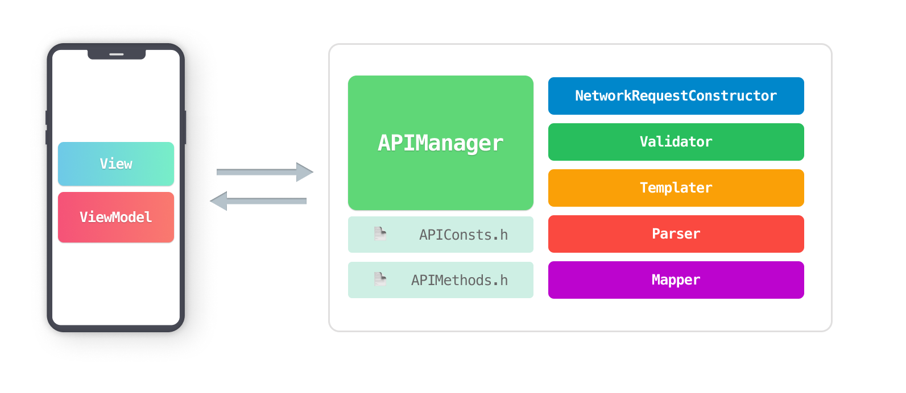
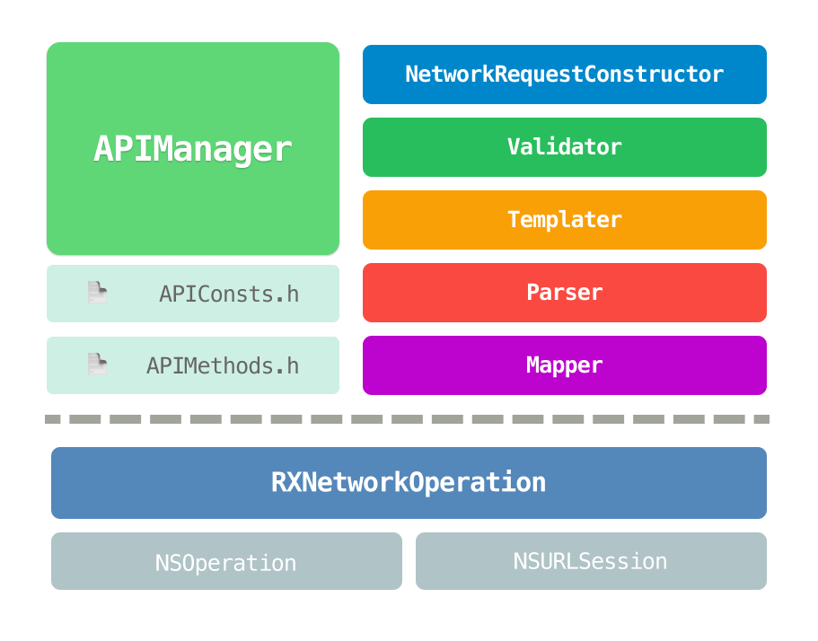
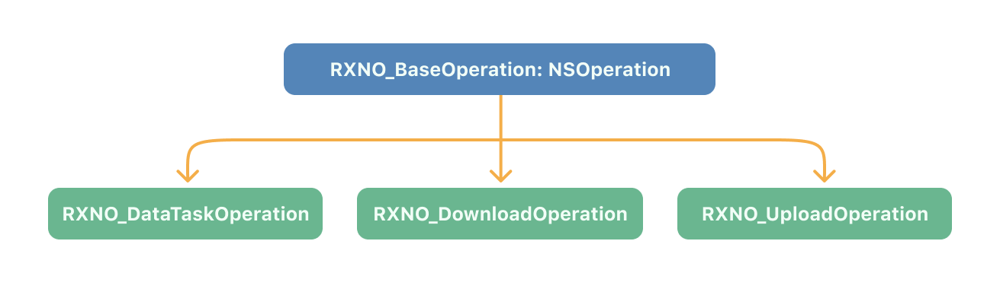
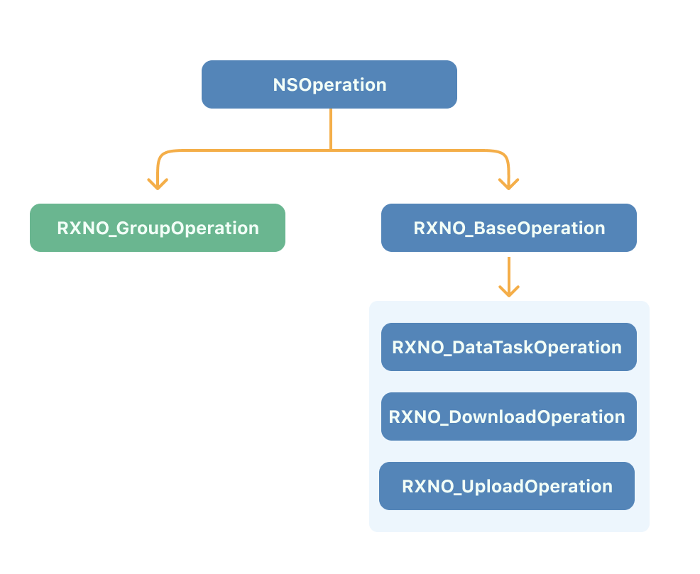
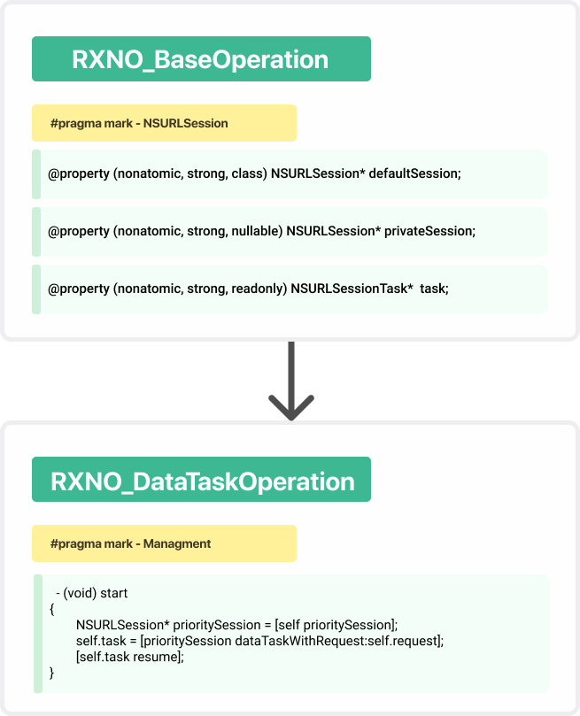
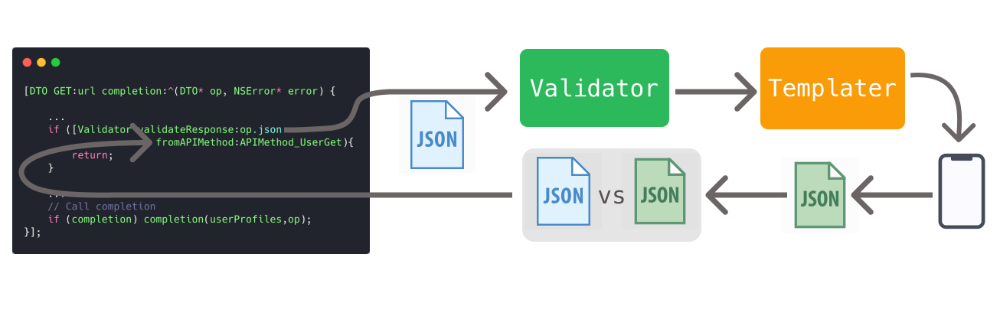
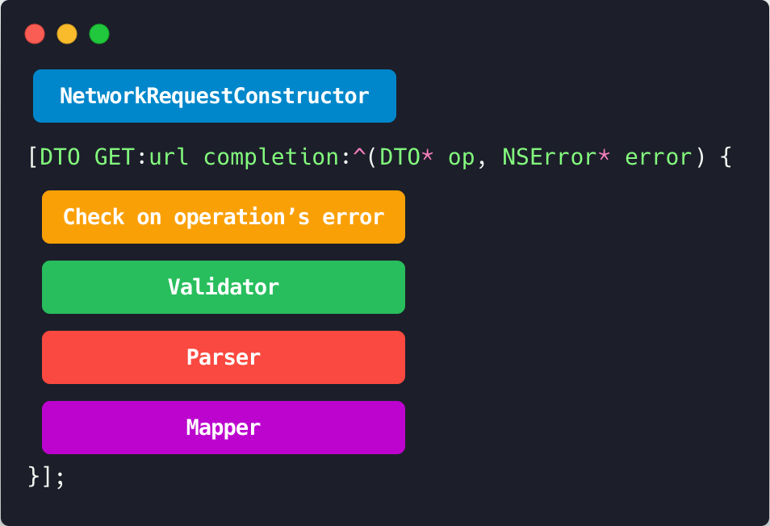
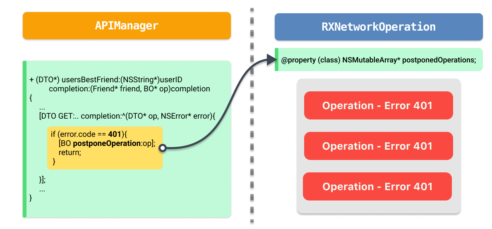
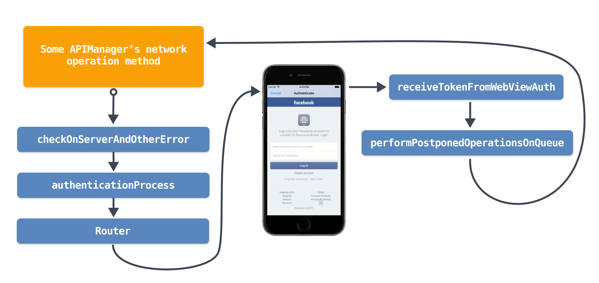
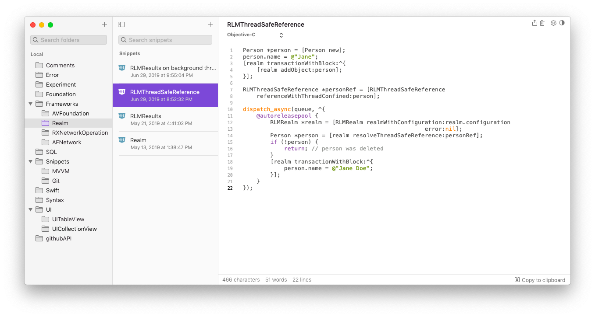

# Сетевой слой - сердце мобильного приложения

Как эффективно спроектировать сетевой слой для iOS приложения.



# Содержание

- [Для кого написана данная статья](#для-кого-написана-данная-статья)
- [Введение](#введение)
- [Архитектура сетевого слоя](#архитектура-сетевого-слоя)
- [Обязанности классов сетевого слоя](#обязанности-классов-сетевого-слоя)
- [Обязанности отдельных файлов сетевого слоя](#обязанности-отдельных-файлов-сетевого-слоя)
- [Краткое знакомство с RXNO](#краткое-знакомство-с-RXNO)
    - [Получаем json](#получаем-json)
    - [Получаем изображение](#получаем-изображение)
    - [Выгружаем фото на сервер](#выгружаем-фото-на-сервер)
    - [Практика избегания callback-hell в сложно составных операциях](#практика-избегания-callback-hell-в-сложно-составных-операциях)
- [Главное правило построение модулей сетевого слоя](#Главное-правило-построение-модулей-сетевого-слоя)
- [Детальный обзоры модулей сетевого слоя](#Детальный-обзоры-модулей-сетевого-слоя)
    - [🌐🕹 APIManager.h](#APIManager.h)
    - [📄 Файл APIConsts.h](#Файл-APIConsts.h)
    - [📄 Файл APIMethods.h](#Файл-APIMethods.h)
    - [🏗🧱 NetworkRequestConstructor](#NetworkRequestConstructor)
    - [🖨🧾 Templater](#Templater)
    - [🚦⚖️ Validator](#Validator)
        - [**📚 Общие правила для всех типов данных**](#общие-правила-для-всех-типов-данных)
        - [**Правила для типа "🅰️🅱️" Strings**](#правила-для-типа-Strings)
        - [**Правила для типа  [🍏 🍎 🍊] Arrays**](#правила-для-типа-Arrays)
        - [**Правила для типа {📖} Dictionaries**](#правила-для-типа-Dictionaries)
        - [**Правила для типа 1️⃣ 2️⃣ 3️⃣ Number**](#правила-для-типа-Number)
    - [🗂 🔍 Parser](#Parser)
    - [📄 ➡️ 💾 Mapper](#Mapper)
    - [🌐🕹 APIManager.m](#APIManager.m)
        - [Проверка наличия интернета](проверка-наличия-интернета)
        - [Создание и обработка сетевых операций внутри APIManager](#создание-и-обработка-сетевых-операций-внутри-APIManager)
        - [Ошибка аутентификации и прочие ошибки](ошибка-аутентификации-и-прочие-ошибки)
        - [Краткое объяснение механизма действий при возникновении 401 ошибки](краткое-объяснение-механизма-действий-при-возникновении-401)
        - [Как сетевой слой обрабатывает ошибки аутентификации](ошибки-аутентификации)
        - [APIManager и категории](#APIManager-и-категории)
- [Практика использования сетевого слоя](#практика-использования-сетевого-слоя)
- [Правила для вьюМоделей в файлах имплементации .m](#правила-для-вьюМоделей-в-файлах-имплементации-.m)
- [Порядок действий при добавлении метода в APIManager](#порядок-действий-при-добавлении-метода-в-APIManager)
- [Подведение итогов](#подведение-итогов)
- [Заключение](#заключение)
- [Рекомендации](#рекомендации)
- [Дополнительно](#дополнительно)
- [Автор](#автор)


## Для кого написана данная статья

Статья главным образом нацелена на разработчиков которые увлечены вопросами построения сетевых слоев для приложений с большой функциональной нагрузкой и сложной архитектурой.

Ниже вы сможете ознакомиться со свежим взглядом на столь актуальные проблемы развития и поддержки сетевого стека приложения 2021 года.

В отличие от большинства работ посвященных темам архитектуры, которые являются по большей части теоретическими, данная статья изобилует примерами конкретных решений. 
И по этой причине является достаточно длинной и объемной, отчего если вы так же как и я крайне увлечены вопросами построения массивных архитектур, для облегчения восприятия рекомендуется разделить знакомство с материалом на несколько заходов, с целью лучшего усвоения знаний.

## Введение

Весь сетевой слой строится на концепции создания группы классов которые инициализируют и обслуживают сетевые операции фреймворка `RXNetworkOperation`.

Сетевые операции - это наследники класса `NSOperation`, которые инкорпорируют в себя поддержку протоколов класса `NSURLSession`, а также добавляют новый слой абстракции для более удобного управления операциями.

Стандартный класс `NSURLSessionTask` (и его наследники) традиционно выполняющие сетевые запросы напротив же принципиально не используется в сетевом слое напрямую, по причине того, что поддержка различных протоколов для корректного функционирования объекта, является громоздкой и недостаточно гибкой.

К примеру если вы хотите во время получения данных из интернета отображать прогресс загрузки, при использовании `RXNetworkOperation` вам не потребуется реализовывать методы протокола, все необходимые данные вы можете получить в соответствующих блоках.  

Вдобавок вам доступна возможность крайне гибко настраивать объекты сетевых операций, в результате чего вы можете выполнять операции синхронно, не создавать проперти для их удержания в памяти, приостанавливать и возобновлять в любой момент, а также пользоваться всеми преимуществами обычного объекта `NSOperation`.

## Архитектура сетевого слоя

Для того чтобы работа с сетью в нашем приложении была легка и приятна, нам требуется провести первоначальную декомпозицию всего сетевого слоя.
Слой будет разделен на следующие модули и файлы, которые вы можете увидеть ниже:  



## Обязанности классов сетевого слоя

| Emoji-Код | Название модуля               | Функциональная обязанность                                                                                                     |
| --------- | ----------------------------- |:------------------------------------------------------------------------------------------------------------------------------ |
| 🌐🕹      | **APIManager**                | Создает и модифицирует сетевые операции, используя остальные модули.                                                           |
| 🏗🧱      | **NetworkRequestConstructor** | Конструирует запросы `NSURLRequest` к `API`.                                                                                   |
| 🚦⚖️      | **Validator**                 | Валидирует ответ полученный от сервера.                                                                                        |
| 🖨🧾      | **Templater**                 | Восстанавливает образцы ответов сервера в формате `.json` с диска устройства, чтобы `Validator` мог сравнить ответ с образцом. |
| 🗂 🔍     | **Parser**                    | Извлекает данные из сложной структуры.                                                                                         |
| 📄 ➡️ 💾  | **Mapper**                    | Собирает модели данных из `json`.                                                                                              |

<br>

## Обязанности отдельных файлов сетевого слоя

| Название файла       | Функциональная обязанность                                             |
| -------------------- | ---------------------------------------------------------------------- |
| 📄  **APIConsts.h**  | Содержит объявление аббревиатур, макросов и СИ-функций.                |
| 📄  **APIMethods.h** | Содержит перечисления `API` методов которые поддерживает сетевой слой. |

<br>

## Краткое знакомство с RXNO

Фреймворк `RXNetworkOperation` (**RXNO**) является приватной коммерческой технологией, которая **не** распространяется в открытом доступе. Однако философия фреймворка и некоторые моменты реализации являются публично открытыми. 

 Итак, приступим к знакомству. 
 Технология предлагает на выбор несколько различных классов для выполнения задач.

| Имя Класса               | Сокращенное название | Предназначение                                                                                                                                                                                                                                                |
| ------------------------ |:--------------------:| ------------------------------------------------------------------------------------------------------------------------------------------------------------------------------------------------------------------------------------------------------------- |
| `RXNO_DataTaskOperation` | **DTO**              | Скачивает данные без записи на диск.<br/>Выгружает данные на сервер.<br/>Является универсальным и самым часто используемым классом.<br/>Широко используется для большинства повседневных задач, получения `json`, скачивание изображений, выгрузки данных.    |
| `RXNO_DownloadOperation` | **DO**               | Скачивает данные и записывает их на диск в качестве отдельного файла.                                                                                                                                                                                         |
| `RXNO_UploadOperation`   | **UO**               | Предназначен для выгрузки данных на сервер, в отличие от `DTO` имеет отличительную способность выгружать данные находящиеся на диске устройства(без предварительной конвертации их в `NSData`), для этого в качестве параметров принимает локальный `NSURL` . |



**Примеры использования:**

#### 1) Получаем json. <a name="получаем-json"></a>
   
   Создает, запускает и удерживает операцию в памяти без необходимости создавать проперти.
   
   ```objectivec
   [[DTO GET:url completion:^(DTO * _Nonnull op, NSError * _Nullable error) {
       NSLog(@"op.json: %@",op.json);
   }] retainOperationAndStart];
   ```
   <br>
   
#### 2. Получаем изображение. <a name="получаем-изображение"></a>
   Создает операцию и добавляет в очередь.
   
   ```objectivec
   DTO* picOp =
   [DTO GET:url params:@{} completion:^(DTO * _Nonnull op, NSError * _Nullable error) {
       UIImage* image = [UIImage imageWithData:op.receivedData];
   }];
   [self.queue addOperation:picOp];
   ```
   <br>

#### 3. Выгружаем фото на сервер <a name="выгружаем-фото-на-сервер"></a>
   Инициализирует операцию с помощью заранее подготовленного `NSURLRequest` и кастомизирует ее поведение путем присвоения приватного `NSURLSession`, на основе которого внутри операции будет создан объект `NSURLSessionDataTask`.
   
   ```objectivec
   NSURLRequest* request = [NSURLRequest new];
   DTO* customOp =
   [DTO request:request uploadProgress:^(DTO * _Nonnull op, DTOUpProgress p) {
   
       NSLog(@"Progress: %f",(float)p.totalBytesSent/p.totalBytesExpectedToSend);
   
   } downloadProgress:nil completion:^(DTO * _Nonnull op, NSError * _Nullable error) {
   
       if (op.state == RXNO_SuccessFinished){
           NSLog(@"Your photo was successfully uploaded!");
       }else{
           NSLog(@"Your photo was uploaded with error: %@",error);
       }
   }];
   customOp.privateSession = self.myPrivateSession;
   [self.queue addOperation:customOp];
   ```
---

<br>

#### Практика избегания callback-hell в сложно составных операциях <a name="практика-избегания-callback-hell-в-сложно-составных-операциях"></a>

Часто можно стать свидетелем того, как для полноценного отображения интерфейса контроллера требуется выполнить несколько сетевых запросов, которые зависят друг от друга и должны выполняться в строгой последовательности.
Например, для того чтобы отобразить всю музыку пользователя в таблице, вам сначала потребуется получить `id` всех альбомов, а затем только скачать сами списки. 

Выше был приведен один из самых тривиальных примеров когда для получения данных нужно выполнить несколько операций, где каждая последующая зависит от данных которые получила предыдущая.

В итоге при использовании стандартных подходов в построении сетевого слоя, а именно использование голых `NSURLSessionTask`, а также оберток по типу `AFNetworking` и прочих, у вас неизбежно будет образовываться `callback-hell `разной степени сложности. <br><br>

<p align="center">
  
</p>

Для решения этого вопроса внутри фреймворка `RXNO` был разработан класс `RXNO_GroupOperation`.
Который точно так же как и `RXNO_BaseOperation` является прям наследником `NSOperation`, и также имеет схожий с `RXNO_BaseOperation` интерфейс управления.

<p align="center">
  
</p>


`RXNO_GroupOperation` имеет некую схожесть с `NSBlockOperation`, и предназначен для того, чтобы в теле его `mainBlock` вы синхронно запускали выполнение обычных сетевых операций, для избежания возникновения `callback-hell`.

В примере ниже мы инициализируем групповую операцию, затем инициализируем две сетевые операции и синхронно их выполняем.

```objectivec
 GO* go =
[GO groupOperation:^(GO * _Nonnull groupOp) {

    DTO* getUsersAlbums = [[DTO GET:url1] syncStart];

    NSArray<NSNumber*>* albums = getUsersAlbums.json[@"albums"];

    DTO* getAllUsersMusic = [[DTO GET:url2 params:@{@"albums":albums}] syncStart];

    [weak.array addObjects:getAllUsersMusic.json[@"music"]];
}];
[self.queue addOperation:go];
```

Таким образом при использовании групповых операций мы полностью избавляемся от такого явления как **callback-hell**, что существенно экономит время разработки.

В начале статье мы говорили, что наша цель это создания сетевого слоя для приложений с весомой функциональной нагрузкой, благодаря внутренним алгоритмам групповых операций, пользователь может собирать из них свои произвольные конструкты, речь идет о том, что имеется возможность в теле одной групповой операции выполнять другие.<br>
Данная особенность открывает целый горизонт возможностей легкого получения больших объемов данных.

В пример можно привести этот симуляционный код:

```objectivec
 // Итак по нажатию кнопки у нас инициализируется групповая операция 'downloadMediaOperation'.
  - (IBAction) downloadMediaContent
 {
   self.downloadMediaOperation = [self getAllMediaContent];
   [self.queue addOperation: self.downloadMediaOperation];
 }

 // Также у нас есть возможность отменить ее выполнение.
 - (IBAction) cancelDownloadingMediaContent
 {
    [self.downloadMediaOperation cancel];
 }
```

Метод `getAllMediaContent` инициализирует одну групповую операцию, в теле которой выполняются две других.

В итоге получается, что конечный пользователь получит всего одну групповую операцию, которая может иметь неограниченную вложенность. В результате работы которой он может получить ожидаемый эффект не имея такого побочного явления как `callback-hell`.

```objectivec
 - (GO*) getAllMediaContent
 {
     __block GroupOperation* group =  [GroupOperation groupProgressDescription:nil
                                                                 progressCount:nil
                                                          progressCancellation:nil
                                                               executableBlock:^(GO * _Nonnull groupOp){

        GO* musicOperation = [weak getAllMusicProgressCancellation:^{
                                // Следим за тем, что если 'group' был отменент, то и отменяем вложенные операции.
                                 if (group.state == RXNO_Cancelled){ [musicOperation cancel]; }
                             }];
        ...

        GO* videoOperation = [weak getAllVideoProgressCancellation:^{
                                // Следим за тем, что если 'group' был отменент, то и отменяем вложенные операции.
                                if (group.state == RXNO_Cancelled){ [videoOperation cancel]; }
                              }];
        ....
     }];
   return group;
 }
```

<br>

## Главное правило построение модулей сетевого слоя

Среди прочих можно выделить одно главенствующие правило, которое заключается в том, что каждый модуль сетевого слоя должен иметь **только методы класса** и **только проперти класса**.

Подобный радикальный шаг был предпринят для того, чтобы избежать порождения кучи синглтонов и вопросов кому и где хранить `strong` ссылки на объекты осуществляющие администрирование сетевого слоя.
<br>
<br>

## Детальный обзоры модулей сетевого слоя

### 🌐🕹 APIManager.h <a name="APIManager.h"></a>

| Главная задача          | Создание, модификация и выполнение сетевых операций.                                                                                                                                        |
| ----------------------- | ------------------------------------------------------------------------------------------------------------------------------------------------------------------------------------------- |
| **Список обязанностей** | - Предоставление методов взаимодействия с `API` продукта.<br/>- Поддерживать протокол аутентификации <Auth2_0_Delegate>.<br/>- Управлять полученным токеном, удалять и записывать в память. |

Фреймворк `RXNO` предоставляет выбор пользователю на основании какой сессии `NSURLSession` будет создана задача `NSURLSessionTask`.<br>
По умолчанию для каждой операции фреймворк предоставляет свою внутреннею сессию, которая является проперти класса.<br>
Несмотря на это, мы имеем возможность установить свою собственную сессию, которая может содержать некие кастомные настройки, и тогда на ее основании будет создана задача `NSURLSessionTask`.

Более наглядно это инженерное решение можно увидеть на данной схеме:

<p align="center">
  
</p>

Как мы можем видеть в методе `start` алгоритм вызывает функцию `prioritySession`, которая возвращает приватную сессию из `privateSession` если она была проинициализирована, а если нет, то возвращает `defaultSession`.

Именно для подобных целей класс `APIManager` хранит собственную дефолтную сессию. 
Чтобы в случае необходимости мы в любой момент могли сконфигурировать сессию и на ее базе создать нужную задачу.

```objectivec
#pragma mark - URLSession

@property (class, nonatomic, readonly, strong) NSURLSession* defaultSession;
```

Такой случай может наступить когда вы должны выполнить запрос с содержанием чувствительных данных, то есть например запрос для перевода средств в банковском приложении.

Для которого одним из требований безопасности будет запрет кэширования любых данных сопутствующих этому запросу, для чего вам собственно и придется создать сессию с эфемерной конфигурацией `[NSURLSessionConfiguration ephemeralSessionConfiguration]`.

К слову сказать в данной реализации версии `APIManager` мы можем видеть только одну сессию класса, на самом деле их может быть неограниченно много, для каждой из ваших потребностей.

---

<br>

Далее мы имеем объявление двух очередей `NSOperationQueue`, они нужны поскольку все наши сетевые соединения выполняются наследниками `NSOperation`.

Очередь `aSyncQueue` предназначена для выполнения асинхронных операций.
А  `syncQueue` исключительно для тех которые нужно выполнять в строгой последовательности.

```objectivec
#pragma mark - Queues
@property (class, nonatomic, readonly, strong) NSOperationQueue* aSyncQueue;
@property (class, nonatomic, readonly, strong) NSOperationQueue* syncQueue;
```

----

<br>

После декларации очередей идет объявление разных вспомогательных методов и проперти, которые занимаются вопросами подготовки и настройки сетевого стека.

```objectivec
#pragma mark - BaseURL & EndPoint
/*--------------------------------------------------------------------------------------------------------------
  Тут можно хранить значение, которое вы намериваетесь использовать в качестве адреса к серверу во всех запросах.
  Например: 'https://api.vk.com/method/'
 --------------------------------------------------------------------------------------------------------------*/
@property (class, nonatomic, strong, nullable) NSString* baseURL;

/*--------------------------------------------------------------------------------------------------------------
  Возвращает результат соединения двух строк. 'baseURL' и значение из аргумента 'method'.
 --------------------------------------------------------------------------------------------------------------*/
+ (NSString*) baseURLappend:(NSString*)method;


#pragma mark - Customization
/*--------------------------------------------------------------------------------------------------------------
 Метод создан для возможности дополнительной настройки 'APIManager'a перед использованием.
 Например, вы хотите задать некие дополнительные пользовательские параметры.
 Вы можете сделать это, вызывает данный метод внутри 'didFinishLaunchingWithOptions:..'.
 --------------------------------------------------------------------------------------------------------------*/
+ (void) prepareAPIManagerBeforeUsing:(nullable void(^)(void))completion;
```

---

<br>

Далее следует объявление проперти хранящие токен и методы управления им.

```objectivec
#pragma mark - Token Property
/*--------------------------------------------------------------------------------------------------------------
  Проперти хранит модель токена полученного после авторизации.
  Если вы перезапустили приложение, то геттер проперти автоматически извлечет токен из 'KeyChain'.
 --------------------------------------------------------------------------------------------------------------*/
@property (class, nonatomic, strong, nullable) Token* token;


#pragma mark - Token Access Methods

+ (BOOL) isThereTokenInKeychain;                //  Возвращает 'YES' если токен был записан в 'KeyChain'
+ (nullable Token*) restoreTokenFromKeychain;   //  Восстанавливает модель токена из 'KeyChain'

+ (void)     removeTokenInKeychain;             //  Удаляет токен из 'KeyChain'
+ (NSError*) saveTokenInKeychain:(Token*)token; //  Сохраняет токен в 'KeyChain'

/*--------------------------------------------------------------------------------------------------------------
  Как правило, метод вызывается после успешной авторизации или получения обновленного токена.
  Метод обновляет значение в самом проперти 'token', а также записывает новую версию в 'KeyChain'.
 --------------------------------------------------------------------------------------------------------------*/
+ (void) updateToken:(NSString*)accessToken expiresAfter:(NSString*)expiresAfter userID:(NSString*)userID;
```

---

Ниже идет секция методов которые выполняют требования протокола `<Auth2_0_Delegate>`.<br>
Который занимается вопросами координации процесса получения токена.

```objectivec
#pragma mark - <Auth2_0_Delegate>
/*--------------------------------------------------------------------------------------------------------------
 'AuthViewController' вызывает этот метод у своего делегата и передает ему полученный токен.
 --------------------------------------------------------------------------------------------------------------*/
+ (void) receiveTokenFromWebViewAuth:(nullable Token*)token error:(nullable NSError*)error;

/*--------------------------------------------------------------------------------------------------------------
 Данный метод вызывается внутренними алгоритмами APIManager, если операция завершилась неудачно по причине 
 устаревшего токена. Внутри вызывается метод класса 'Router', который представляет 'AuthViewController'. 
 В свою очередь который после получение свежего токена вызывает метод 'receiveTokenFromWebViewAuth' у своего делегата,
 которым является класс APIManager.
 --------------------------------------------------------------------------------------------------------------*/
+ (void) authenticationProcess:(nullable AuthenticationCompletion)completion;
```

----

<br>

В предпоследней секции под названием `Network Operations`, содержаться методы, которые создают операции, которые непосредственно осуществляют все взаимодействие с интернетом.

Ниже приведены в пример несколько демонстрационных методов получающие данные пользователей.<br>
Обратите внимание на некоторые моменты:

1) Все методы являются исключительно методами классов.

2) Все методы имеют параметры которые, принимают данных из которых будет компоноваться запрос. 
   Если для выполнения запроса вам потребуется передать большое количество данных, вместо множества параметров имеет смысл объявить один `:(nullable NSDictionary<NSString*,id>*)properties` .

3) Метод возвращают не только объекты `DTO,DO,UO`, а также и групповые операции `GO`.

```objectivec
#pragma mark - Network Operations
/*--------------------------------------------------------------------------------------------------------------
 Возвращает массив информации о пользователях
 --------------------------------------------------------------------------------------------------------------*/
+ (DTO*) usersGet:(NSArray<NSString*>*)userIDs
           fields:(NSArray<NSString*>* _Nullable)fields
       completion:(nullable void(^)(NSArray<UserProfile*>* _Nullable userProfiles, BO* op))completion;


/*--------------------------------------------------------------------------------------------------------------
 Возвращает массив записей со стены пользователя или сообщества
 --------------------------------------------------------------------------------------------------------------*/
+ (DTO*) wallGet:(nullable NSString*)ownerID
          offset:(NSInteger)offset
           count:(NSInteger)count
          filter:(nullable NSString*)filter
      completion:(nullable void(^)(NSArray<WallPost*>* _Nullable wallPosts, BO* op))completion;

/*--------------------------------------------------------------------------------------------------------------
 Метод загружает массив изображений на сервер.
 Ограничения: не более 6 фотографий за один раз в методе.
 --------------------------------------------------------------------------------------------------------------*/
+ (GO*) uploadImages:(NSArray<NSData*>*)imagesData
              userID:(nullable NSString*)userID
             groupID:(nullable NSString*)groupID
          completion:(nullable void(^)(NSArray<NSDictionary*>* _Nullable savedImages, GO* op))completion;

/*--------------------------------------------------------------------------------------------------------------
 Совершает запрос к серверу. Удаляет файлы cookie в 'WKWebsiteDataStore'.
 Сбрасывает значение в 'APIManager.token' и удаляет токен из 'KeyChain'.
 --------------------------------------------------------------------------------------------------------------*/
+ (DTO*) logout:(nullable void(^)(void)) completion;
```

----

<br>

И наконец в последней секции перечисленны вспомогательные методы, в которые выносят разный код с целью избегания его дублирования и сокращения общего количества кода в приложении.

```objectivec
#pragma mark - Helpers - Syntax Sugar
/*--------------------------------------------------------------------------------------------------------------
 Ниже будут представлены методы который позволяют сократить синтаксис кода при работе с сетевым слоем.
 --------------------------------------------------------------------------------------------------------------*/

/*--------------------------------------------------------------------------------------------------------------
 Метод вызывается внутри групповых операций, чтобы прекращать выполнение последующих операций, если текущая была
 завершена с ошибкой. Метод вызывает переданный 'completion' блок, если операция содержит 'error'.
 --------------------------------------------------------------------------------------------------------------*/
+ (NSError*) callCompletion:(nullable void(^)(NSError* _Nullable error))completion ifOccuredErrorInOperation:(BO*)op;

/*--------------------------------------------------------------------------------------------------------------
 Метод создан для сокращения синтаксиса.
 Вызывается внутри 'completion' блоков методов класса APIManager.
 --------------------------------------------------------------------------------------------------------------*/
+ (NSError*) callCompletionWithTwoArg:(nullable void(^)(NSError* _Nullable error, id _Nullable arg1))completion ifOccuredErrorInOperation:(BO*)op;

+ (NSError*) callCompletionWithThreeArg:(nullable void(^)(NSError* _Nullable error, id _Nullable arg1, id _Nullable arg2))completion ifOccuredErrorInOperation:(BO*)op;
```

Весь код вы можете увидеть здесь: [APIManager.h](CodeSnippets(RU)/APIManager.h)
<br><br>

### 📄 Файл APIConsts.h <a name="Файл-APIConsts.h"></a>

В данном файле мы объявляем все `typedef` сокращения для классов и блоков, макросы `#define` и СИ-функции.

```objectivec
#ifndef APIConsts_h
#define APIConsts_h

/*--------------------------------------------------------------------------------------------------------------
 (📄) File 'APIConsts.h' - содержит объявление аббревиатур и сокращенных названий
 --------------------------------------------------------------------------------------------------------------*/

@class  APIManager;
typedef APIManager API;

@class  NetworkRequestConstructor;
typedef NetworkRequestConstructor NRC;

typedef void(^AuthenticationCompletion)(NSError* _Nullable error);


/*--------------------------------------------------------------------------------------------------------------
Макрос созданный для ситуации когда в приложении отключено логирование. Но по-прежнему имеется потребность выводить 
логи во время возникновения критических ошибок. Например: Валидатор не может найти шаблон запроса на диске и поэтому
возвращает ошибку даже для корректного ответа сервера.
 --------------------------------------------------------------------------------------------------------------*/
#if __has_feature(objc_arc)
#define APILog(FORMAT, ...) fprintf(stderr,"%s %s\n", [[NSString stringWithFormat:@"%s",__PRETTY_FUNCTION__] UTF8String], [[NSString stringWithFormat:FORMAT, ##__VA_ARGS__] UTF8String]);
#else
#define APILog(format, ...) CFShow([NSString stringWithFormat:@"%s %@",__PRETTY_FUNCTION__, [NSString stringWithFormat:format, ## __VA_ARGS__]]);
#endif

#endif
```

Весь код вы можете увидеть здесь: [APIConsts.h](CodeSnippets(RU)/APIConsts.h)
<br><br>

### 📄 Файл APIMethods.h <a name="Файл-APIMethods.h"></a>

Хорошим тоном является объявление всех строковых констант в одном месте. Что мы и сделаем, объявив в файле `APIMethods.h` все методы которые поддерживает наш сетевой слой.

Помимо строковых констант файл имеет дублирование тех же самых методов уже в формате `enum`.
Это сделано для общего удобства пользователя, который будет передавать свои аргументы в параметры методов конфигурирующих сетевые запросы.

```objectivec
#ifndef APIMethods_h
#define APIMethods_h

/*--------------------------------------------------------------------------------------------------------------
 (📄) File 'APIMethods.h' - содержит перечисления API методов которые поддерживает 'APIManager'
 --------------------------------------------------------------------------------------------------------------*/

#pragma mark - Enum API Part
/*--------------------------------------------------------------------------------------------------------------
 Перечисления API методов которые поддерживает 'APIManager'.
 Используются для удобства в 'NetworkRequestConstructor' в качестве аргументов для функций построения запросов.
 --------------------------------------------------------------------------------------------------------------*/
typedef NS_ENUM(NSInteger, APIMethod) {

    APIMethod_Unknow = 0,
    APIMethod_UserGet,
    APIMethod_FriendsGet,

    APIMethod_WallGet,
    APIMethod_WallPost,

    APIMethod_PhotosGetAll,
    APIMethod_PhotosGetWallUploadServer,
    APIMethod_PhotosSaveWallPhoto,

    APIMethod_Logout
};


#pragma mark - String Constants API Part
/*--------------------------------------------------------------------------------------------------------------
  Строковые константы содержащие название EndPoint название API-методов.
  Используются конструктором 'NetworkRequestConstructor' при построении NSURLRequest.
 --------------------------------------------------------------------------------------------------------------*/
static NSString *const usersGet = @"users.get"; // Возвращает расширенную информацию о пользователях.
static NSString *const wallGet  = @"wall.get";  // Возвращает записи со стены пользователей
static NSString *const wallPost = @"wall.post"; // Позволяет создать запись на стене,

static NSString *const photosGetAll  = @"photos.getAll"; // Возвращает все фотографии пользователя или сообщества в анти-хронологическом порядке.
static NSString *const friendsGet    = @"friends.get";   // Возвращает список идентификаторов друзей пользователя или расширенную информацию о друзьях пользователя


static NSString *const photosGetWallUploadServer = @"photos.getWallUploadServer"; // Возвращает адрес сервера для загрузки фотографии на стену пользователя или сообщества.
static NSString *const photosSaveWallPhoto       = @"photos.saveWallPhoto";       // Сохраняет фотографии после успешной загрузки на URI, полученный методом

static NSString *const logout = @"auth.logout";

#endif 
```

Весь код вы можете увидеть здесь: [APIMethods.h](CodeSnippets(RU)/APIMethods.h)
<br><br>

### 🏗🧱 NetworkRequestConstructor <a name="NetworkRequestConstructor"></a>

| Главная задача          | Конструировать запросы 'NSURLRequest' для обращения к API |
| ----------------------- | --------------------------------------------------------- |
| **Список обязанностей** | - Конфигурация сетевых запросов                           |

Философия данного модуля заключается в предоставлении пользователю нескольких вариантов инициализации запросов.

1. Вы можете получить нужный вам запрос используя общий метод `+buildRequestForMethod:properties:.`<br>
   В который передается значение из того самого енума `APIMethod` из файла `APIMethods.h`, и в параметр `properties` вы должны передать все необходимые значения.

2. Вы можете получить нужный вам запрос используя индивидуальную для каждого метода `API` функцию.<br>
   Которые также делятся на два подвида:
   
   - Первый вид принимает несколько сырых аргументов (`int`/`nsstring`/`float`/итд) и сам формирует запрос.
   
   - Второй вид принимает готовый словарь с параметрами, и в случае надобности самостоятельно добавляет необходимые значения.

```objectivec
@interface NetworkRequestConstructor : NSObject

#pragma mark - Shared method

/*--------------------------------------------------------------------------------------------------------------
 🥇 Основной метод для взаимодействия с конструктором запросов.
 --------------------------------------------------------------------------------------------------------------*/
+ (nullable NSMutableURLRequest*) buildRequestForMethod:(APIMethod)method
                                             properties:(nullable NSDictionary<NSString*,id>*)properties;

#pragma mark - Individual methods
#pragma mark - APIMethod - users.get

/*--------------------------------------------------------------------------------------------------------------
 ⭐️ Возвращает расширенную информацию о пользователях.
 -------
 📥 Формирует запрос из пришедшего словаря с параметрами:

 - user_ids  : [81313]
 - fields    : [photo_50,photo_100,online,last_seen,music]
 - name_case : Nom
 -------
 📖 Подробнее: https://vk.com/dev/users.get
 --------------------------------------------------------------------------------------------------------------*/
+ (nullable NSMutableURLRequest*) buildRequestForMethod_UsersGet:(nullable NSDictionary<NSString*,id>*)properties;

+ (nullable NSMutableURLRequest*) buildRequestForMethod_UsersGet:(nullable NSArray<NSString*>*)userIds
                                                          fields:(nullable NSArray<NSString*>*)fields
                                                        nameCase:(nullable NSString*)nameCase;


#pragma mark - APIMethod - wall.get

/*--------------------------------------------------------------------------------------------------------------
 ⭐️ Возвращает записи со стены.
 -------
 📥 Формирует запрос из пришедшего словаря с параметрами:

 - owner_id  : 81313
 - offset    : 0
 - count     : 10
 - filter    : all
 -------
 📖 Подробнее: https://vk.com/dev/wall.get
 --------------------------------------------------------------------------------------------------------------*/
+ (NSMutableURLRequest* _Nullable) buildRequestForMethod_WallGet:(nullable NSDictionary<NSString*,id>*)properties;

+ (NSMutableURLRequest* _Nullable) buildRequestForMethod_WallGet:(nullable NSString*)ownerID
                                                          offset:(NSInteger)offset
                                                           count:(NSInteger)count
                                                          filter:(nullable NSString*)filter;

#pragma mark - APIMethod - oauth.logout

+ (NSMutableURLRequest*) buildRequestForMethod_logout;

@end
```

**Пример реализации методов**

```objectivec
+ (NSMutableURLRequest* _Nullable) buildRequestForMethod_FriendsGet:(nullable NSString*)ownerID
                                                              order:(nullable NSString*)order
                                                             fields:(NSArray<NSString*>* _Nullable)fields
                                                              count:(NSInteger)count
                                                             offset:(NSInteger)offset
{
    NSMutableDictionary* properties = [NSMutableDictionary new];

    properties[@"user_id"] = (ownerID.length  > 0) ? ownerID  : APIManager.token.userID;
    properties[@"offset"]  = [NSString stringWithFormat:@"%d",(int)offset];
    properties[@"count"]   = (count > 0) ? [NSString stringWithFormat:@"%d",(int)count] : @"1";
    return [NRC buildRequestForMethod_FriendsGet:properties];
}


+ (NSMutableURLRequest* _Nullable) buildRequestForMethod_FriendsGet:(nullable NSDictionary<NSString*,id>*)properties
{
    // Создаем свой словарь с параметрами, с целью добавить недостающие параметры если пользователь
    // не передал их самостоятельно.
    NSMutableDictionary* params = [NSMutableDictionary new];
    params[@"user_id"] = APIManager.token.userID;
    params[@"offset"]  = @"0";
    params[@"count"]   = @"1";

    params[@"order"]   = @"hints";
    params[@"fields"]  = @[@"photo_50",@"photo_100"];

    params[@"name_case"]    =  @"nom";
    params[@"v"]            =  @"5.21";
    params[@"access_token"] =  APIManager.token.access_token;

    // Объединяем словарь из параметров с шаблоном.
    // Если одно и тоже проперти есть в двух словарях, то приоритет отдается значению из словаря который
    // передал пользователь в параметры метода 
    if ((properties.allKeys.count > 0) || (properties != nil)){
        params = (NSMutableDictionary*)[params mergeWithHighPriority:properties isConcatenateArrays:YES];
    }

    // Формируем request
    NSMutableURLRequest* request =
    [BO createRequestWithURL:[API baseURLappend:friendsGet] HTTPMethod:GET params:params headers:nil];
    return request;
}
```

Весь код вы можете увидеть здесь: 

| Хедер файл                                                                  | Файл имплементации                                                          |
| --------------------------------------------------------------------------- | --------------------------------------------------------------------------- |
| [NetworkRequestConstructor.h](CodeSnippets(RU)/NetworkRequestConstructor.h) | [NetworkRequestConstructor.m](CodeSnippets(RU)/NetworkRequestConstructor.m) |

<br><br>

### 🖨🧾 Templater <a name="Templater"></a>

| Главная задача          | Восстанавливать образцы ответов сервера в формате .json с диска устройства.                                                                                                                                                                                                                                                                                                                                                                                                                                                                                                 |
| ----------------------- | --------------------------------------------------------------------------------------------------------------------------------------------------------------------------------------------------------------------------------------------------------------------------------------------------------------------------------------------------------------------------------------------------------------------------------------------------------------------------------------------------------------------------------------------------------------------------- |
| **Список обязанностей** | - Взаимодействовать с классом `TemplaterFileManager` который осуществляет управление песочницей.<br/><br/>- Записывать/Читать значения из `NSUserDefault`.<br/><br/>- Инициализировать словари из `json` файлов находящихся в песочнице приложения.<br/><br/>- Записывать шаблоны в песочницу по имени `API` метода, по которому был совершен запрос.<br/><br/>- Удалять конкретный шаблон, по имени `API` метода, по которому был совершен запрос.<br/><br/>- Удалять все шаблоны с диска.<br/><br/>- Возможность безопасно перемещать папку с шаблонами в другие локации. |

В диаграмме которая описывает архитектуру всего сетевого слоя, модуль `Templater` стоял ниже чем `Validator`, однако суть работы валидатора тяжело понять без знания механизма работы `Templater`.

Ниже мы можем увидеть как обрабатываются каждый ответ от сервера внутри `APIManager`.<br> 
После удачного выполнения сетевой операции мы вызываем метод валидации ответа, куда передаем сам `json` и значения енума, которое хранит название `API` метода.<br> 

Далее `Validator` самостоятельно вызывает метод класса `Templater`, который будет пытаться восстановить образец корректного ответа сервера.<br> 
В случае если в хранилище устройства окажется нужный образец, произойдет сравнительная проверка.<br> 

Если она будет пройдена успешно, то метод валидации `validateResponse:fromAPIMethod:` вернет `nil`, в противном случае будет возвращена ошибка.<br> 

<p align="center">
  
</p>


Не будем вдаваться в подробности реализации данного модуля, по причине того, что он содержит множество вспомогательных функций, которые обеспечивают корректное функционирование, но прямого отношения к работе сетевого слоя не имеют.

Однако следует сказать о некоторых возможностях которые предоставляет класс.

1. Если вы имеете намерения зашить правильные образцы ответов сервера в проект приложения, то самым удобным способом будет создания архива с именем `APIManagerResponseDefaultTemplates.zip`, который необходимо добавить в `Bundle` приложения.<br> 
   А после вы должны вызывать безопасный метод распаковки `unarchiveFolderWithDefaultTemplates`, даже если вы вызовите его несколько раз то архив заново распакован не будет.<br> 
   Рекомендуется поместить вызов метода распаковщик внутрь метода предварительной настройки `APIManager`'a.
   
   ```objectivec
   + (void) prepareAPIManagerBeforeUsing:(nullable void(^)(void))completion
   {
       ...
      [Templater unarchiveFolderWithDefaultTemplates:nil completion:^(NSError * _Nonnull error) {
           if (error) APILog(@"unarchiveFolderWithDefaultTemplates error: %@",error);
       }];
       if (completion) completion();
   }
   ```

2. Имеется возможность самому определить место где будет распакован архив. Кроме того, вы можете вызвать метод перемещения папки, если решили изменить место положение и тогда внутренние алгоритмы безопасно перенесут данные в новую локацию.

3. После восстановления `json` с диска, образец будет храниться в оперативной памяти устройства. 
   Что позволит сократить время при повторной валидации запроса совершенного по данному `API` методу.

4. Также если вы по каким либо причинам не имеете возможности сохранить целый архив с корректными образцами, архитектура модуля подразумевает возможность записывать примеры корректных ответов на диск динамически.

Выше были изложены самые главные особенности и функциональные обязанности, после чего можно показать сам`.h `файл. 

```objectivec
@interface Templater : NSObject

/*--------------------------------------------------------------------------------------------------------------
 Возвращает адрес на папку, которая содержит файлы-шаблоны.
 Если вы измените значение папки, то папка вместе с файлами переместиться в другое место.
 --------------------------------------------------------------------------------------------------------------*/
@property (atomic, strong, readonly, class) NSString* pathToTemplateDirectory;

/*--------------------------------------------------------------------------------------------------------------
 По умолчанию имеет значение 'NO'. Если заменить на 'YES', то требуемый файл будет искать в bundle приложения.
 --------------------------------------------------------------------------------------------------------------*/
@property (nonatomic, assign, class) BOOL loadTemplateFromBundle;

#pragma mark - Methods
/*--------------------------------------------------------------------------------------------------------------
 Позволяет безопасно изменить местоположение папки с шаблонами.
 --------------------------------------------------------------------------------------------------------------*/
+ (void) setNewPathToTemplateDirectory:(NSString*)path;

/*--------------------------------------------------------------------------------------------------------------
 Восстанавливает ранее записанный json файл с диска или возвращает его из RAM памяти.
 --------------------------------------------------------------------------------------------------------------*/
+ (nullable NSDictionary*) templateForAPIMethod:(APIMethod)method;

/*--------------------------------------------------------------------------------------------------------------
 Записывает образец файла с именем API метода
 --------------------------------------------------------------------------------------------------------------*/
+ (nullable NSError*) writeTemplate:(NSDictionary*)template forAPIMethod:(APIMethod)method;

/*--------------------------------------------------------------------------------------------------------------
 Удаляет образец файла с диска и из RAM по имени API метода
 --------------------------------------------------------------------------------------------------------------*/
+ (nullable NSError*) removeTemplateForAPIMethod:(APIMethod)method;

/*--------------------------------------------------------------------------------------------------------------
 Позволяет безопасно удалить папку со всеми шаблонами одновременно
 --------------------------------------------------------------------------------------------------------------*/
+ (nullable NSError*) removeAllTemplates;


/*--------------------------------------------------------------------------------------------------------------
 Метод распаковывает архив с папкой стандартных json файлов (ответов от сервера).
 Если укажите nil в аргумент 'atPath', тогда алгоритм автоматический разархивирует папку по пути 'Templater.pathToTemplateDirectory'.
 Данный метод вы можете вызывать каждый раз при запуске приложения внутри метода +APIManager.prepareBeforeUsing:,
 внутри встроена защита от повторных разархивировании.
 --------------------------------------------------------------------------------------------------------------*/
+ (void) unarchiveFolderWithDefaultTemplates:(nullable NSString*)atPath
                                  completion:(nullable void(^)(NSError* error))completion;

@end
```

Весь код вы можете увидеть здесь: 

| Хедер файл                                                        | Файл имплементации                                                |
| ----------------------------------------------------------------- | ----------------------------------------------------------------- |
| [Templater.h](CodeSnippets(RU)/Templater.h)                       | [TemplaterFileManager.h](CodeSnippets(RU)/TemplaterFileManager.h) |
| [TemplaterFileManager.h](CodeSnippets(RU)/TemplaterFileManager.h) | [TemplaterFileManager.m](CodeSnippets(RU)/TemplaterFileManager.m) |

<br><br>

### 🚦⚖️ Validator <a name="Validator"></a>

| Главная задача          | Находить возможные ошибки в полученном файле и уведомить об этом пользователя.                                                                                                                                 |
| ----------------------- | -------------------------------------------------------------------------------------------------------------------------------------------------------------------------------------------------------------- |
| **Список обязанностей** | - Валидировать ответы от сервера по ключам методов `API`.<br/>- Вы можете передать пару `json`+`APIMethod` в общий метод, который самостоятельно определит нужный метод валидации и вернет вам результат.<br/> |

Модуль `Validator` поддерживает два вида валидации полученных ответов.

1. **Автоматический** - проверяется наличие ключей в словарях, типы данных хранимые по этим ключам, а также возможна "проверка на правила".

2. **Ручной** - когда сам разработчик решает как ему определять корректность или некорректность ответа.

Несомненно стоит отметить, что процесс валидации является очень специфическим.<br>
И не для всех `backend`'ов может подойти автоматический вариант.<br>
В таком случае рекомендуется создавать методы ручной проверки.

Итак, ниже мы можем видеть один общий метод, и метод автоматической валидации.

```objectivec
@interface Validator : NSObject

#pragma mark - Shared Validation Methods
/*--------------------------------------------------------------------------------------------------------------
 Метод распределитель, самостоятельно определяет какой метод валидации вызывать для json полученного по конкретному методу API
 --------------------------------------------------------------------------------------------------------------*/
+ (NSError* _Nullable) validateResponse:(NSDictionary*)recievedJSON fromAPIMethod:(APIMethod)method;


#pragma mark - Automatic Validation (for pair json + template)
/*--------------------------------------------------------------------------------------------------------------
 Метод автоматической валидации сверяет пришедший json и образец с диска.
 В случае нахождения несовпадений - возвращает ошибку.

 Стандартная процедура валидации заключается в нескольких действиях:
 1. Проверка на наличие всех ключей из шаблона в json.
 2. Проверка на идентичные типы данных (чтобы по одному и тому же ключу были был один тип).

 (Дополнительно)
  3. Если шаблон содержит "правила" валидации, они также будут выполнены.
     Например, можно валидировать какое-то конкретное значение из json на длину,соотвествие,суффиксу итд.
     Для этого объект который вы хотите валидировать должен иметь словарь правил с его именем (напр: "age-Rules").
 --------------------------------------------------------------------------------------------------------------*/
+ (NSError* _Nullable) automaticValidateResponse:(NSDictionary*)recievedJSON
                                        template:(NSDictionary*)templateJSON
                                  validationMask:(ResponseValidationMask)mask
                                   fromAPIMethod:(APIMethod)method;
...

@end
```

После них объявляются методы поддержки валидации ответов для конкретных `API` методов.

Правила нэйминга для методов валидации является следующим:`validateResponseFrom_`+ `название метода API`.

```objectivec
#pragma mark - Specified Validation Method (for specific API method)

/*--------------------------------------------------------------------------------------------------------------
  Метод валидирует ответ сервера на запрос метода "users.get".
 --------------------------------------------------------------------------------------------------------------*/
+ (NSError* _Nullable) validateResponseFrom_usersGet:(NSDictionary*)recievedJSON;

/*--------------------------------------------------------------------------------------------------------------
 Метод валидирует ответ сервера на запрос метода "wall.get".
 --------------------------------------------------------------------------------------------------------------*/
+ (NSError* _Nullable) validateResponseFrom_wallGet:(NSDictionary*)recievedJSON;

/*--------------------------------------------------------------------------------------------------------------
 Метод валидирует ответ сервера на запрос метода "photos.getAll".
 --------------------------------------------------------------------------------------------------------------*/
+ (NSError* _Nullable) validateResponseFrom_photosGetAll:(NSDictionary*)recievedJSON;

/*--------------------------------------------------------------------------------------------------------------
 Метод валидирует ответ сервера на запрос метода "friends.get".
 --------------------------------------------------------------------------------------------------------------*/
+ (NSError* _Nullable) validateResponseFrom_friendsGet:(NSDictionary*)recievedJSON;
```

<br>

**Пример реализации метода**

Реализация метода полностью зависит от потребностей разработчика.<br>
Вы можете написать тут собственную кастомную проверку, а при наличии шаблона можете воспользоваться методом
автоматического тестирования, который сверит полученный `json` и его образец с диска по десятку параметров.

```objectivec
/*--------------------------------------------------------------------------------------------------------------
 Метод валидирует ответ сервера на запрос метода "users.get".
 --------------------------------------------------------------------------------------------------------------*/
+ (NSError* _Nullable) validateResponseFrom_usersGet:(NSDictionary*)recievedJSON
{
    // Пробует найти сохраненный образец ответа на диске
    NSDictionary* template = [Templater templateForAPIMethod:APIMethod_UserGet];
    // Если не находит его, значит не с чем сравнивать
    if (!template) return nil;


    // Если находит, то вызывает метод автоматической валидации
    NSError* error = [Validator automaticValidateResponse:recievedJSON
                                                 template:template
                                           validationMask:AllChecks
                                            fromAPIMethod:APIMethod_UserGet];
    return error;
}
```

<br>

**Альтернативная реализация**

```objectivec
/*--------------------------------------------------------------------------------------------------------------
 Метод валидирует ответ сервера на запрос метода "friends.get".
 --------------------------------------------------------------------------------------------------------------*/
+ (NSError* _Nullable) validateResponseFrom_friendsGet:(NSDictionary*)recievedJSON
{
    if !(recievedJSON[@"response"]) 
         return [NSError errorWithDomain:@"hasn't 'response' in json from 'friends.get'" code:0 userInfo:nil];

  return nil;
}
```

**Подробнее об автоматической валидации данных**

Выше вы уже могли увидеть упоминания о методе выполняющим автоматическую проверку, теперь пришло время познакомиться с ним поближе.<br>
Итак, один из главных параметров, которые принимает метод это битовая маска.<br> 
Вы можете передать тот набор флагов, проверку на которые вас интересует в каждом конкретном случае.

```objectivec
/*--------------------------------------------------------------------------------------------------------------
  Битовая маска, содержит настройки по которым будет валидироваться ответ сервера.
 --------------------------------------------------------------------------------------------------------------*/
typedef NS_OPTIONS(NSUInteger, ResponseValidationMask) {

    CheckOnKeys           = 1 << 0, // Проверяет наличие ключей из шаблона в полученном json от сервера
    CheckSubEntityOnKeys  = 1 << 1, // Проверяет наличие ключей из шаблона во вложенных структурах
    CheckOnTypesOfValues  = 1 << 2, // Проверяет соответствие типов данных по ключам
    CheckOnExtendedRules  = 1 << 3, // Осуществляет проверку на правила (если они были перечисленны в шаблоне)

    AllChecks = CheckOnKeys | CheckSubEntityOnKeys | CheckOnTypesOfValues | CheckOnExtendedRules
};
```

---

⚠️ **Есть только лишь одно важное исключение**. 

Автоматические алгоритмы способны <u><mark>валидировать только словари</mark></u>. Сравнивать между собой два массива алгоритм не может, по причине невозможности установить какие объекты сравнивать друг с другом.<br>
Поэтому если ваш сервер возвращает массив, а вы хотите использовать методы автоматической валидации, увы сделать этого не получиться.<br>
Только если создать полуавтоматический метод, который самостоятельно будет извлекать элементы из массива и передавать их в методы авт.валидации.

---

Если вы внимательно читали весь раздел выше, то могли заметить выражение "**словарь правил**".<br>
Данный термин означает словарь в котором хранятся непосредственные параметры валидации <u>для конкретного проперти</u>.

**Приведем  пример**:<br>
Представим перед вами стоит задача валидировать ответ сервера на предмет возраста юзера. Чтобы ему было больше `18` но меньше `27`.<br>
Тогда для решения этого вопроса создайте в шаблоне "`словарь с правилами`".<br> 
Ключ к правилам должен содержать имя объекта валидации и суффикс `-Rules` на конце.

```objectivec
(Template.json)
{
  "age" : 20,
  "age-Rules" : { "minimum" : 18,
                  "maximum" : 27
                }
}
```

 Получив данный словарь с правилами, алгоритм будет проверять значение, чтобы оно находилось в диапазоне `18-27`.

Итак, изучив демонстрационный пример мы поняли что такое "**словарь правил**", и по какому принципу он работает.<br> 
Теперь давайте ознакомимся с остальными возможностями этой технологии.

---

**📚 Общие правила для всех типов данных** <a name="Общие-правила-для-всех-типов-данных"></a>

| Название ключа   | Описание                                                                                                                                                                                                                                                                                                       |
| ---------------- | -------------------------------------------------------------------------------------------------------------------------------------------------------------------------------------------------------------------------------------------------------------------------------------------------------------- |
| 👉🏻`isOptional` | (По-умолчанию отсутствие ключа из шаблона в ответе сервера - воспринимается алгоритмом как ошибка).<br/><br/>                     Значение `true` для этого ключа будет говорить алгоритму, что наличие пары (ключ-значение)<br/><br/>                     для этого `json` объекта - является необязательным. |
| 👉🏻`mustMatch`  | Значение `true` требует соответствия значения переменной из шаблона, с тем что пришло с сервера.<br/><br/>                    Данный ключ применим ко всем следующим типа данных (`Strings/Numbers/Dictionaries/Arrays`).                                                                                      |

**Пример**<br>
Как мы можем видеть из шаблона ниже, то наличие значение по ключу `favouriteFilm` в пришедшем с сервера ответе, является необязательным.<br>
А значение по ключу `jurisdiction`, мало того что, должно присутствовать в ответе сервера, так и значение должно быть обязательно равняться значению из словаря правил, то есть `US`.

```objectivec
(Template.json)
{
 "favouriteFilm"         : "Avatar 2010",
 "favouriteFilm-Rules" : {
                            "isOptional" : true
                          },

"jurisdiction"       : "US",
"jurisdiction-Rules" : {
                         "mustMatch" : true,
                       }
}
```

---

<br>

**Правила для типа "🅰️🅱️" Strings** <a name="Правила-для-типа-Strings"></a>

| Название ключа                       | Описание                                                               |
| ------------------------------------ | ---------------------------------------------------------------------- |
| 👉🏻`equalInLength`                  | Следит за тем чтобы длина строки в шаблоне и в `json` была одинакова.  |
| 👉🏻`lengthMustBeEqualOrGreaterThan` | Длина значения в `json` должна быть больше или равна этой цифре.       |
| 👉🏻`lengthMustBeEqualOrLessThan`    | Длина значения в `json` должна быть меньше или равна этой цифре.       |
| 👉🏻`hasSuffix`                      | Значение в `json` должно содержать данный суффикс.                     |
| 👉🏻`matchWithOneOf`                 | Значение в `json` должно быть идентичным одному из объектов в массиве. |

**Пример**

Один из хрестоматийных примеров это валидация пришедшего кода подтверждения транзакции с сервера.<br>
Допустим код подтверждения всегда содержит всего 4 цифры, то есть если вам придет больше или меньше, то это будет считаться ошибкой. 

```json
(Template.json)
{
  "crediCardPassCode"       : "4321",
  "crediCardPassCode-Rules" : {
                               "equalInLength" : true
                              },

  "userPassword"       : "qwerty123",
  "userPassword-Rules" : {
                          "lengthMustBeEqualOrGreaterThan" : 6,
                          "lengthMustBeEqualOrLessThan"    : 20
                         },

  "rootClass"       : "NSObject",
  "rootClass-Rules" : {
                       "hasSuffix" : "NS"
                      }

 "continents"       : "Europe",
 "continents-Rules" : {
                       "matchWithOneOf" : ["Africa","Antarctica","Asia","Europe","North America","Australia","South America"]
                      }
}
```

---

**Правила для типа  [🍏 🍎 🍊] Arrays** <a name="Правила-для-типа-Arrays"></a>

 Помимо базовых ключей (`isOptional` и `mustMatch`) массивы поддерживают еще два других.

| Название ключа                       | Описание                                                                |
| ------------------------------------ | ----------------------------------------------------------------------- |
| 👉🏻 `elementsMustBeEqualOrMoreThan` | Количество элементов в массиве должно быть больше или равно этой цифре. |
| 👉🏻 `elementsMustBeEqualOrLessThan` | Количество элементов в массиве должно быть меньше или равно этой цифре. |

**Пример**<br>
Ниже показана ситуация когда требуется чтобы количество элементов в массиве находилось в определенном диапазоне.

```json
(Template.json)
{ 
   "carWheels" : ["left-front", "right-front",
                  "left-rear",  "right-rear"],

   "carWheels-Rules" : {
                         "elementsMustBeEqualOrMoreThan" : 4,
                         "elementsMustBeEqualOrLessThan" : 6
                       }
}
```

----

**Правила для типа {📖} Dictionaries** <a name="Правила для типа Dictionaries"></a>

Сами по себе словари могут иметь только два базовых параметра валидации (`isOptional` и `mustMatch`), в остальном нужно задавать конкретные правила для каждого отдельного объекта внутри словаря.

**Пример**<br>
Правила указанные в словаре говорят, что отсутствие словаря `platform` в пришедшем с сервера джейсоне не будет считаться ошибкой, но если словарь будет присутствовать, то он должен быть идентичен словарю из шаблона.

```json
(Template.json)
{
 "platform"  :  {
                  "OS"     : "iOS",
                  "device" : "iPhone",
                },

 "platform-Rules" : {
                     "isOptional" : true,
                     "mustMatch"  : true
                    }
}
```

---

**Правила для типа 1️⃣ 2️⃣ 3️⃣ Number** <a name="Правила-для-типа-Number"></a>

Как было показано во введении, числовые значения из `json` поддерживают только валидацию на минимальное и максимальное значение.<br>
 (⚠️) Булевые переменные не поддерживают валидацию.

---

**🛣🗿 Дополнительно**

Если на диске у вас имеется `json`-образец, а с сервера приходит модифицированная версия.
То ошибок не будет, если вы не будете менять структуру старых объектов, а просто добавите еще что-то новое.

---

Весь код вы можете увидеть здесь: [Validator.h](CodeSnippets(RU)/Validator.h) / [Validator.m](CodeSnippets(RU)/Validator.m) .
<br><br>

### 🗂 🔍 Parser <a name="Parser"></a>

| Главная задача          | Извлекать данные из сложной структуры                                                                                    |
| ----------------------- | ------------------------------------------------------------------------------------------------------------------------ |
| **Список обязанностей** | - Содержать код методов которые извлекают данные из сложных структур, чтобы не засорять данным кодом остальные сущности. |

`Parser` по праву  можно назвать самым простым модулем в сетевом слое.<br> 
Поскольку он применим исключительно в особых случаях, когда требуются достать глубоко расположенные данные.<br>
Обычно данные находиться на поверхности и мы сразу готовый `json` передаем на конвертацию в модели в модуль `Mapper`.

```objectivec
@interface Parser : NSObject

#pragma mark - Parsing elements from API method 'user.get'
/*--------------------------------------------------------------------------------------------------------------
 Извлекает код платформы с которой пользователь совершил свой крайний сеанс.
 Извлекает данные из ответа сервера на выполнение метода 'UserGet'.
 --------------------------------------------------------------------------------------------------------------*/
+ (nullable NSNumber*) lastSeenPlatformInUserGetMethod:(NSDictionary*)json error:(NSError*_Nullable* _Nullable)error;

/*--------------------------------------------------------------------------------------------------------------
 Извлекает количество подписчиков из словаря 'counters' который был получен в ответ вызов метода 'UserGet'.
 --------------------------------------------------------------------------------------------------------------*/
+ (nullable NSNumber*) followersInUserGetMethodFromCounter:(NSDictionary*)counters error:(NSError*_Nullable* _Nullable)error;


#pragma mark - Parsing elements from API method 'wall.post'
/*--------------------------------------------------------------------------------------------------------------
  Извлекает 'post_id' и json полученного по методу 'wall.post'
 --------------------------------------------------------------------------------------------------------------*/
+ (nullable NSNumber*) postIDInWallPostMethod:(NSDictionary*)json error:(NSError*_Nullable* _Nullable)error;

@end
```

Так же как и другие, модуль имеет свои правила нэйминга.

1. Названий методов образуется по следующему принципу:`lastSeenPlatform`+`In`+`UserGet` + `Method`.

2. Если вы передаете целиком тот json который вам пришел с сервера прямо в параметр метода, тогда параметр должен называться `json`.

3. Если вы передаете в метод уже какую-то структуру из вложенностей, например вы передаете внутренний массив counters, тогда параметр метода должен так и называться - `counters`.

**Пример реализации**

```objectivec
#pragma mark - Parsing elements from API method 'wall.post'
/*--------------------------------------------------------------------------------------------------------------
 Извлекает 'post_id' и json полученного по методу 'wall.post'
 --------------------------------------------------------------------------------------------------------------*/
+ (nullable NSNumber*) postIDInWallPostMethod:(NSDictionary*)json error:(NSError*_Nullable* _Nullable)error
{
    if (json.allKeys.count < 1) { *error = [NSError initWithMsg:@"+postIDInWallPostMethod: received empty json"]; return nil;}

    NSNumber* postID = nil;
    if (json[@"response"]){
        NSDictionary* response = json[@"response"];
        postID = response[@"post_id"];
    }else {
        *error = [NSError initWithMsg:@"+postIDInWallPostMethod: 'json[@\"response\"]' has not found"];
    }
    return postID;
}
```

Весь код вы можете увидеть здесь: [Parser.h](CodeSnippets(RU)/Parser.h) / [Parser.m](CodeSnippets(RU)/Parser.m) .
<br><br>

### 📄 ➡️ 💾 Mapper <a name="Mapper"></a>

| Главная задача          | Собирать моделей данных из json файлов           |
| ----------------------- | ------------------------------------------------ |
| **Список обязанностей** | - Создавать модели данных из полученного `json`. |

Модуль `Mapper` можно называть вторым по легкости модулем сетевого слоя после `Parser`'a.<br>
Поскольку маппинг данных является достаточно трудозатратным делом, поэтому внутри данного модуля имеет смысл подключить внешнею библиотеку.<br>
Выбор библиотеки будет зависеть от языка вашего проекта, а также возможно от набора специфических требований.<br>

Мы предпочитаем использовать библиотеку [FastEasyMapping](https://github.com/Yalantis/FastEasyMapping).

Одним из камней преткновения в реализации данного модуля является вопрос, где хранить методы описывающие механизм маппинга для конкретной модели.<br>
Мы считаем, что подобный код должен размещаться в самой модели, чтобы модуль `Mapper` был максимально чистым и лаконичным.<br>

**Пример модели поддерживающей маппинг**

```objectivec
@class FEMMapping;

/*--------------------------------------------------------------------------------------------------------------
 (👱🏼‍♂️👱🏼‍♀️📋) 'Friend' - описывает модель друга.
 --------------------------------------------------------------------------------------------------------------*/

@interface Friend : NSObject

@property (nonatomic, strong) NSString* userID;
@property (nonatomic, strong) NSString* first_name;
@property (nonatomic, strong) NSString* last_name;
@property (nonatomic, strong) NSString* photo_50;
@property (nonatomic, strong) NSString* photo_100;

#pragma mark - Mapping
/*--------------------------------------------------------------------------------------------------------------
 Позволяет стороннему фреймворку найти необходимые ключи и вставить их в соответствующие свойства
 --------------------------------------------------------------------------------------------------------------*/
+ (FEMMapping *)defaultMapping;

@end
```

```objectivec
@implementation Friend

#pragma mark - Mapping
/*--------------------------------------------------------------------------------------------------------------
 Позволяет стороннему фреймворку найти необходимые ключи и вставить их в соответствующие свойства
 --------------------------------------------------------------------------------------------------------------*/
+ (FEMMapping *)defaultMapping
{
    FEMMapping *mapping = [[FEMMapping alloc] initWithObjectClass:[Friend class]];
    // property from nsobject : keypath from json
    [mapping addAttributesFromDictionary:@{
                                            @"first_name": @"first_name",
                                            @"last_name" : @"last_name",
                                            @"photo_50"  : @"photo_50",
                                            @"photo_100" : @"photo_100"
                                           }];

    FEMAttribute *userIDAttribute =
    [FEMAttribute mappingOfProperty:@"userID" toKeyPath:@"id" map:^id(id value) {
        // NSNumber -> NSDate
        return [(NSNumber*)value stringValue];
    }];
    [mapping addAttribute:userIDAttribute];

    return mapping;
}

@end
```

А сам модуль будет выглядеть так

```objectivec
@interface Mapper : NSObject

/*--------------------------------------------------------------------------------------------------------------
 Возвращает массив объектов содержащих детальную информацию о пользователях.
 --------------------------------------------------------------------------------------------------------------*/
+ (nullable NSArray<UserProfile*>*) usersGetFromJSON:(NSDictionary*)json error:(NSError*_Nullable* _Nullable)error;

/*--------------------------------------------------------------------------------------------------------------
 Возвращает список идентификаторов друзей пользователя или расширенную информацию о друзьях пользователя
 --------------------------------------------------------------------------------------------------------------*/
+ (nullable NSArray<Friend*>*) friendsFromJSON:(NSDictionary*)json error:(NSError*_Nullable* _Nullable)error;

@end
```

```objectivec
@implementation Mapper

/*--------------------------------------------------------------------------------------------------------------
 Возвращает массив объектов содержащих детальную информацию о пользователях.
 --------------------------------------------------------------------------------------------------------------*/
+ (nullable NSArray<UserProfile*>*) usersGetFromJSON:(NSDictionary*)json error:(NSError*_Nullable* _Nullable)error
{
    if (json.allKeys.count < 1) { *error = [NSError initWithMsg:@"+usersGetFromJSON: received empty json"]; return nil;}

    FEMMapping*           objectMapping = [UserProfile defaultMapping];
    NSArray<UserProfile*>* userProfiles = [FEMDeserializer collectionFromRepresentation:json[@"response"] mapping:objectMapping];

    return userProfiles;
}

/*--------------------------------------------------------------------------------------------------------------
Возвращает список идентификаторов друзей пользователя или расширенную информацию о друзьях пользователя
 --------------------------------------------------------------------------------------------------------------*/
+ (nullable NSArray<Friend*>*) friendsFromJSON:(NSDictionary*)json error:(NSError*_Nullable* _Nullable)error
{
    if (json.allKeys.count < 1) { *error = [NSError initWithMsg:@"+friendsFromJSON: received empty json"]; return nil;}

    FEMMapping*    objectMapping = [Friend defaultMapping];
    NSArray<Friend*>*    friends = [FEMDeserializer collectionFromRepresentation:json[@"items"] mapping:objectMapping];

    return friends;
}

@end
```

Весь код вы можете увидеть здесь: [Mapper.h](CodeSnippets(RU)/Mapper.h) / [Mapper.m](CodeSnippets(RU)/Mapper.m) .
<br><br>

### 🌐🕹 APIManager.m <a name="APIManager.m"></a>

Дорогие коллеги, прочитав все то, что написано выше вы ознакомились со всеми вспомогающими модулями, которые обеспечивают корректную работу `APIManager`'a.<br>
Теперь вы готовы приступить к самой интересной части статьи, где будут непосредственно рассмотрены все аспекты управления сетевым слоем.<br>
<br>
#### Проверка наличия интернета
Если мы хотим обеспечить максимальную производительность работы нашего сетевого слоя, то имеет смысл проверять наличие интернета соединения только после неудачного завершения работы сетевой операции.

Для этого мы имеем определенный набор инструментов.<br>
Одним из самых популярных и горячо любимых инструментов в нашем сообществе является `Reachability`, однако данная технология проверяет только наличие локальной сети.<br> 
То есть если ваш wi-fi раздает сигнал, но не имеет непосредственного доступа к сети, то `Reachability` не вернет вам ни одной ошибки.<br>
Поэтому я предлагаю вам взглянуть на эту таблицу, где аналогичные инструменты проверяющие доступность наличия сети, разбиты по определенным категориям.<br>

| **Способ определения наличия сети**                 | **Протоколы / уровень OSI**              | **Инструменты**                                                                 |
|:--------------------------------------------------- |:---------------------------------------- | ------------------------------------------------------------------------------- |
| Может отправлять исходящий пакет                    | PPP<br> (data link layer)                | `SCNetworkReachability`, `Reachability`, `NWPathMonitor`, `waitForConnectivity` |
| Конечный узел получит наш пакет и отправит обратный | ICMP <br>(internet layer)                | `SimplePing`, `SwiftPing`, `GBPing`                                             |
| Может отправлять и получать данные                  | WISPr 2.0, RADIUS<br>(application layer) | `RealReachability`, `Connectivity`                                              |

Опять же как вы могли догадаться в конечном итоге выбор технологии зависит от языка вашего проекта.<br>
В нашем сетевом слое мы используем [RealReachability](https://github.com/dustturtle/RealReachability), впрочем, если вы используете `swift`, то рекомендуем вам [Connectivity](https://github.com/rwbutler/Connectivity).<br>

В разделах написанных выше мы уже упоминали метод `prepareAPIManagerBeforeUsing`, он как нельзя подходит для конфигурации своих и сторонних инструментов перед началом использования сетевого слоя.

```objectivec
#pragma mark - Customization
/*--------------------------------------------------------------------------------------------------------------
  Метод рекомендуется вызывать в 'didFinishLaunchingWithOptions:..'.
 --------------------------------------------------------------------------------------------------------------*/
+ (void) prepareAPIManagerBeforeUsing:(nullable void(^)(void))completion
{
    [API setBaseURL:@"https://api.vk.com/method/"];

    GLobalRealReachability.hostForPing  = @"www.google.com";
    GLobalRealReachability.hostForCheck = @"www.goolge.com";

    if (completion) completion();
}
```

<br>

#### Создание и обработка сетевых операций внутри APIManager

В одном из первых разделов статьи мы знакомились с хедер файлом класса `APIManager`, где вы могли заметить секцию `#pragma mark-Network Operations`, в которой объявлялись методы создающие сетевые операции.

```objectivec
@interface APIManager : NSObject <Auth2_0_Delegate>
...
#pragma mark - Network Operations
/*--------------------------------------------------------------------------------------------------------------
 Возвращает массив информации о пользователях
 --------------------------------------------------------------------------------------------------------------*/
+ (DTO*) usersGet:(NSArray<NSString*>*)userIDs
           fields:(NSArray<NSString*>* _Nullable)fields
       completion:(nullable void(^)(NSArray<UserProfile*>* _Nullable userProfiles, BO* op))completion;

...
@end
```

<br>

Теперь настало время поближе познакомиться с внутренними аспектами функционирования данных методов.

1. **Первым** вызывается метод класса `NetworkRequestConstructor`, который собирает `NSURLRequest` или просто `URL` строку для операции.

2. **Вторыми** (после выполнения операции) вызываются внутренние методы `APIManager`'a, которые проверяют не возникли ли какие-либо ошибки за время выполнения операции.

3. **Третьим** вызывается метод класса `Validator`, который валидирует ответ сервера.

4. **Четвертым** вызывается метод класса `Parser`, который извлекает нужную структуру из пришедшего ответа с сервера.

5. **Пятым** вызывает метод класса `Mapper`, который собирает модели данных на основе полученной `json` структуры.

6. **Шестым** вызывается `completion` блок метода, в который будут переданы созданные модели данных, как результат работы целой функции.

Также стоит отметить еще два очень важных момента.

1. Если в одном из перечисленных выше этапов возникает ошибка, то дальнейшие выполнение алгоритма немедленно прекращается вызовом `completion` блок метода и передачей в нее ошибки и других соответствующих параметров.

2. <u>Набор модулей</u> применяющихся для обслуживания сетевых операций <u>является индивидуальным для каждого отдельного метода</u>. 
   Как показывает практика, в большинстве случаев нет необходимости использовать модули `Validator` и `Parser` , поскольку сервера больших интернет ресурсов (такие как соц.сети) возвращают либо очень вариативный `json`, то есть ответ на один и тот же запрос может очень сильно отличаться и иметь разную структуру, в зависимости от пользователя. 
   Либо иметь крайне упрощенную вложенность, при которой не имеет смысла создавать отдельный метод в классе `Parser`.

<br>

<p align="center">
  
</p>


В конечном итоге каждый метод `APIManager`'а выглядит примерно так как показано ниже.
Решение занимает всего 30 строчек.

```objectivec
/*--------------------------------------------------------------------------------------------------------------
 Возвращает массив информации о пользователях 
 --------------------------------------------------------------------------------------------------------------*/
+ (DTO*) usersGet:(NSArray<NSString*>*)userIDs
           fields:(NSArray<NSString*>* _Nullable)fields
       completion:(nullable void(^)(NSArray<UserProfile*>* _Nullable userProfiles, BO* op))completion
{
    // NetworkRequestConstructor
    NSURLRequest* request = [NetworkRequestConstructor buildRequestForMethod_UsersGet:userIDs fields:fields nameCase:nil];

    // NetworkOpeation
     DTO* netOp =
    [DTO request:request uploadProgress:nil downloadProgress:nil completion:^(DTO * _Nonnull op, NSError * _Nullable error) {

        // Check on 401 and other server's error
        if ([APIManager checkOnServerAndOtherError:op apiMethodCompletion:completion]){
            return;
        }

        // Validator    
        error = [Validator validateResponse:op.json fromAPIMethod:APIMethod_UserGet];
        if ([API callCompletionIfOccuredErrorInOp:op result:nil error:error block:completion]){
            return;
        }

        // Mapper
        NSArray<UserProfile*>* userProfiles = [Mapper usersGetFromJSON:op.json error:&error];
        if ([API callCompletionIfOccuredErrorInOp:op result:userProfiles error:error block:completion]){
            return;
        }

        // Call completion
        if (completion) completion(userProfiles,op);
    }];
    return netOp;
}
```

<br>

#### Ошибка аутентификации и прочие ошибки

Традиционно для обработки ошибок возникших во время выполнения операции, в  классе `APIManager` используется метод `checkOnServerAndOtherError`.<br>
Он обрабатывает широкий спектр ошибок. Если на ошибки по типу отмены операции или истекания времени выполнения реакция довольно-таки предсказуемая, просто вызывается `completion` блок и в него передаются соответствующие объекты.<br>
То реакция на ошибку `401` значительно отличается своей сложностью решения.<br>

#### Краткое объяснение механизма действий при возникновении 401 ошибки

Фреймворк **RXNO** в одном из своих классов имеет массив так называемых **"отложенных операций"**, если ваша операция была завершена с ошибкой аутентификации, то вы добавляете ее в данный массив.<br>
После чего занимаетесь вопросами получения нового токена.<br>
Как только получите новый токен, то сразу же вызывайте метод библиотеки который в своем блоке передаст в ваше распоряжение массив тех самый **"отложенных операций"**, а ваша задача вручную вставить в каждую из операций новый токен.<br>
Далее вы передадите массив модифицированных операций в блок той функции, а она в свою очередь пошлет их на выполнение в очередь.<br>

<p align="center">
  
</p>

---

#### Как сетевой слой обрабатывает ошибки аутентификации<a name="ошибки-аутентификации"></a>

Если операция завершиться `401`-ой ошибкой, то метод `checkOnServerAndOtherError` вызовет соответствующую функцию библиотеки **RXNO**, чтобы добавить эту операцию в массив **"отложенных"**.

После вызовет собственный метод  `authenticationProcess`, который в свою очередь с помощью роутера представит на экране устройства контроллер с формой авторизации.

```objectivec
+ (void) authenticationProcess:(nullable AuthenticationCompletion)completion
{
    @synchronized ([NSNotificationCenter defaultCenter])
    {
        if (self.isOpenAuthenticationProcess){
            return;
        } else {
            self.isOpenAuthenticationProcess = YES;
        }
        [Router showOAuthControllerWithDelegate:(id<Auth2_0_Delegate>)[APIManager class] showType:PresentController_ShowType];
        APIManager.authenticationCompletion = completion;
    }
}
```

Поскольку при асинхронном выполнении операций сразу несколько из них могут завершиться одновременно и также одновременно вызывать цепочку методов, которые приведут их к `authenticationProcess`, для того чтобы не возникло коллизий при попытке одновременно показать один и тот же контроллер, была создана специальная булевая переменная.

```objectivec
// APIManager.m
@interface APIManager ()
@property (class, nonatomic, assign) BOOL isOpenAuthenticationProcess;
@property (class, nonatomic, copy) AuthenticationCompletion authenticationCompletion;
@end
```

Которая не позволит случиться подобной коллизии. А также всего один раз позволит установить значение для блока `authenticationCompletion`, который будет вызван после того как процесс получения свежего токена будет завершен.

Если процесс получения свежего токена представить в виде схемы, то она будет такой:

<p align="center">
  
</p>

В коде метода `receiveTokenFromWebViewAuth` вы можете заметить на первый взгляд странные проперти по типу `isMayUnlockSemaphore` или методы `unlockSemaphoreForAllPostponned`.<br> 
Дело заключается в том, что **RXNO** поддерживает синхронное выполнение операций.<br>
Чтобы операция могла выполняться синхронно, для этого поток с которого она вызывает метод `syncStart` будет заблокирован технологией семафоров `GCD`, до тех пор, пока она не будет выполнена.<br>
А если представить, что синхронная операция также может завершиться с ошибкой `401`, то внутренние алгоритмы не должны позволять "отпускать" семафор ожидания, до тех пор, пока не будет получен новый токен и операция будет выполнена снова, либо во время получения токена произойдет ошибка.

```objectivec
+ (void) receiveTokenFromWebViewAuth:(nullable Token*)token error:(nullable NSError*)error
{
   if (error){
        for (BO* op in RXNO_BaseOperation.postponedOperations)
        {
            op.isMayUnlockSemaphore = YES;
            op.json = (error.userInfo) ? error.userInfo : @{ @"message" : @"Token was received with error" };
        }
        // Разблокируем ранее замороженные потоки
        [BO unlockSemaphoreForAllPostponned];
         if (APIManager.authenticationCompletion) APIManager.authenticationCompletion(error);
        // Удаляем все отложенные операции.
        [BO removeAllPostponedOperations];
        APIManager.isOpenAuthenticationProcess = NO;
        return;
  }
    // Ниже обрабатывается случай успешного получения свежего токена.
    // Записываем в keychain и записываем в RAM
    [APIManager saveTokenInKeychain:token];
    [APIManager updateToken:token.access_token expiresAfter:token.expiresAfter userID:token.userID];

    // Вызываем метод выполнения отложенных операций.
    // Вставляем свежий токен в параметры каждой операции которые были завершены с ошибкой.
    [BO performPostponedOperationsOnQueue:APIManager.aSyncQueue
                     updateOperationBlock:^NSArray<BO*>* (NSArray<BO*>* rawOperations) {

                         for (int i=0; i<=rawOperations.count-1; i++)
                         {
                             BO* op = rawOperations[i];
                             modifyOperation block = RXNO_BaseOperation.modificationBlocksForPostponedOperations[op.uniqueHash];

                             if (block){
                                 op =  block(op);
                             }else {
                                 op.parameters[@"access_token"] = APIManager.token.access_token;
                             }
                         }
                         return rawOperations;
                     }];

    APIManager.isOpenAuthenticationProcess = NO;
    if (APIManager.authenticationCompletion) APIManager.authenticationCompletion(error);
}
```

Теперь узнав во всех подробностях механизмы аутентификации, вам будет понятен код метода `checkOnServerAndOtherError`.

Также обратите внимание на следующий момент, если вы совершили запрос на сервер, он до него дошел, и вам был отправлен ответ с ошибкой (например отказ в доступе), тогда с точки зрения `NSURLSessionDataTask` операция завершилась успехом. Потому что запрос был отправлен, а ответ получен. А как раз таки в теле ответа и будет скрываться ошибка, которую мы должны обнаружить и отреагировать.<br>
В коде расположенном внизу мы видим что производится проверка на наличие ключа `error` в джейсоне ответа.<br>
Далее все происходит по известному нам сценарию.<br>

- Если операция завершилась `401`-ой, то она откладывается, и вызывается метод запускающий процесс аутентификации.

- Если операция завершилась по какой-либо иной причине, тогда без лишних промедлений вызывается `completion` блок того метода `APIManager`'а, в котором она была создана.

```objectivec
/*--------------------------------------------------------------------------------------------------------------
 Метод вызывается из completion блоков сетевых операций (инициализированных внутри методов APIManager'a).
 Из принятого аргумента 'op' - алгоритм выявляет ошибки возникшей во время выполнения операции.
 Если в аргумент 'completion' будет передан блок, то алгоритм в случае выявления ошибки, самостоятельно вызовет
 completionBlock метода APIManager'a (Это позволяет существенно сократить синтаксис).
 --------------------------------------------------------------------------------------------------------------*/
+ (NSError* _Nullable) checkOnServerAndOtherError:(BO*)op apiMethodCompletion:(nullable void(^)(id value, BO* op))completion
{
    // Обрабатываем случай когда запрос дошел до сервера, но был составлен неудачно и вернулся с ошибкой
    if (op.json[@"error"])
    {
        NSString* domain = [NSString stringWithFormat:@"Error code %@",op.json[@"error"][@"error_msg"]];
        op.error = [NSError errorWithDomain:domain code:0 userInfo:op.json[@"error"]];

        // User authorization failed.
        if ([op.json[@"error"][@"error_code"] integerValue] == 5){
            NSLog(@"Error 401");
            // ⚠️ Запрещаем разблокировать поток если операция завершилась с кодом 401
            // Нужно обновить токен, выполнить операцию, а потом уже разрешать отпускать семафор
            if (op.isSync) { op.isMayUnlockSemaphore = NO; }
            [BO postponeOperation:op];

            // Запускаем процесс аутентификации или получения свежего токена
            [APIManager authenticationProcess:^(NSError * _Nullable error) {

                if (error) {
                    // Сразу вызываем completion той операции которая первая завершилась ошибкой.
                    // Чтобы она имела эксклюзивное право пробросить сигнал во view, а view могло
                    // отобразить единственное 'UIAlertView'.
                    if (completion) completion(nil,op);

                    for (BO* postponedOp in RXNO_BaseOperation.postponedOperations)
                    {
                        // Вызываем 'completion' блоки всех остальные отложенных сетевых операции
                        if ((![postponedOp isEqual:op]) && (postponedOp.completion)){
                              postponedOp.completion(postponedOp, error);
                        }
                    }
                }
            }];
            return op.error;
        }
    } else if (op.error.code == -1009){
               op.error = [NSError initWithMsg:@"No Internet connection" code:-1009];
    }

    // Handling Other Errors ...
    if ((completion) && (op.error)) completion(nil,op);

    return op.error;
}
```

На этом часть статьи описывающая внутренние устройство сетевого слоя заканчивается, и начинается часть повествующая о практике использования сетевого слоя в приложении.

Весь код вы можете увидеть здесь:  [APIManager.m](CodeSnippets(RU)/Mapper.m) .

---

<br>

#### APIManager и категории

Руководствуясь накопленным опытом разработки на свифт, можно сделать вывод, что практика создания отдельных категорий расширяющих класс - является достаточно эффективной.<br>
Поэтому вне зависимости от языка который вы используете на своем проекте, при возникновении необходимости расширить функционал одного из модулей, смело создавайте категории.

Одним из классических случаев когда требуется расширить функционал класс, является вопрос "*под чью юрисдикцию разместить разные вспомогательные методы ?*".
Для этого по умолчанию рекомендуется создавать категорию `APIManager+Utilites`.

```objectivec
/*--------------------------------------------------------------------------------------------------------------
 🌐🍑 'APIManager(Utilites)' - содержит методы косвенно используемые в 'APIManager' и его категориях.
 ---------------
 Содержит методы помогающие осуществлять корректное функционирование 'APIManager', которые невозможно поместить
 в любые другие его категории по причине того что не входят в их круг функциональных обязанностей.

 Например это могут быть методы которые:
 - конвертируют 'NSDictionary' в 'NSData'.
 - определяет расширение файла по бинарному коду.
 - конвертирует значение 'enum' в 'NSString'
--------------------------------------------------------------------------------------------------------------*/
@interface APIManager (Utilites)

/*--------------------------------------------------------------------------------------------------------------
 Конвертирует значения 'enum' в 'NSString'
 --------------------------------------------------------------------------------------------------------------*/
+ (NSString*) convertAPIMethodToString:(APIMethod)enumValue;

/*--------------------------------------------------------------------------------------------------------------
 Возвращает 'mimeType' после анализа 'NSData'
 --------------------------------------------------------------------------------------------------------------*/
+ (NSString *)mimeTypeForData:(NSData*)data;

/*--------------------------------------------------------------------------------------------------------------
 Возвращает расширение файла после анализа 'NSData'
 --------------------------------------------------------------------------------------------------------------*/
+ (NSString *)extensionForData:(NSData *)data;

/*--------------------------------------------------------------------------------------------------------------
 Конвертирует бинарный код в 'NSDictionary'
 --------------------------------------------------------------------------------------------------------------*/
+ (nullable NSDictionary*) convertDataToDict:(NSData*)data withError:(NSError**)error;

@end
```

Также подобные категории можно создавать например для поддержки шифрования и прочих функциональных обязанностей.<br>
Весь код вы можете увидеть здесь: [APIManager+Utilites.h](CodeSnippets(RU)/APIManager+Utilites.h)  / [APIManager+Utilites.m](CodeSnippets(RU)/APIManager+Utilites.m).
<br>

## Практика использования сетевого слоя

Конечно же очевидным является то, что практики взаимодействия с сетевым слоем могут существенно отличаться в разных архитектурных паттернах.<br>
По моему мнению одним из самых сбалансированных, является паттерн **MVVM**, поскольку соотношение между количеством файлов и удобством использования у него является оптимальным.<br>
Ниже будут продемонстрированы примеры работы сетевого слоя в архитектуре **MVVM**.

<p align="center">
  
</p>

| Обязанности<br/>ViewController                                        | Обязанности<br/>ViewModel                                                                                                                                                                        | Обязанности<br/>APIManager                                                                           |
| --------------------------------------------------------------------- |:------------------------------------------------------------------------------------------------------------------------------------------------------------------------------------------------ | ---------------------------------------------------------------------------------------------------- |
| - Хранить `viewModel`.<br/><br/>- Обрабатывать `UI` события<br/><br/> | - Хранить сетевые операции.<br/><br/>- Иметь методы обертки (которые обращаются к `APIManager` за созданием операций).<br/><br/>- Иметь метод отменяющий работу всех сетевых операций.<br/><br/> | - Создавать и конфигурировать сетевые операции.<br/><br/>- Отвечать за обновление и хранение токена. |

Как мы можем видеть из таблицы находящейся выше, основная функциональная нагрузка ложиться на `viewModel` контроллера.

```objectivec
/*--------------------------------------------------------------------------------------------------------------
(🗃⚖️📱) 'UserProfileVM' - viewModel табличного контроллера 'UserProfileTVC'.
--------------------------------------------------------------------------------------------------------------*/

@interface UserProfileVM : NSObject

// Пользовательские данные
@property (nonatomic, strong) NSString* userID;

// Данные для UI
@property (nonatomic, strong) NSMutableArray<id>* cellsViewModel;

// Сетевые операции
@property (nonatomic, strong) GO* loadAllNeededConentOp;

@property (nonatomic, strong) __block DTO* userInfoNetOp;
@property (nonatomic, strong) __block DTO* userPhotoNetOp;
@property (nonatomic, strong) __block DTO* userWallNetOp;
@property (nonatomic, strong)  DTO* logoutNetOp;

#pragma mark - Work with Network operations
/*--------------------------------------------------------------------------------------------------------------
Получает расширенную информацию о пользователе по 'self.userID' или по 'APIManager.token.userID'.
Инициализирует viewModel ячейки с помощью полученной модели, и добавляет ее в 'cellsViewModel'.
--------------------------------------------------------------------------------------------------------------*/
- (DTO*) userInfoOpRunItself:(BOOL)runOpItself
                     onQueue:(nullable NSOperationQueue*)queue
                  completion:(nullable void(^)(NSError* _Nullable error, UserProfileCellVM* _Nullable cellVM))completion;


/*--------------------------------------------------------------------------------------------------------------
Получает коллекцию фотографий пользователя по его 'self.userID' или по 'APIManager.token.userID'.
Инициализирует viewModel ячейки с помощью полученной модели, и добавляет ее в 'cellsViewModel'.
--------------------------------------------------------------------------------------------------------------*/
- (DTO*) photosOpRunItself:(BOOL)runOpItself
                   onQueue:(nullable NSOperationQueue*)queue
                completion:(nullable void(^)(NSError* _Nullable error))completion;


/*--------------------------------------------------------------------------------------------------------------
Получает записи со стены пользователя по 'self.userID' или по 'APIManager.token.userID'.
Инициализирует viewModel ячейки с помощью полученной модели, и добавляет ее в 'cellsViewModel'.
--------------------------------------------------------------------------------------------------------------*/
- (DTO*) wallOpRunItself:(BOOL)runOpItself
                 onQueue:(nullable NSOperationQueue*)queue
              completion:(nullable void(^)(NSError* _Nullable error,
                          NSArray<WallPostCellVM*>* _Nullable viewModels,
                          NSArray<NSIndexPath*>*    _Nullable indexPaths))completion;

/*--------------------------------------------------------------------------------------------------------------
Последовательно выполняет три сетевых операции (userInfoNetOp,userPhotoNetOp,userWallNetOp)
--------------------------------------------------------------------------------------------------------------*/
- (GO*) performNeededOperations:(void(^)(NSError* _Nullable error))completion;


#pragma mark - Management of network operations
/*--------------------------------------------------------------------------------------------------------------
Отменяет все запущенные сетевые операции которые выполняются в очереди
--------------------------------------------------------------------------------------------------------------*/
- (void) cancelAllNetworkOperations;


#pragma mark - Initialization
/*--------------------------------------------------------------------------------------------------------------
Инициализирует viewModel с 'userID'. (Данные получает по результату выполнения сетевого запроса в будущем)
--------------------------------------------------------------------------------------------------------------*/
+ (UserProfileVM*) initWithUserID:(nullable NSString*)userID;

@end
```

Из листинга приведенного выше мы можем выявить некоторые правила, которые должны исполняться в **.h** файле вьюМодели.

1. Проперти на сетевые операции **ВСЕГДА** должны иметь аттрибут `__block`.<br>
   Это нужно потому, что в первый раз операция может завершиться неудачно (с ошибкой `401`) и с помощью внутреннего метода-помощника `checkOnServerAndOtherError` в классе `APIManager` она автоматически будет отложенна и выполненна еще раз, после того как `APIManager` самостоятельно запросит и получит свежый токен.<br>
   Поскольку каждая сетевая операция является наследником класса `NSOperation`, а одну и ту же операцию невозможно вставить в очередь более одного раза.<br>
   Поэтому внутри метода `performPostponedOperationsOnQueue` операции пересоздаются, импортируя все параметры их предшествеников.<br> 
   Следовательно, если ваше проперти не будет иметь аттрибута `__block`, то в случае неудачного завершения `401` и повторного успешного выполнения, ваша `viewModel`  будет удерживать ссылку именно на первую реинкарнацию операции.<br>
   То есть на ту операцию которая завершилась ошибкой.
   
   ```objectivec
    @property (nonatomic, strong) __block DTO* userInfoNetOp
   ```

---

2. Для каждой сетевой операции внутри `viewModel` помимо проперти также должен иметься индивидуальный метод-обертка, который обращается к `APIManager` для инициализирования данной операции и обрабатывает `completion` блок того метода конструктора.<br>
   Это нужно для того, чтобы получив готовые модели данных в `completion` блоке, вы могли преобразовать их во внутренние `viewModel` (например для ячеек таблицы) и добавить их к примеру во внутренние массив данных.<br>
   
   ```objectivec
    - (DTO*) userInfoOpRunItself:(BOOL)runOpItself
                         onQueue:(nullable NSOperationQueue*)queue
                      completion:(nullable void(^)(NSError* _Nullable error, UserProfileCellVM* _Nullable cellVM))completion;
   ```

---

3. Вне зависимости от того насколько большую функциональную нагрузку имеет абстрактный контроллер, содержит ли он проперти всего на одну сетевую операцию или на десяток.<br>
   Мы должны обязательно иметь проперти на групповую операцию, которую необходимо выполнять каждый раз, когда данный контроллер представляется на экране устройства.<br>
   Внутри кода данной групповой операции должны вызываться методы обертки для обычных сетевых операций (о которых рассказано пунктом выше). 
   
   ```objectivec
    @property (nonatomic, strong) GO* loadAllNeededConentOp;
   ```

---

4. По умолчанию метод в котором инициализируется групповая операция, называется `performNeededOperations`.<br> 
   Именно этот метод надо вызывать внутри `viewDidLoad` вашего контроллера.<br>
   А не на прямую вставлять групповую операцию в очередь.
   
   ```objectivec
    - (GO*) performNeededOperations:(void(^)(NSError* _Nullable error))completion;
   ```

---

5. Правилом хорошего тона для каждой `viewModel`, является наличие метода под названием `cancelAllNetworkOperations`, в обязанности которого входит отмена операций инициированных данным контроллеров, которые находятся в очереди и ожидают начала своего выполнения.
   
   ```objectivec
    - (void) cancelAllNetworkOperations
   ```

<br><br>

#### Правила для вьюМоделей в файлах имплементации .m

1. В методах обертках сетевых операций, в `completion` блоках от методов `APIManager`'а, всегда обновляйте ссылку на вашу сетевую операцию.
   
   ```objectivec
   weak.userInfoNetOp = (DTO*)op;
   ```
   
    Это важно потому, что в аргументах этого блока всегда проходит самая актуальная ссылка на операцию. Если до этого операция завершилась ошибкой `401`, то после успешного выполнения в этот параметр будет передана вновь созданная операция.
   
   ```objectivec
    - (DTO*) userInfoOpRunItself:(BOOL)runOpItself
                         onQueue:(nullable NSOperationQueue*)queue
                      completion:(nullable void(^)(NSError* _Nullable error, UserProfileCellVM* _Nullable cellVM))completion
    {
        ...
        self.userInfoNetOp =
        [APIManager usersGet:self.userID
                      fields:nil
                  completion:^(NSArray<UserProfile*>* _Nullable userProfiles, BO* _Nonnull op) {
   
            // Update property refrence on fresh operation
            weak.userInfoNetOp = (DTO*)op;
            ...
        }];
        ...
    }
   ```

---

2. Как вы могли видеть ранее, каждый метод-обертка имеет два одинаковых параметра `runOpItself` и `queue`. Они нужны для того, чтобы метод обертка самостоятельно решил надо ли запускать выполнения операции или нет, ставить в очередь или нет.<br>
   Для этого всегда вставляйте данный отрезок кода в нижнею часть этих методов.
   
   ```objectivec
        // Решает, начинать ли процесс выполнения операции в данный момент или нет.
        if ((runOpItself) && (self.userWallNetOp.state == RXNO_ReadyToStart)){
            [self.userWallNetOp start];
        }else if ((!runOpItself) && (queue) && (self.userWallNetOp.state == RXNO_ReadyToStart)){
            [queue addOperation:self.userWallNetOp];
        }
   ```

---

3. Установите идентификатор для вашей сетевой операции, чтобы ее потом можно было удалить из очереди (`NSOperationQueue`) до начала ее фактического исполнения.<br>
   Такая функциональная возможность может пригодиться когда вы выходите с экрана, от имени которого в очередь были добавлены операции.<br>
   Подобную задачу можно решить путем добавления проперти через категорию.
   
   ```objectivec
    // NSObject+AdditionalProperties.m
   
    - (NSString *)addressInMemory
    {
        NSString *addressInMemory = objc_getAssociatedObject(self, @selector(addressInMemory));
        if (!addressInMemory){
            addressInMemory = [NSString stringWithFormat:@"%p",self];
            [self setAddressInMemory:addressInMemory];
        }
        return addressInMemory;
    }
   
    - (void)setAddressInMemory:(NSString *)addressInMemory
    {
        objc_setAssociatedObject(self, @selector(addressInMemory), addressInMemory, OBJC_ASSOCIATION_RETAIN_NONATOMIC);
    }
   ```
   
    Чтобы в самом методе обертке, присвоить идентификатор контроллера вашим операциям.
   
   ```objectivec
    self.userInfoNetOp.owner = self.addressInMemory;
   ```
   
    Далее в методе `cancelAllNetworkOperations` мы вызываем публичный метод `cancelAllNetworkOperationsByEqualToString` библиотеки **RXNO**, который отменяет операции с идентичным `owner` в своем массиве `operations`.
   
   ```objectivec
    - (void) cancelAllNetworkOperations
    {   // Отменяем работу сразу на двух очередях, на синхронной и асинхронной
        [BO cancelAllNetworkOperationsByEqualToString:self.addressInMemory inQueue:APIManager.aSyncQueue];
        [BO cancelAllNetworkOperationsByEqualToString:self.addressInMemory inQueue:APIManager.syncQueue];
    }
   ```
   
    А сам метод `cancelAllNetworkOperations` должен вызывать внутри метода `dealloc`.
   
   ```objectivec
    - (void)dealloc
    { 
        [self cancelAllNetworkOperations];
    }
   ```

---

4. Вызовите все необходимые методы-обертки внутри `performNeededOperations`.<br>
   Чтобы в дальнейшем при открытии контроллера, вы могли получить все необходимые данные для его функционирования - всего в один клик.
   
   ```objectivec
    - (GO*) performNeededOperations:(void(^)(NSError* _Nullable error))completion
    {
        __weak UserProfileVM* weak = self;
        // Group operation initialization
        self.loadAllNeededConentOp = [GO groupOperation:^(GO * _Nonnull groupOp){
   
            // Синхронно получаем расширенные данные пользователя
            [[weak userInfoOpRunItself:NO onQueue:nil completion:nil] syncStart];
   
            // Синхронно получаем набор фотографий пользователя
            [[weak photosOpRunItself:NO onQueue:nil completion:nil]  syncStart];
   
            // Синхронно получаем массив записей со стены пользователя
            [[weak wallOpRunItself:NO onQueue:nil completion:nil] syncStart];
   
            if (completion) completion(weak.userWallNetOp.error);
        }];
        [APIManager.syncQueue addOperation:self.loadAllNeededConentOp];
        return self.loadAllNeededConentOp;
    }
   ```
   
    Всегда вызывайте этот метод внутри `viewDidLoad`, чтобы к моменту вызова `viewDidAppear` все данные успели скачаться и подготовиться.
   
   ```objectivec
    - (void)viewDidLoad
    {
        [self.viewModel performNeededOperations:^(NSError * _Nullable error) {
            MainQueue(^{
                [weak.tableView reloadData];
            });
        }];
    }
   ```

Весь код вы можете увидеть здесь: 

| Хедер файл                                            | Файл имплементации                                    |
| ----------------------------------------------------- | ----------------------------------------------------- |
| [UserProfileTVC.h](CodeSnippets(RU)/UserProfileTVC.h) | [UserProfileTVC.m](CodeSnippets(RU)/UserProfileTVC.m) |
| [UserProfileVM.h](CodeSnippets(RU)/UserProfileVM.h)   | [UserProfileVM.m](CodeSnippets(RU)/UserProfileVM.m)   |

<br><br>

## Порядок действий при добавлении метода в APIManager

Ниже будет расписана инструкция по добавлению поддержки методов вашего `API` в `APIManager`.<br>

**(1) APIMethods.h**

1. Добавьте значение в `enum` `APIMethod`.
   
   ```objectivec
   typedef NS_ENUM(NSInteger, APIMethod) {
       ...
       APIMethod_StatisticsGet,
   };
   ```

2. Добавьте строковую константу содержащею `endPoint` вашего метода в файл `APIMethods.h`.
   
   ```objectivec
   #pragma mark - String Constants API Part
   ...
   static NSString *const statisticsGet = @"statistics.get";
   ```

---

**(2) APIManager+Utilites**

3. В методе `convertAPIMethodToString` добавьте поддержку созданного вами значения `enum`.
   
   ```objectivec
   #import "APIManager+Utilites.m"
   /*--------------------------------------------------------------------------------------------------------------
    Конвертирует значения 'enum' в 'NSString'
    --------------------------------------------------------------------------------------------------------------*/
   + (NSString*) convertAPIMethodToString:(APIMethod)enumValue
   {   ...
       switch (enumValue) {
           case APIMethod_StatisticsGet: convert = @"statistics.get"; break;
       }
       ...
   }
   ```

---

**(4) NetworkRequestConstructor**

4. Создайте два метода в **NetworkRequestConstructor**.
   
   - Первый с набором параметров.
     
     ```objectivec
     + (nullable NSMutableURLRequest*) buildRequestForMethod_statisticsGet:(nullable NSArray<NSString*>*)userIds
                                                                    fields:(nullable NSArray<NSString*>*)fields;
     ```
   
   - Второй с единственным параметров, словарем `properties`.
     
     ```objectivec
     + (nullable NSMutableURLRequest*) buildRequestForMethod_statisticsGet:(nullable NSDictionary<NSString*,id>*)properties;
     ```

5. Добавьте поддержку ваших методов конструирующих `NSURLRequest` в метод распределитель `buildRequestForMethod:properties:`.
   
   ```objectivec
   + (NSMutableURLRequest* _Nullable) buildRequestForMethod:(APIMethod)method
                                                 properties:(nullable NSDictionary<NSString*,id>*)properties
   {   ...
       switch (method) {
          case APIMethod_StatisticsGet: request = [NRC buildRequestForMethod_StatisticsGet:properties]; break;
          ...
       }
      ...
   }
   ```

---

**(5) Validator**

6. Создайте соответствующий метод, который будет валидировать ответ сервера.<br>
   *Даже если вы пока не знаете как валидировать данные, создайте метод,  он может пригодиться вам в будущем.
   
   ```objectivec
   + (NSError* _Nullable) validateResponseFrom_statisticsGet:(NSDictionary*)recievedJSON;
   ```

7. Добавьте поддержку вашего метода внутри `validateResponse:fromAPIMethod:`
   
   ```objectivec
   + (NSError* _Nullable) validateResponse:(NSDictionary*)recievedJSON fromAPIMethod:(APIMethod)method
   {   ...
       switch (method) {
           case APIMethod_StatisticsGet: error = [Validator validateResponseFrom_statisticsGet:recievedJSON]; break;
           ...
       }
     ...
   }
   ```

----

**(6) YourModel**

8. Создайте метод маппинга джейсона внутри вашей модели.
   
   ```objectivec
   + (FEMMapping *)defaultMapping
   {
       FEMMapping *mapping = [[FEMMapping alloc] initWithObjectClass:[Statitstics class]];
       // property from nsobject : keypath from json
       [mapping addAttributesFromDictionary:@{ @"timeStatitstics": @"time_statitstics",
                                               @"activityStatitstics" : @"activity_statitstics" }];   
       return mapping;
   }
   ```

---

**(7) Parser**

9. Если сервер конкретно по запросу на метод, поддержку которого вы собираетесь добавить, возвращает крайне сложную структуру данных.<br> 
   И вы испытываете сложности в извлечении нужной структуры, чтобы потом ее передать в `Mapper`.<br>
   То тогда создайте и вынесите этот код в метод, который будет находиться в модуле `Parser`.<br>

---

**(8) Mapper**

10. Создайте метод, который будет принимать `json` и `error`, а возвращать подготовленные структуры данных.
    
    ```objectivec
    + (nullable NSArray<Statitstics*>*) statitsticsFromJSON:(NSDictionary*)json error:(NSError*_Nullable* _Nullable)error;
    ```

----

**(9) APIManager**

11. Создайте соответсвующий метод.<br>
    Инициализируйте операцию и `completion` блок для нее, где используйте те методы, которые вы создали следуя предыдущим пунктам инструкции.
    
    ```objectivec
    + (DTO*) statitsticsGet:(NSArray<NSString*>*)userIDs
                     fields:(NSArray<NSString*>* _Nullable)fields
                 completion:(nullable void(^)(NSArray<Statitstics*>* _Nullable usersStatitstics, BO* op))completion;
    ```

---

<br>

## Подведение итогов

Итак, коллеги, настало время подвести итоги нашего исследования, что же дает нам подобная архитектура сетевого слоя ?

- Потрясающие декомпозирование позволяет одновременно разрабатывать сетевой слой, разделившись на команду от  **3** до **5** человек. (По числу количества модулей `API`,`NRC`,`Validator`,`Parser`,`Mapper`).

- Великолепное тестирование и автономность, благодаря целенаправленной политики не создавания объектов, а лишь пользование методами и пропертями классов.

- Поразительная лаконичность. По сколько обязанности четко распределены между модулями, конечные методы в `APIManager` в среднем занимают от **30** до **50** строк кода (**при написании на objective-c*).

Все вышеописанные преимущества предоставляют необыкновенную легкость в использовании и поддержке сетевого слоя.
Как результат снижается цена разработки продукта, поскольку сокращается затрачиваемое время на поддержку и обслуживание.
Сокращается потому, что изобретенные инструменты позволяют меньшим количеством кода - управлять большим функционалом.

## Заключение

Дорогие коллеги, абсолютно ясным является тот факт, что каждое приложение имеет свою направленность, относительно которой и развивается ее сетевой слой.<br>
Который обязательно имеет некую определенную специфику.

Данная реализация сетевого слоя показывает лишь общие моменты для большинства приложений.<br> 
И предлагает переосмыслить некоторые обыденные постулаты его построения.

Прошу вас не воспринимать все практики буквально, вполне возможно, что в приложении с очень глубокой спецификой вам понадобится сетевой слой с другим набором модулей и иным набором обязанностей.

<br>

## Рекомендации

В связи с вышеизложенным материалом, хочу порекомендовать некоторые технологии и доклады других разработчиков, которые могут повысить вашу эффективность в работе с сетевым слоем в `iOS` приложениях.

**Утилиты**

1. `Must-Have` приложение [**Bagel**](https://github.com/yagiz/Bagel) - перехватывает все входящие и исходящие пакеты с вашего симулятора. 
   Что позволяет увидеть все важные детали ваших запросов.
   Прекрасная и интуитивная замена [wireshark'a](https://www.wireshark.org/).
   
    <p align="center">
      
    </p>


2. `Must-Have` приложение [**SnipperApp2**](https://snipper.app/) - нативный менджер сниппетов кода.
   Во времена когда мобильная архитектура стремительно усложняется, каждому разработчику необходимо иметь под рукой собственную библиотеку сниппетов.
   Постепенный отказ от гуглинга каждодневных проблем по типу `NSAppTransportSecurity`, в сумме экономит приличное количество времени.
   
    <p align="center">
      
    </p>

**Доклады**

1. [Евгений Ртищев — Работаем с сетью эффективно](https://www.youtube.com/watch?v=7HtE3Ci78nU). Великолепный доклад, в котором повествуется о тонких нюансах работы с `NSURLSession`.
   Рекомендую ознакомиться всем разработчикам, перед написанием сетевого слоя в новом проекте.

2. [Глеб Новик — Архитектура сервисного слоя с использованием составных операций](https://www.youtube.com/watch?v=yAjzkwbFIds).
   Замечательное выступление с рассказом о том, как правильно проектировать и разделять обязанности для модулей сетевого слоя. 


## Дополнительно

[🇬🇧 English Readme](README.md)


## Автор

[👨🏼‍💻 @m1a7](github.com/m1a7)  <br>👌🏻 thisismymail03@gmail.com
